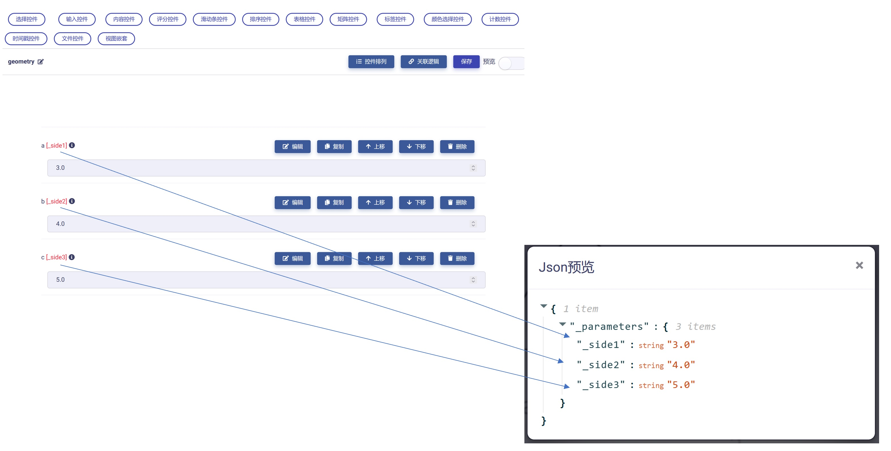

# Matrix模型视图简介

模型视图（Model-View）是Matrix专门设计的一套用于实现数据标准化、前端UI设计、以及后端代码数据流交互的虚拟载体。

**从UI设计角度来说**，模型视图将每一个功能相对独立的UI模块定义为控件（controls）和组件（components），然后将小的控件和组件通过简单“拖放”操作，组合或者嵌套构成更大规模的模型视图。

用户甚至可以将自行开发的模型视图和从其他用户购买的模型视图进一步嵌套组合形成新的模型视图，从而衍生出无限的可能性和多样性。

所以，**模型视图的本质就是各种控件、组件、子模型视图的重用、拼接、嵌套与组合**。基于这一理念，UI设计也转变为一系列模型视图的重用、拼接、嵌套和组合操作，就像拆装“乐高”玩具一样，这将大大提高设计效率和成果的可复用性。

**从数据标准化角度来说**，模型视图的理念非常契合于面向对象编程的思想，即把对象作为操作数据的基本单元。这样一来，Matrix通过模型视图的重用、拼接、嵌套与组合完美地可视化和标准化了各种数据对象及其操作。模型视图对抽象的数据对象建模进行了可视化。

一个复杂的数据对象可以被分解为多个简单的数据对象加以描述和建模，而整个建模过程只需要简单的“拖放”操作就能完成。用户也可以在Matrix市场购买其他用户的数据对象，再加以重用，大大提升了工作效率。

**从数据流角度来说**，每一个模型视图都被Matrix自动映射为json格式的数据节点树（如下图例子）。

这种机制便于后端程序代码读取和解析对应节点的数据流并实施操作逻辑。也就是说在Matrix中，任何复杂UI中的单个控件或者组件，都存在与其逐一对应的数据节点属性。对UI的任何改动和变化，都会精准的反馈到数据节点树中的对应位置，并被后端代码捕捉。

简单总结一下，一个模型视图具有以下特征和功能：

1. **可拼接性**：一个模型视图能够很方便地与其他模型视图一起配合使用，或者嵌套在另一模型视图内部。一个复杂的模型视图可以拆分成多个简单的模型视图。

2. **可重用性**：每个模型视图都是具有独立功能的模块单元，可以在任意多个UI场景重复使用。

3. **可维护性**：每个模型视图仅仅包含自身的完整逻辑，容易被理解和维护。

4. **可实体化性**：每个模型视图都可以在Matrix被实体化为模型实例，从抽象模型到实体化对象的转变将革命性的地改变数据标准化方式、采集方式和处理方式。这一点，将陆续在Matrix其他相关教程中详细介绍。