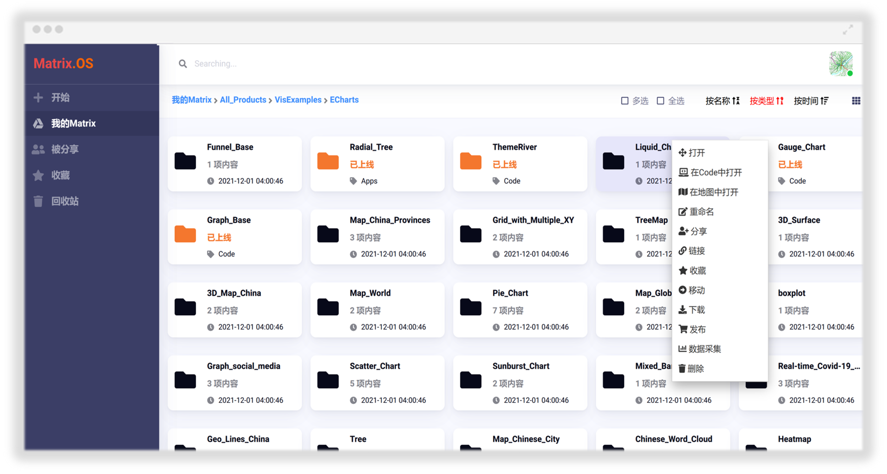

# Matrix简介

Matrix 是一站式的知识管理、协同开发、共享学习、成果发布与应用组装云计算平台。将 "云化管理、社交共享、专业电商、数据资源、虚拟装备" 五大要素有机融为一体。为个人、企业、院所、团队，定制打造新型互联网协同平台，助力行业数字化转型发展，打造世界一流的、面向未来的专业云端操作系统与服务智脑。

## 实现知识到工具的跃迁

在 Matrix，通过使用交互协作式地图、项目画布、模型驱动的应用程序和微服务让您把所获取的知识快速转化为硬核工作能力与高效云端工具，打造自由聚合的全新专业工作与服务模式。

## 像使用个人电脑一样简便

顺应个人电脑用户习惯，Matrix 云操作系统将繁冗的云端开发、部署和配置流程归零化，让每个人像使用个人电脑一样快速上手云计算。

## 沙盒与组装

Matrix 提供了自由度极高的沙盒模式，所有组件（如应用程序、代码、微服务、交互式地图、数据科学工具、项目模块、业务流程模板等）都可编程、可嵌入、可复用，可共享，随心所欲地组装和集成各种专业工具和实验平台。

## 实时高效的团队协作

让包括项目经理、专业工程师、数据科学家、开发人员、终端用户等在内的所有人聚焦同一个目标。

## 精益与敏捷的开发与分享

支持多种数据科学工具语言跨平台使用，云端协作式集成开发平台 IDE 快速构建、部署、启动“云装备”并分享到专业圈子。

## 用户自治与社交化驱动的生态系统演化与资源升级

千里之行，不必始于足下。让学习不再从零开始，每一个体通过创作、共享、交易、订阅等模式积累完成自己的知识管理平台，消灭重复劳动，实现学习、研发、应用的一体化协同。

