# 管理与操作

## 打开

在云桌面，左键单击任一组件，或者右键点击该组件，从菜单中选择 ，即可打开该组件，如下图所示：

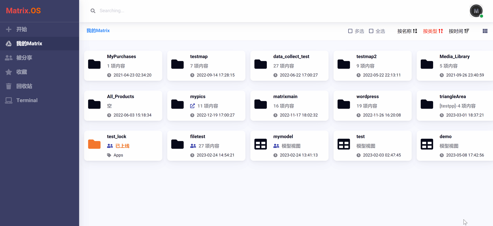

## 重命名

右键点击组件，从菜单中选择 ，在弹出对话框中输入新的组件名称，即可完成对组件的重命名，如下图所示：

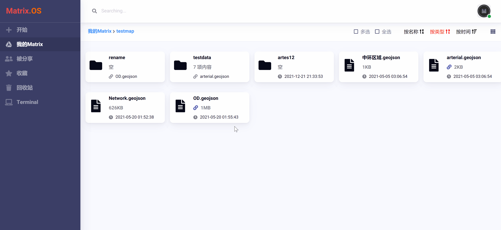

## 选定

### 多选模式

在 Matrix.OS 右上方，点击选中  复选框，即开启多选模式，可选中多个组件。取消选中该复选框，则自动退出多选模式。如下图所示：

### 全选模式

在 Matrix.OS 右上方，点击选中  复选框，即选中云桌面当前路径下的全部组件。取消选中该复选框，则自动退出全选模式。如下图所示：

## 移动

移动操作是指将所选单个或多个组件从当前路径移动到其他路径。通过移动操作，在 Matrix.OS 可以方便的实现组件的拼接、嵌套、组装与维护管理。

### 移动单个组件

右键点击要移动的组件，从菜单中选择  选项，在弹出的文件移动操作对话框中选择目标路径后，点击 ，即完成组件的移动，如下图所示：

注意：当组件内容较多或体量较大时，移动操作可能需要耗费一段时间，请耐心等待。

### 移动多个组件

勾选  或 ，选定多个组件后，点击右侧的  按钮，在弹出的文件移动操作对话框中选择目标路径后，点击 ，即完成多个组件的移动，如下图所示：

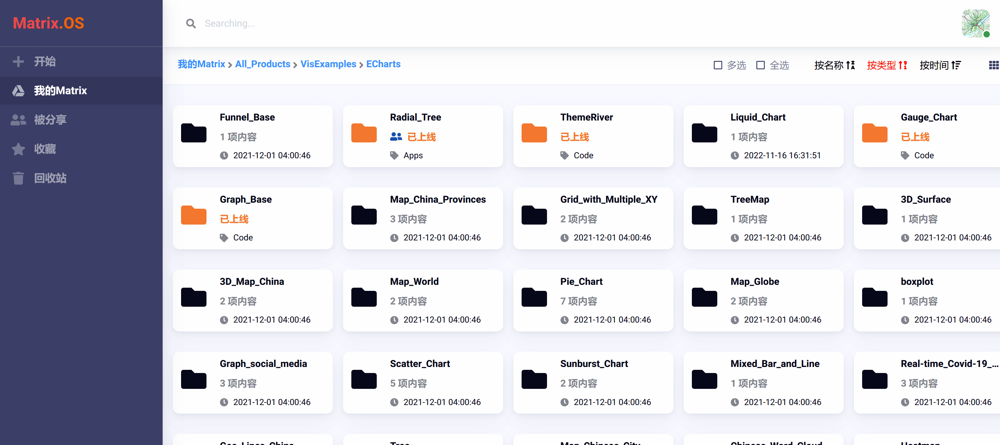

注意：当组件内容较多或体量较大时，移动操作可能需要耗费一段时间，请耐心等待。

## 删除与回收站

### 删除单个组件

右键点击要删除的组件，从菜单中选择  选项，点击 ，即可将组件移动到回收站，如下图所示：

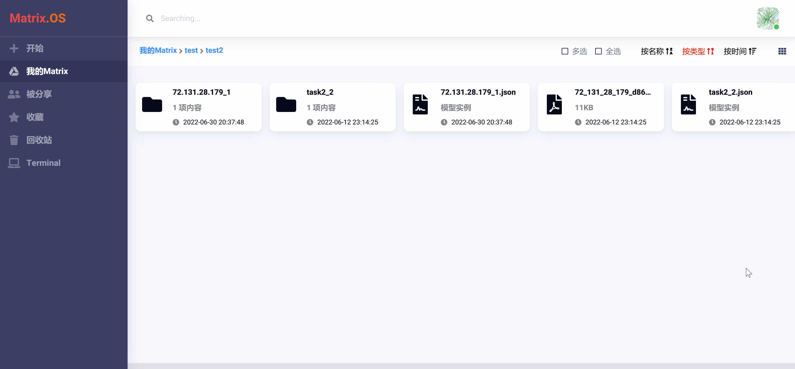

### 删除多个组件

勾选  或 ，选定多个组件后，点击右侧的  按钮，然后点击 ，即可将全部选定组件移动到回收站，如下图所示：

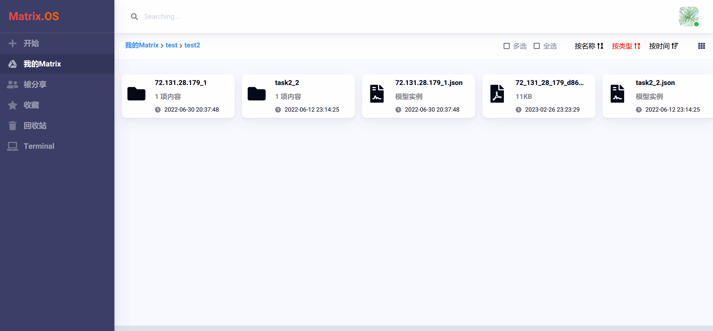

### 回收站

点击左侧导航栏中的  按钮，即进入 Matrix.OS 回收站页面，可以查看已删除的组件，如下图所示：

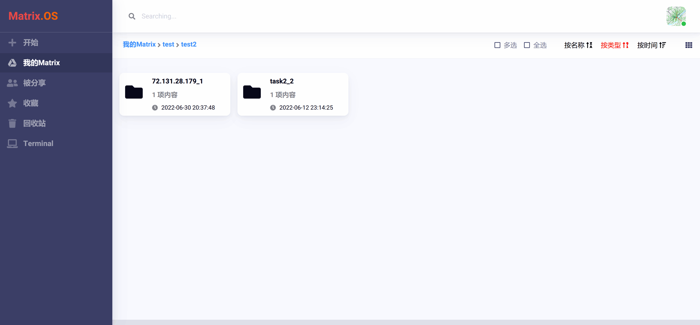

右键点击回收站中的组件，可以选择将组件  或者 ，如下图所示：

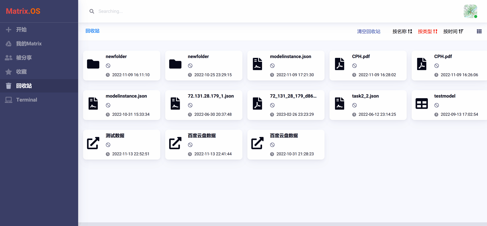

也可点击桌面右上角  按钮，将回收站中内容全部清空，如下图所示：

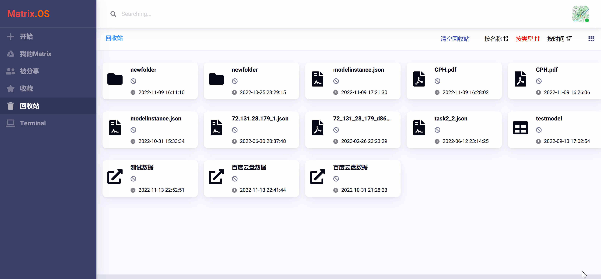

## 显示与排序

若要更改组件在 Matrix.OS 中的显示方式，请点击桌面右上角的显示模式切换按钮  或 ，可以在显示图标和列表之间进行选择，如下图所示：

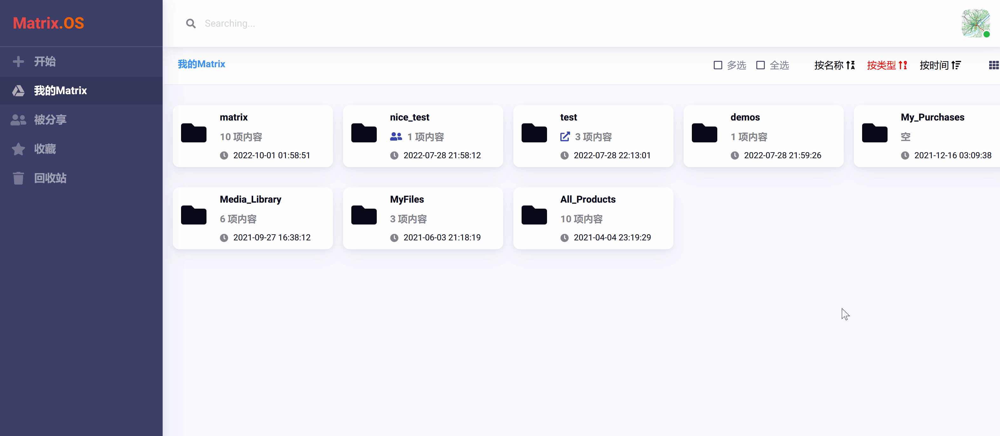

您也可以"按名称"、"按类型"、"按时间"对当前路径下的组件进行排序，如下图所示：

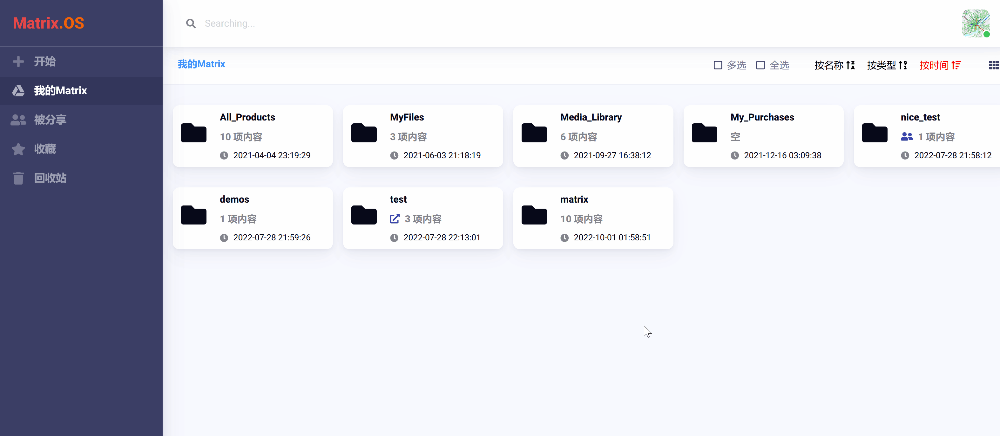

## 收藏

Matrix.OS 提供了收藏功能，方便用户随时保存收藏感兴趣和常用的组件。右键点击要收藏的组件，在弹出菜单中选择 ，即可将组件加入收藏夹，如下图所示：

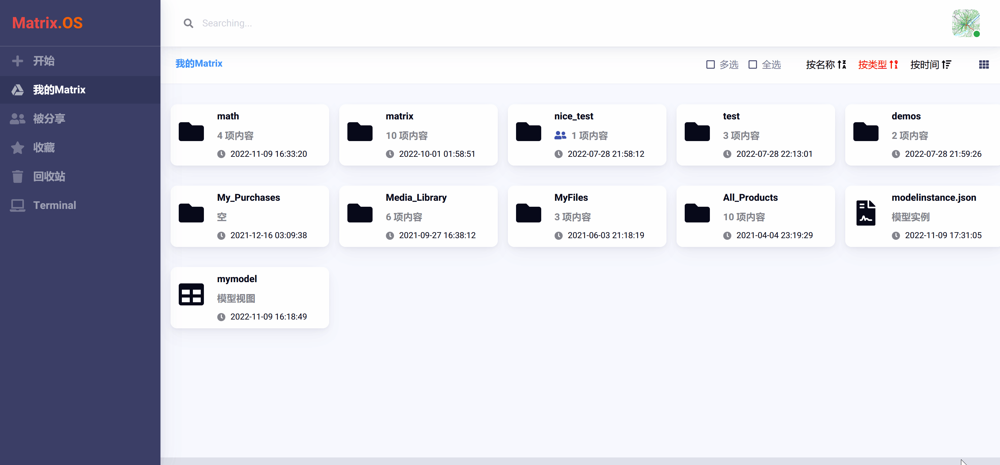

点击左侧导航栏中的  按钮，即进入 Matrix.OS 收藏夹页面，可以查看您所有收藏的组件，如下图所示：

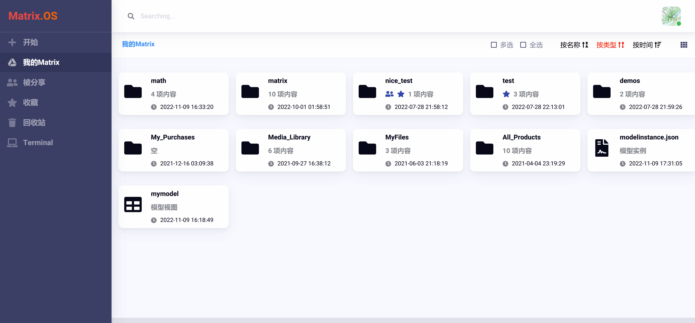

## 下载

右键点击组件，从菜单中选择 ，将对组件进行打包压缩并下载，如下图所示：

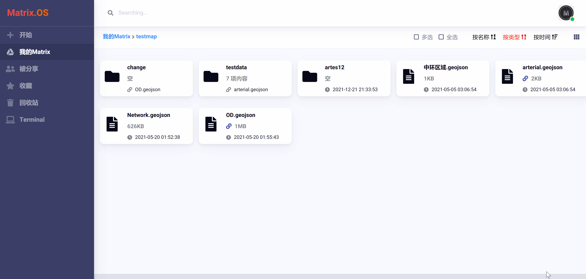