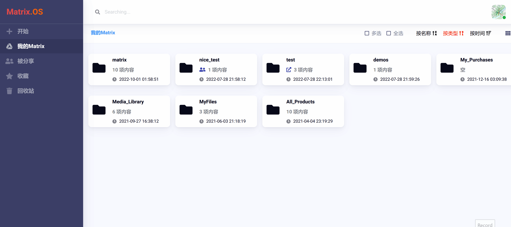
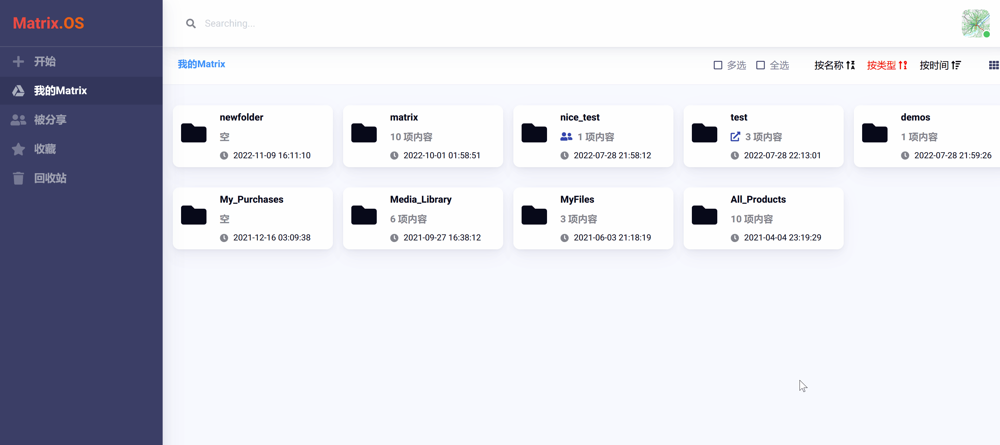
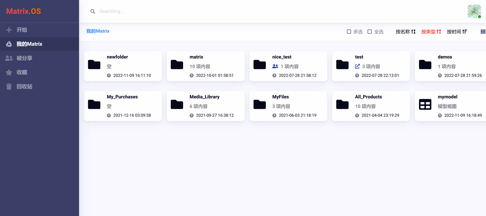
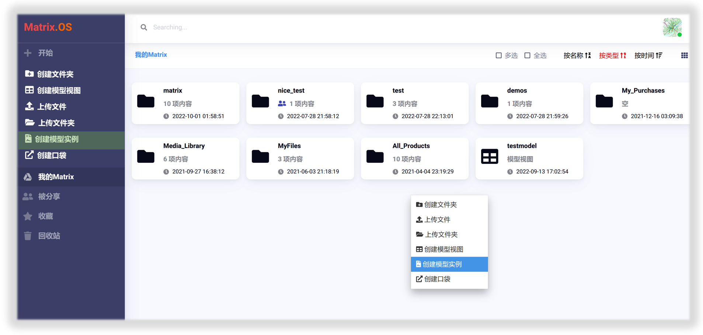
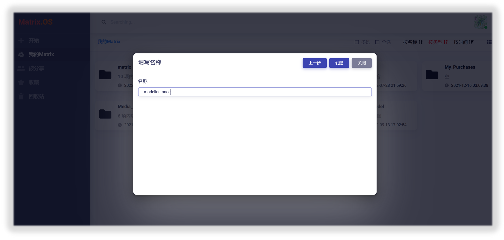
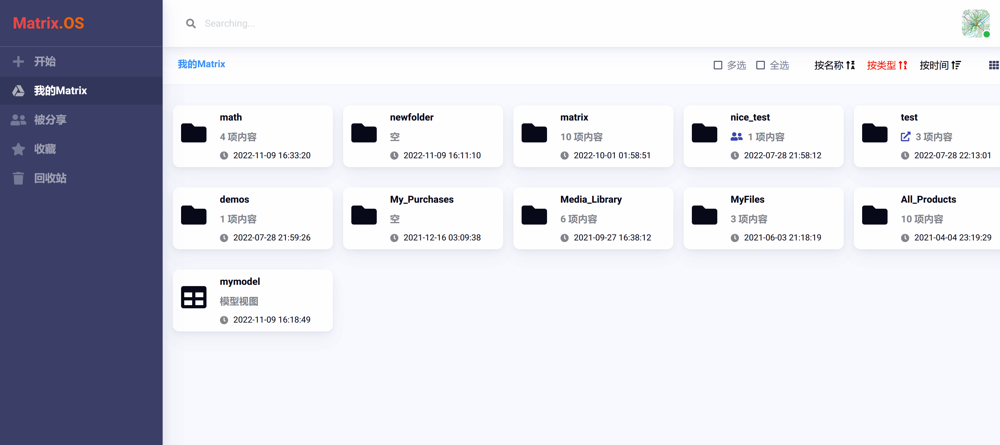
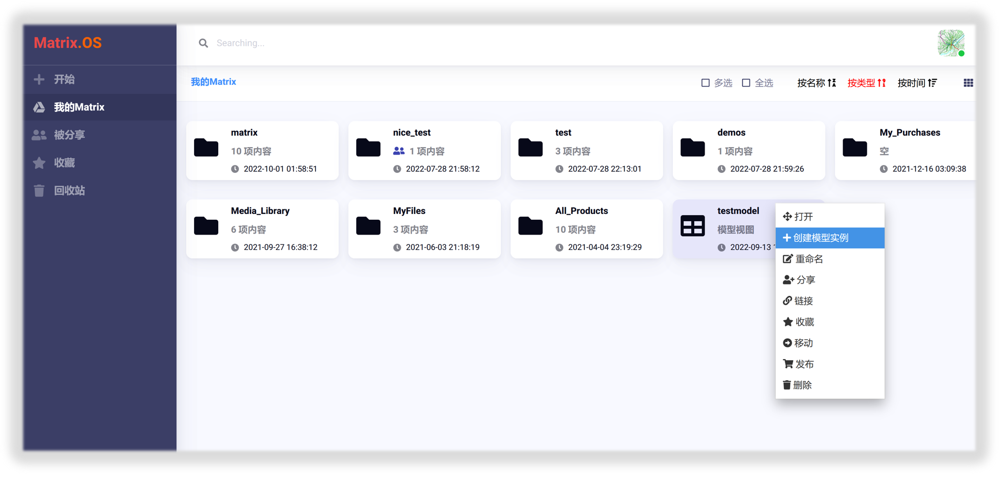
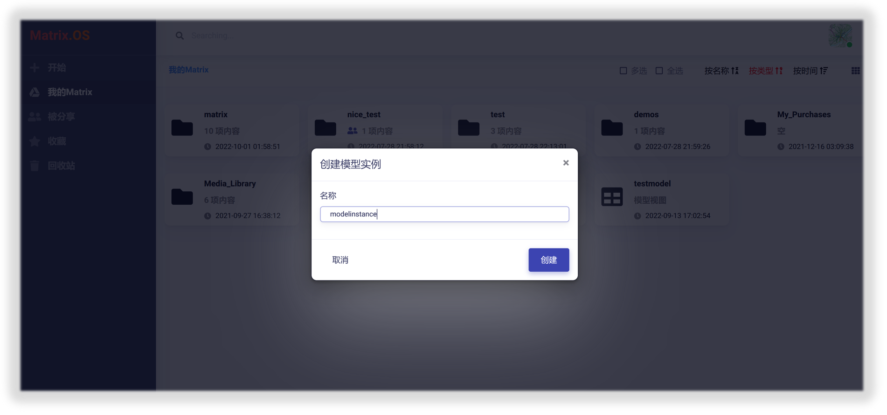
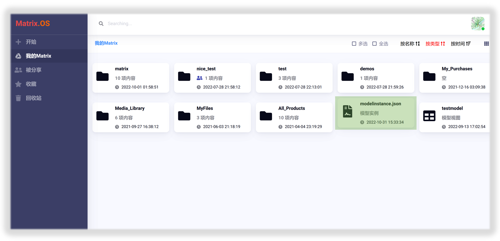
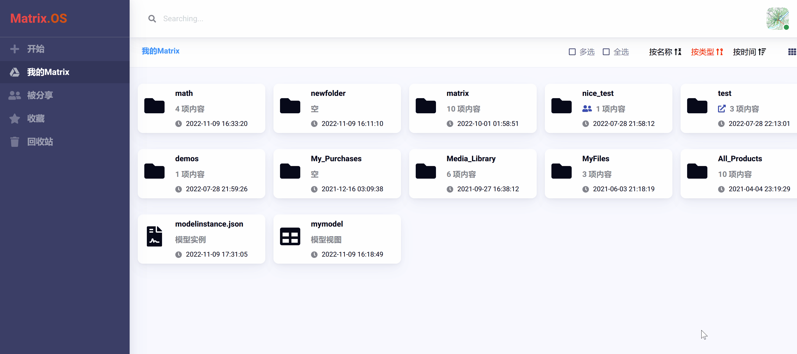

# 创建组件

## 创建文件夹

**文件夹是Matrix所有云端组件的载体和工作区**。

在Matrix.OS上，点击左侧导航栏`开始`按钮下的`创建文件夹`(或右键单击云桌面空白处选择`创建文件夹`)，在弹出对话框中输入名称，点击`创建`按钮，即可在OS当前路径下创建一个新文件夹，如下图所示：

## 创建模型视图

模型视图（Model-View）是 Matrix 用于实现数据标准化、前端UI设计、和交互接口功能的标准模型与可视化页面。关于模型视图的详细介绍和使用请参考后续教程《模型视图管理器》相关章节。

在 Matrix.OS 上，点击左侧导航栏`开始`按钮下的`创建模型视图`(或右键单击云桌面空白处选择`创建模型视图`)，在弹出对话框中输入名称，点击`创建`按钮，即可在OS当前路径下创建一个新模型视图，如下图所示：

## 上传文件

可以将单个或多个本地文件上传到 Matrix，点击左侧导航栏`开始`按钮下的`上传文件`(或右键单击云桌面空白处选择`上传文件`)，如下图所示：

在弹出的对话框中选择需要上传的本地文件即可开始上传，上传文件较大时可能耗时较长。Matrix 对上传文件大小做了限制，超大文件可以通过其他更高效方式在 Matrix 平台访问或被组件调用，使用方法参见后续相关教程。

## 上传文件夹

可以将本地文件夹上传到 Matrix，点击左侧导航栏`开始`按钮下的`上传文件夹`(或右键单击云桌面空白处选择`上传文件夹`)，如下图所示：

在弹出的对话框中选择需要上传的本地文件夹即可开始上传，上传文件夹较大时可能耗时较长。Matrix 对上传文件大小做了限制，超大文件可以通过其他更高效方式在 Matrix 平台访问或被组件调用，使用方法参见后续相关教程。

## 创建模型实例

模型实例是将模型视图实体化后形成的数据元、可以广泛地应用于 Matrix 各类型云端组件中，并且实现不同层级的嵌套和组装（详见后续相关教程）。在 Matrix.OS 上，可采用以下两种不同方法创建模型实例：

### 方法1

1) 点击左侧导航栏`开始`按钮下的`创建模型实例`(或右键单击云桌面空白处选择`创建模型实例`)，如下图所示：

2) 使用弹出的`选择视图`对话框在您的 Matrix.OS 云桌面选择需要实例化的模型视图，点击`下一步`按钮，如下图所示：

**注意**：您可以选择自己设计开发的模型视图，也可选择从开放平台购买的模型视图，或者选择其他人分享给您的模型视图。

3) 在对话框中输入模型实例的名称，点击`创建`按钮，如下图所示：

动图展示如下：

### 方法2

1) 在 Matrix.OS 云桌面右键点击模型视图文件，选择`创建模型实例`，如下图所示：

2) 在对话框中输入模型实例的名称，点击`创建`按钮，如下图所示：

动图展示如下：

通过方法1或方法2成功创建模型实例后，会显示在云桌面当前位置。如下图所示：

## 创建口袋(Pocket)

Pocket 可以通过链接方式将资源引用到 Matrix.OS，并在各种类型组件中使用(代码、地图等等)。
在 Matrix.OS上，点击左侧导航栏`开始`按钮下的`创建口袋`(或右键单击云桌面空白处选择`创建口袋`)，在弹出对话框中，输入口袋的名称和链接地址，点击`创建`按钮，即可完成 Pocket 的创建，如下图所示：

以上显示了创建一个 Pocket，将百度云盘数据作为外部资源引入到 Matrix.OS 的例子。通过 Pocket 也可以将视频、网页等多媒体资源嵌入到 Matrix 组件中。

当然，Pocket 也可用来链接 Matrix.OS 内生资源，输入 Pocket 名称后，点击`云OS导入`按钮，在对话框中，选择要链接的OS资源，点击`确定`即可，如下图所示：

