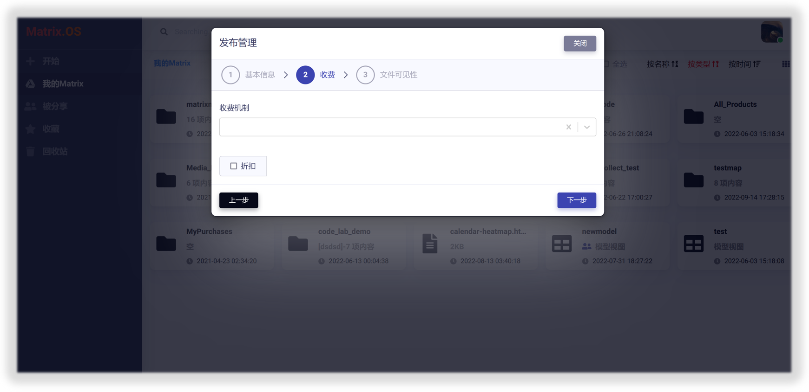

# 发布组件到开放平台

您可以将任何Matrix.OS上的组件发布到Matrix开放平台，惠及其他用户，并依托Matrix.OS实现线上运营与管理。

组件发布后，在Matrix.OS和Matrix开放平台分别展现为下面形式：

## 开启发布

在Matrix.OS上，右键点击要发布的组件，选择`发布`，即开启组件发布流程，如下图所示：

## 基本信息设置

您可以通过弹出的"发布管理"对话框，完成发布基本信息设置，包括：

* **封面：**即组件发布到开放平台的封面图片，点击图片可随时更换。
* **产品名称：**即组件发布到开放平台的名称。
* **发布类别：**即组件发布到开放平台的类型，例如：App(云应用)、Code(可执行代码)、View(模型视图)、Map(交互地图)、Project(项目)、和Resource(资源)等；发布类别确定后不可更改。
* **产品标签：**便于发布组件的归类、推荐和检索，增加组件在开放平台的曝光度。
* **产品简介：**介绍组件的核心功能和特色，显示在开放平台的组件主页。

基本信息设置页面如下图所示：

## 定价与收费

您可以对发布组件进行定价与收费，设置完基本信息后，点击`下一步`按钮，即进入"收费"设置页面，如下图所示：

### 收费机制

Matrix支持4种不同的组件定价收费机制，如下图所示：

#### 免费订阅

组件对所有使用者免费，组件开发者无需设置组件价格，如下图所示：

#### 一次性付费订阅

使用者只需一次性支付费用即可获得组件的永久使用权，组件开发者需要在"定价"栏输入组件的收费价格(精确到小数点后两位)，如下图所示：

#### 按使用时间订阅(仅适用于App类型组件)

使用者支付费用购买组件在一定时间内的使用权，**开发者可以自行定制"阶梯型"时间收费价签**，用来满足不同使用者的需求，如下图所示：

添加自定义时间收费价签非常简单，只需要输入"使用天数"和"定价"，然后点击`添加价签`按钮，即可将价签添加到下方的列表中。如果要删除已添加的价签，只需要点击价签按钮右侧的"X"即可，如下动图所示：

#### 按使用次数订阅(仅适用于App类型组件)

使用者支付费用购买组件指定次数的使用权，**开发者可以自行定制"阶梯型"次数收费价签**，用来满足不同使用者的需求，如下图所示：

添加自定义次数收费价签非常简单，只需要输入"使用次数"和"定价"，然后点击`添加价签`按钮，即可将价签添加到下方的列表中。如果要删除已添加的价签，只需要点击价签按钮右侧的"X"即可，如下动图所示：

**注意：组件发布后，开发者依然可以通过Matrix.OS的"发布管理"功能来随时调整组件的收费机制和收费标准，以更好的满足使用者的需求，这方面内容将在后面教程中详细介绍。**

### 折扣机制

您可以非常方便地定制组件收费折扣机制和有效期，以达到推广和营收目标。折扣机制与所有组件收费机制兼容，Matrix平台会自动做出计算和调整。

选中`折扣`复选框，则激活定价折扣机制，如下图所示：

需要设置以下信息：

* **开始时间：**折扣活动的开始时间
* **结束时间：**折扣活动的结束时间
* **折扣比例：**比照原价降低的百分比(例如，10%的折扣比例意味着打九折)

动图展示如下：

## 可见性与用户权限设置

在完成组件收费设置后，点击`下一步`按钮，即进入"可见性与用户权限"设置页面，如下图所示：

您可通过此功能来逐一设置组件内容对使用者的可见性与操作权限(例如，设置代码开源，数据加密等等)，只需点击组件内容左侧的图标即可：

* **设置为"可见"：**组件发布后，该项内容对所有使用者可见
* **设置为"不可见"：**组件发布后，该项内容对所有组件使用者不可见
* **设置为"锁定"：**组件发布后，使用者对该项组件内容只读
* **设置为"解锁"：**组件发布后，使用者对该项组件内容可读写

动图展示如下：

**注意：可见性与用户权限设置仅适用于App类型组件。**

## 完成发布

完成以上全部设置后，点击`发布`按钮，则成功发布组件，如下图所示：

点击进入该组件，可以发现，全部组件内容被自动锁定(橙色显示，如下图所示)。开发者不得再对组件内容进行修改以免造成用户在订阅使用该组件时出现错误，除非开发者需要对组件进行重构与升级（详见：[组件运营与维护](zh-cn/userguide/os/com/maintain.md)）

进入Matrix开放平台，发布的组件已显示在开放平台页面了。

所有Matrix用户都可以进入组件主页，订阅使用该组件，查看组件最新动态并与开发者交互。

