# 在开放平台订阅组件

您可以在Matrix开放平台订阅他人发布的组件，用以完成特定工作；或者定制、修改、重用、组合到自己开发的组件和项目中来，实现高效的知识管理和团队协作。

## 组件主页

进入Matrix开放平台"市场"页面，可以按类别、评分、和时间来检索组件，也可在页面左上角搜索栏输入关键字来搜索组件，如下图所示：

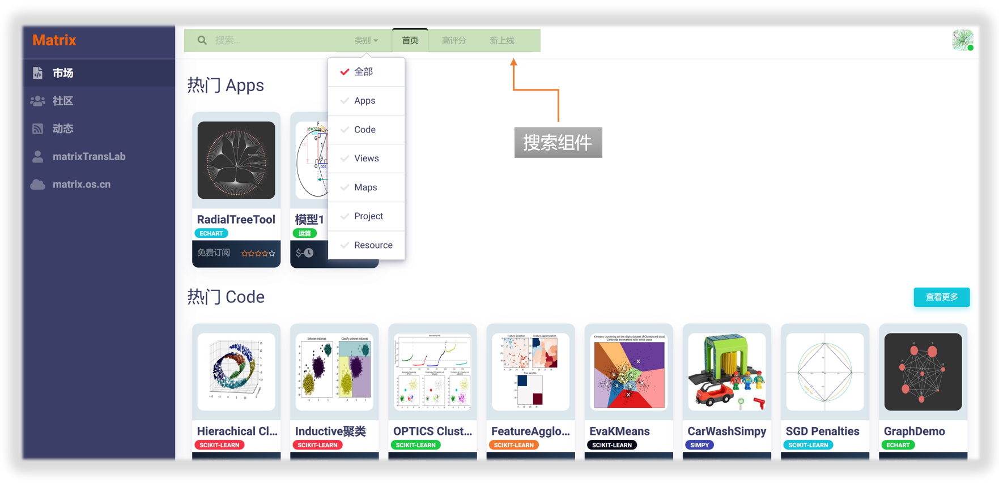

找到感兴趣的组件后，可以点击组件图标，进入组件主页，如下图所示：

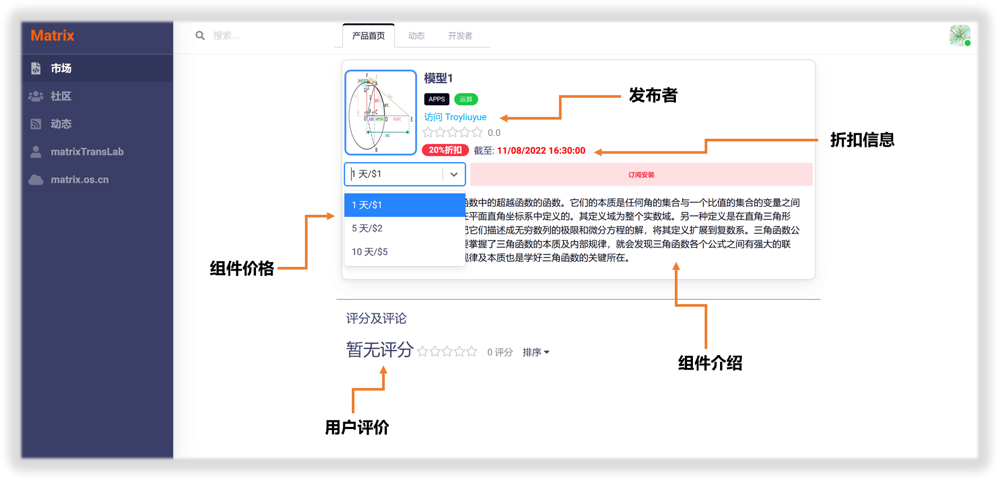

在组件主页，您可以查看：

* 组件基本信息
* 组件发布者
* 组件价格
* 折扣信息
* 组件简介
* 用户评价

## 组件动态

点击组件主页右侧的`动态`选项卡，则进入组件动态页面，可以查看关于组件的更新、功能介绍、用户反馈等信息，如下图所示：

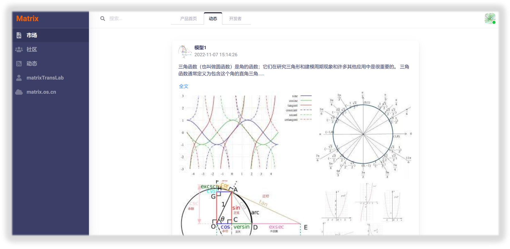

## 组件开发者

点击`开发者`选项卡，则进入组件开发者页面，可以查看组件的开发者团队并与您感兴趣的开发者进行交互，如下图所示：

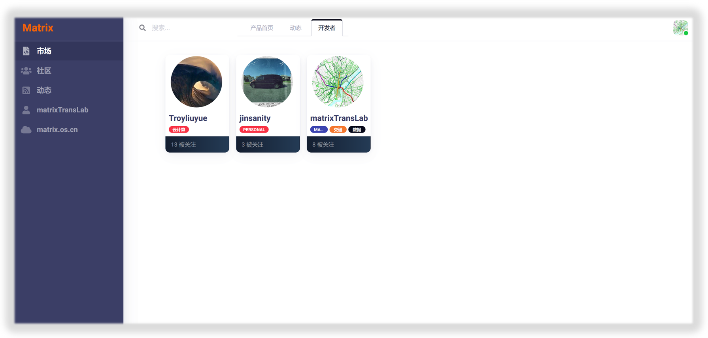

## 组件订阅

返回组件首页，在组件价格下拉式菜单中选择适合您的订阅购买方案，然后点击右侧`订阅安装`按钮，即开始组件订阅安装流程，如下图所示：

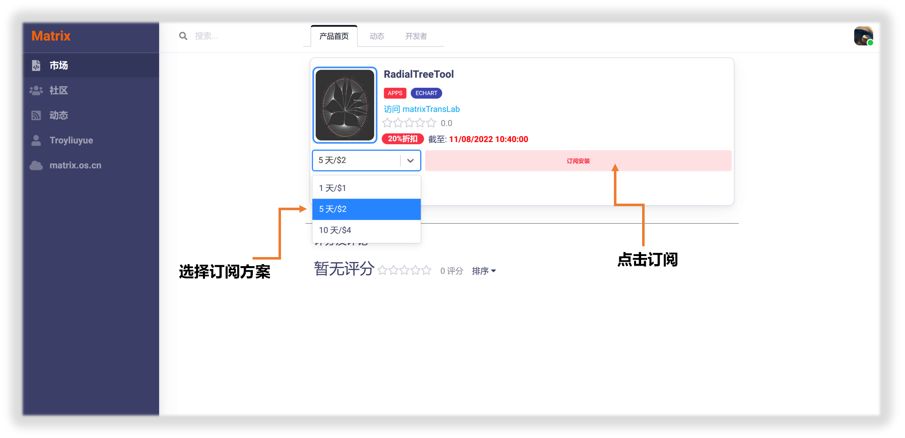

在Matrix，组件的订阅安装过程非常类似于在个人电脑上安装应用程序。点击`订阅安装`按钮后，即弹出"产品订阅与安装"对话框，如下图所示：

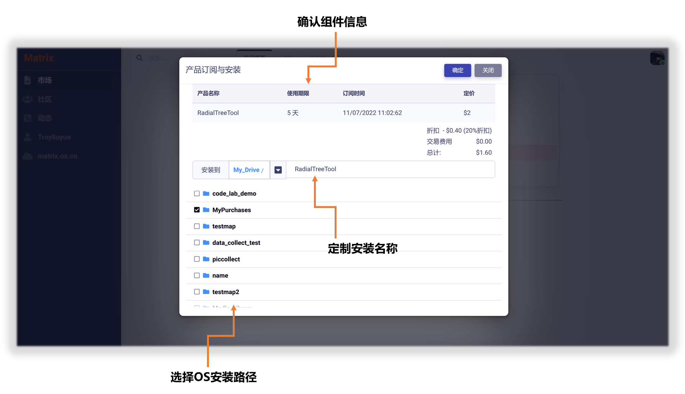

订阅安装过程分为以下几步：

**第一步：确认订阅组件的基本信息和交易费用无误。**

**第二步：选择组件安装路径。**使用"导航"功能，浏览并选定您个人云OS上用来安装组件的路径(如下图所示)，就像您在个人电脑上选择安装应用程序的路径一样。如果您没有选择安装路径，则系统默认将组件安装到您个人OS的根目录下。

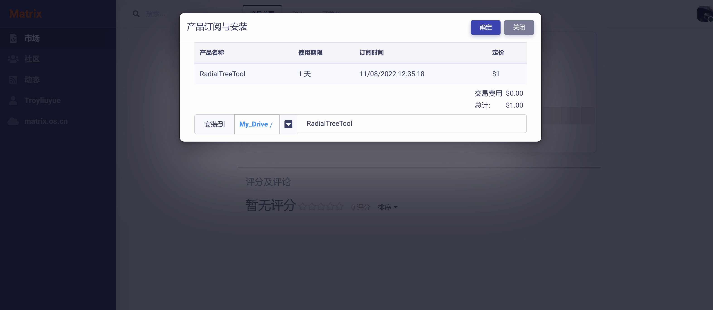

**第三步：设置组件安装名称。**您可以自行定制组件安装的名称(如下图所示)，不需要与开放平台上发布的名称一致，以方便您在自己的OS上使用。如果您没有设置安装名称，则系统默认将组件发布名称作为安装名称。

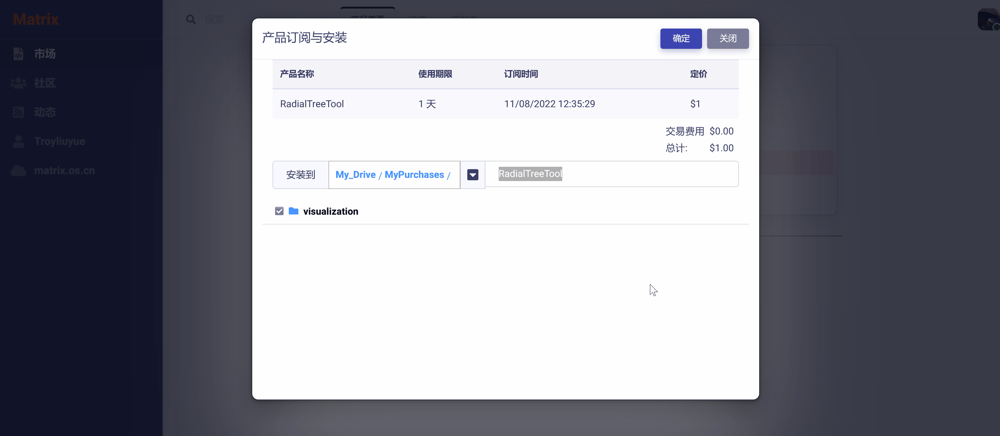

**第四步：确定并完成安装。**

第三步完成后，点击`确定`按钮，组件成功安装后自动刷新页面。您可以点击组件主页上的`运行`按钮直接运行或打开组件，如下图所示：

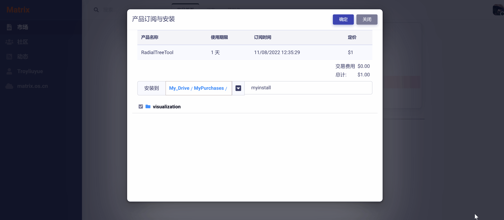

也可点击`查看`按钮，跳转到组件在您个人OS的安装目录，如下图所示：

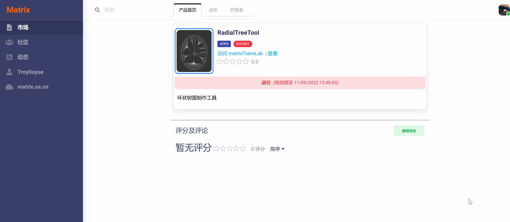

用户可以订阅安装任意多个组件到个人云OS，以达到协同组装使用的目的(后续教程会详细介绍)，如下图所示：

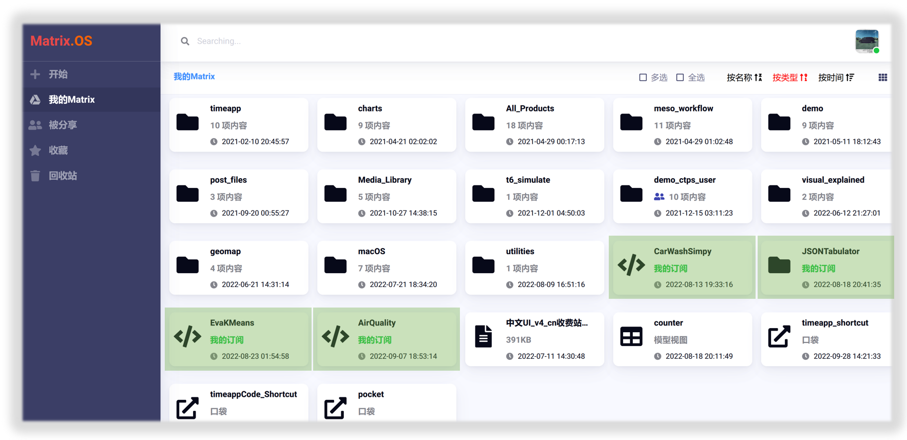

## 组件升级

组件开发者完成组件升级后，Matrix平台会自动通知该组件的全部订阅用户进行升级。用户可以采用以下两种方式完成组件升级：

**方式一：在开放平台升级**

进入开放平台组件主页，点击`升级`按钮，即可自动完成升级，如下图所示：

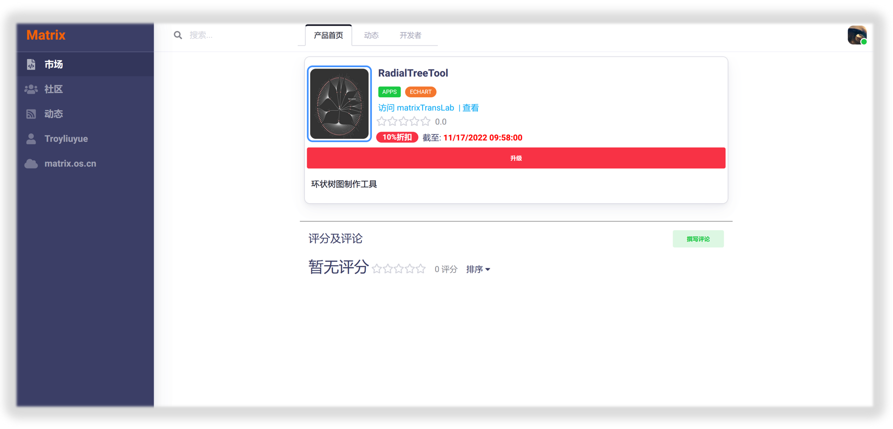

**方式二：在个人云OS升级**

进入组件在个人云OS的安装目录，右键点击组件，在弹出菜单中选择`升级`，即可自动完成升级，如下图所示：

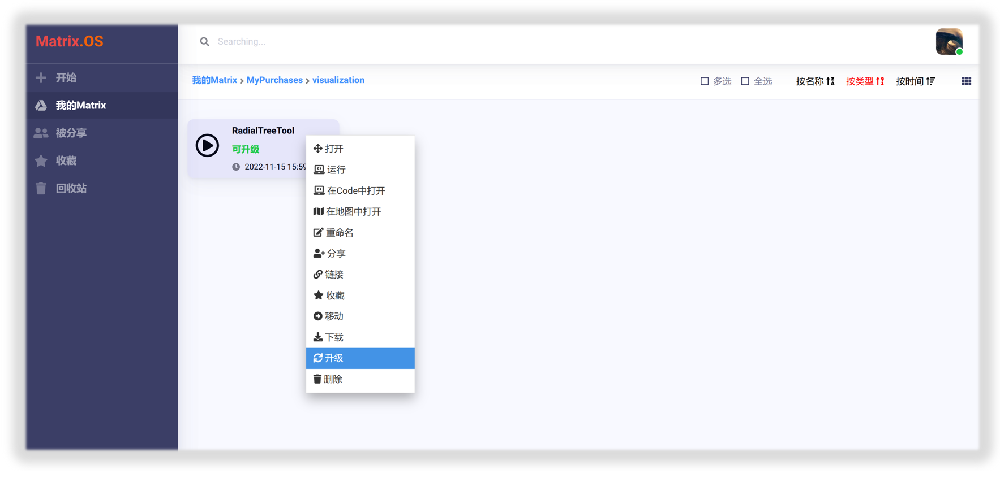

## 组件续订

用户购买组件使用权限到期后(超过使用次数或使用时间限制)，可以对组件进行续订。进入组件主页，选择购买方案后，点击`续订`按钮，即可完成对组件的续订，如下图所示：

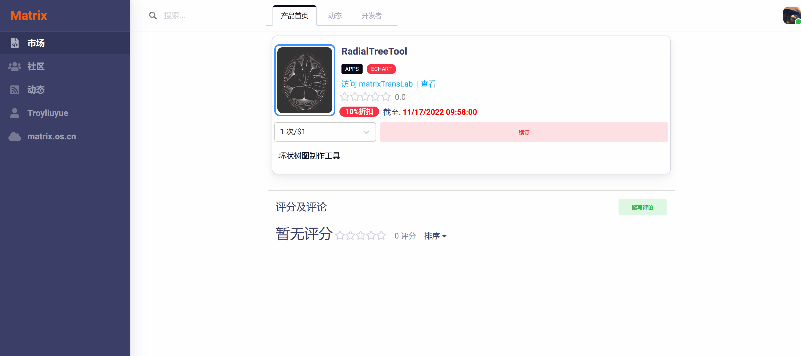