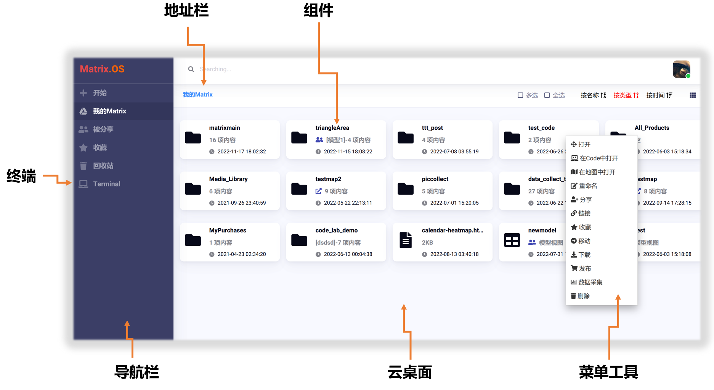
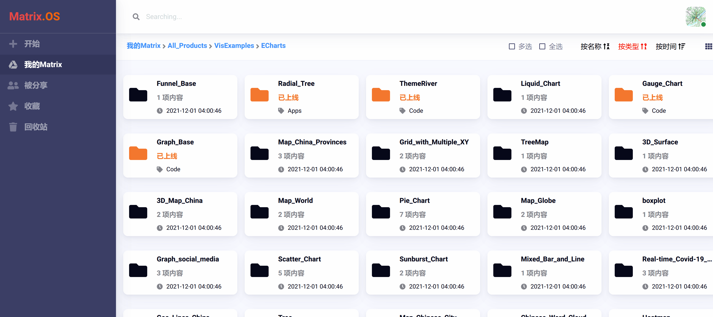

# Matrix.OS 概览

Matrix.OS 是**组件与工具有机结合共同驱动的个人云计算操作系统平台**，将繁冗的云端开发、部署和配置流程归零化，让每个人像使用个人电脑一样快速上手云计算。

您可以在Matrix.OS开发、管理、分享、发布、订阅、组合、应用各种类型的**定制化云端组件**，如应用程序、可执行代码、微服务、项目、交互式地图、数据资源和产品等；高自由度的**沙盒式场景工具**支持所有组件可编程、可复用、可嵌入和可共享，让您可以随心所欲的组装和集成项目应用，与团队伙伴更高效地协同工作，打造自由聚合的全新专业工作、学习和服务模式。

## 总体布局

登录 Matrix.OS，即进入图形化的云端文件管理和浏览器系统 (File Explorer)，如下图所示：

在 Matrix.OS，所有云端组件**都统一以文件或文件夹为载体**在 OS 上存储、管理、和使用。您可以像在个人电脑上一样，在云 OS 定制适合您的工作空间与工作模式。

## "开始" 按钮

单击 Matrix.OS 桌面导航栏左上角的  按钮，即可展开 "开始" 栏，如下图所示：

您可以：

* **创建文件夹**：创建用于开发 Matrix 云端组件的文件夹
* **创建模型视图**：创建用于数据标准化、前端UI设计、以及数据流交互的可视化表单视图模型
* **上传文件**：上传本地文件到 Matrix.OS
* **上传文件夹**：上传本地文件夹到 Matrix.OS
* **创建模型实例**：创建可视化数据模型实例
* **创建口袋（pocket）**：链接外部资源到 Matrix.OS

## 文件浏览与位置

* **我的 Matrix**：显示当前浏览目录路径与内容。
* **被分享**：显示其他用户分享给您的内容。
* **收藏**：显示您收藏的内容，这里包含了其他用户分享给您的内容。
* **回收站**：显示您最近删除的内容，您可以批量删除或还原。

## 右键菜单

右键点击云桌面**空白处**，即弹出如下图所示菜单选项：

与点击  按钮相同，您可以通过右键菜单来：

* **创建文件夹**：创建用于开发 Matrix 云端组件的文件夹
* **创建模型视图**：创建用于数据标准化、前端UI设计、以及数据流交互的可视化表单视图模型
* **上传文件**：上传本地文件到 Matrix.OS
* **上传文件夹**：上传本地文件夹到 Matrix.OS
* **创建模型实例**：创建可视化数据模型实例
* **创建口袋（pocket）**：链接外部资源到 Matrix.OS

右键点击任一云组件，即弹出如下图所示菜单选项：

* **打开**：打开所选内容
* **在Code中打开**：在云端集成开发环境 Code 中打开所选内容
* **在地图中打开**：在交互式地图 Map 中打开所选内容
* **重命名**：更改文件或文件夹名称
* **分享**：分享所选内容，设置团队操作权限
* **链接**：通过链接分享所选内容，设置访问权限
* **收藏**：添加所选内容到收藏夹
* **移动**：移动所选内容到指定位置
* **下载**：打包下载所选内容
* **发布**：将所选内容作为组件发布到开放平台
* **数据采集**：设计和实施数据采集任务
* **删除**：将所选内容移动到"回收站"

## 使用 Terminal

您也可以使用网络终端 (Web Terminal) 或者本地终端 (Local Terminal)，用命令行操作来实现全部云 OS 文件管理功能，并与云桌面的同步；同时可以快捷配置云端组件开发与编译环境、运行云端代码和程序组件等。详细信息参见：《[使用终端](zh-cn/userguide/os/tools/terminals/terminal.md)》