<head> 
     
     
</head> 
<link rel="stylesheet" href="https://use.fontawesome.com/releases/v5.0.13/css/all.css">

# 文件管理

## 选定

### 多选模式

在Matrix.OS右上方，点击"多选"复选框，即开启多选模式，可选中多个项目组件，如下图所示：

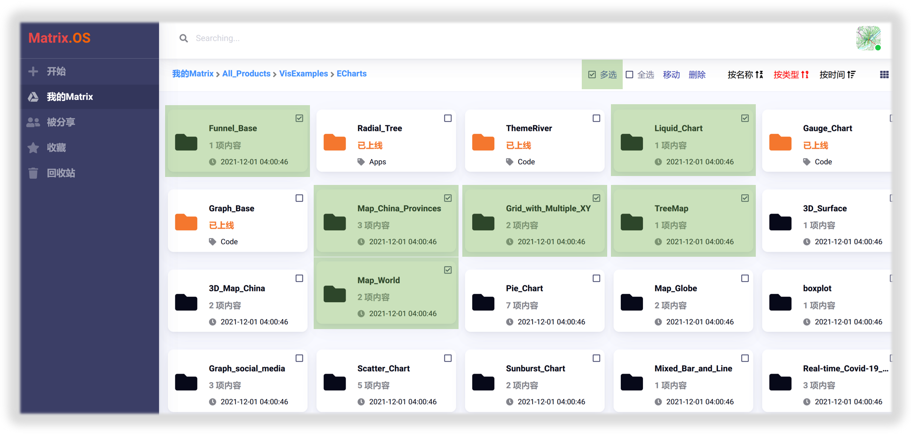

取消选中"多选"复选框，则自动退出多选模式。

### 全选模式

在Matrix.OS右上方，点击"全选"复选框，即选中云桌面当前路径下的全部项目组件，如下图所示：

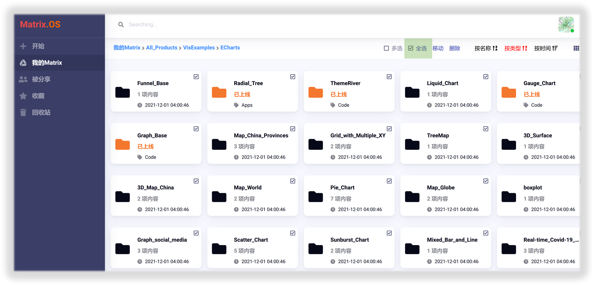

取消选中"全选"复选框，则自动退出全选模式。

## 移动

移动操作是指将所选单个或多个项目组件从当前路径移动到其他路径。通过移动操作，在Matrix.OS可以方便的实现项目组件的拼接、嵌套、组装与维护管理。

### 移动单个组件

右键点击要移动的组件，从菜单中选择`移动`选项，在弹出的文件移动操作对话框中选择目标路径后，点击`确定`，即完成项目组件的移动，如下图所示：

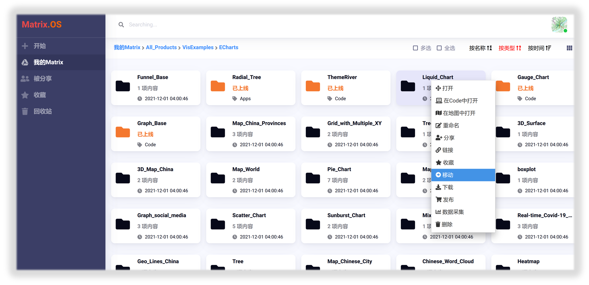
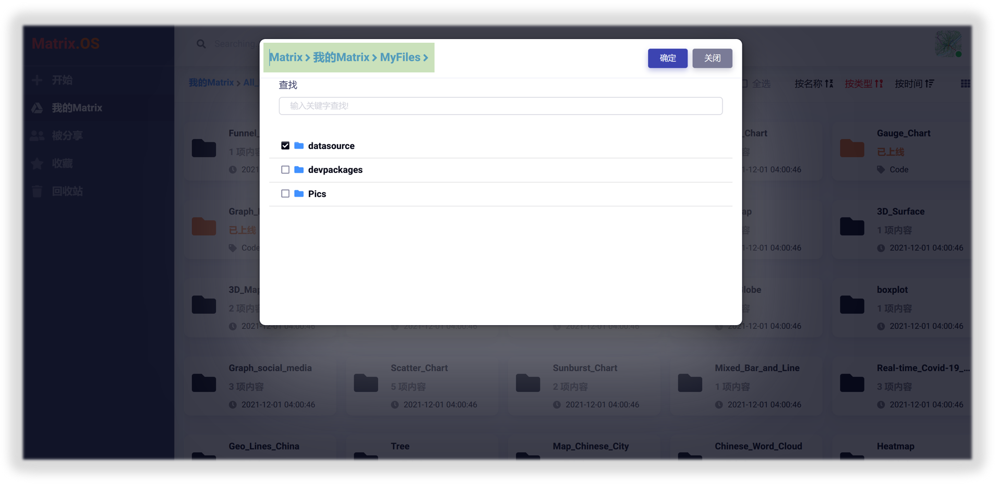

注意：当项目组件内容较多或体量较大时，移动操作可能需要耗费一段时间，请耐心等待。

### 移动多个组件

首先进入"多选"或"全选"模式，选定多个项目组件后，点击右侧的`移动`按钮，在弹出的文件移动操作对话框中选择目标路径后，点击`确定`，即完成多个项目组件的移动，如下图所示：

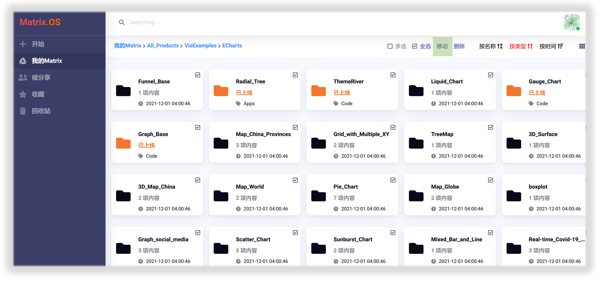

## 删除与回收站

### 删除单个组件

右键点击要删除的组件，从菜单中选择`删除`选项，点击`确定`，即可将组件移动到回收站，如下图所示：

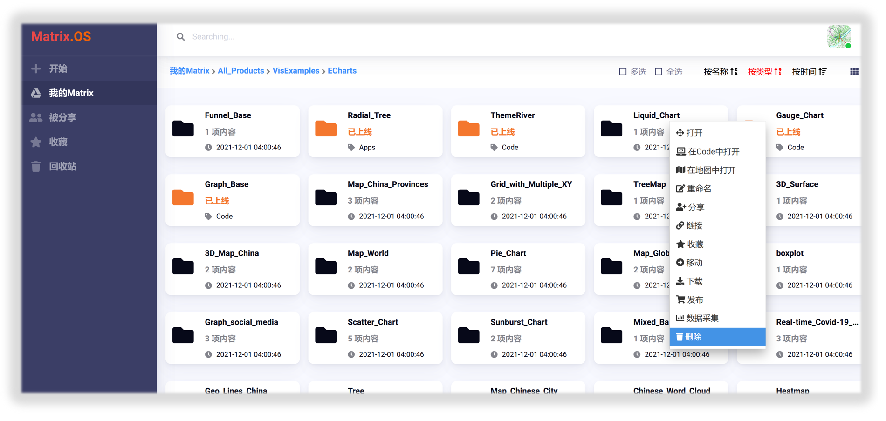
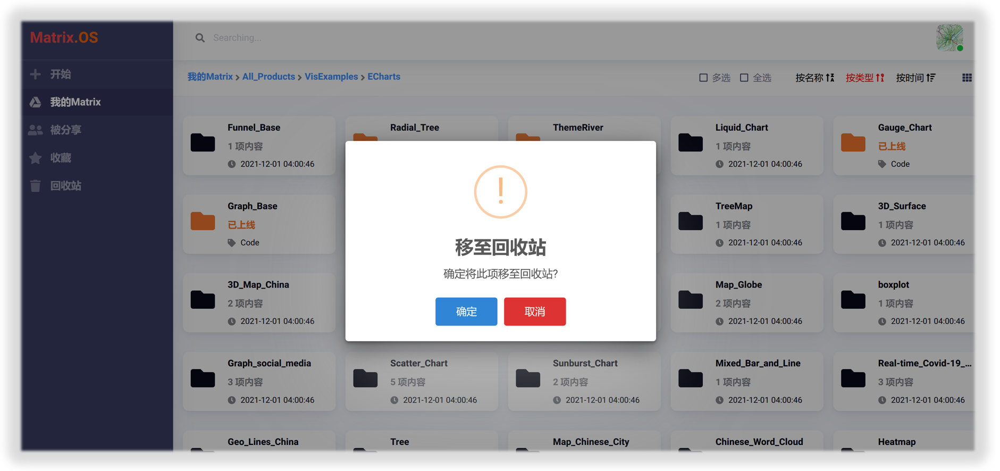

### 删除多个组件

首先进入"多选"或"全选"模式，选定多个项目组件后，点击右侧的`删除`按钮，然后点击`确定`，即可将全部选定组件移动到回收站，如下图所示：

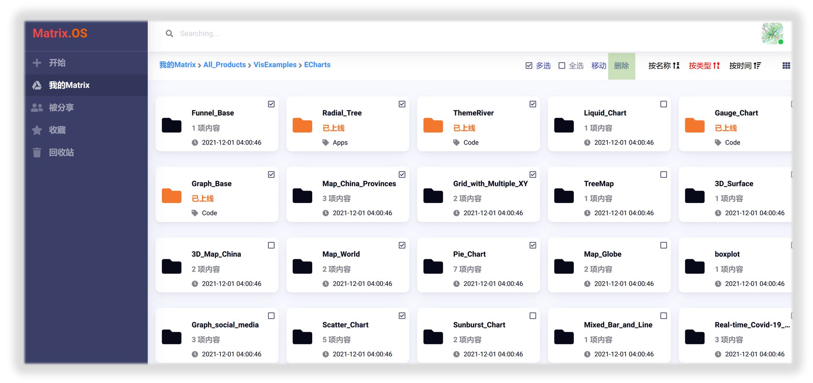
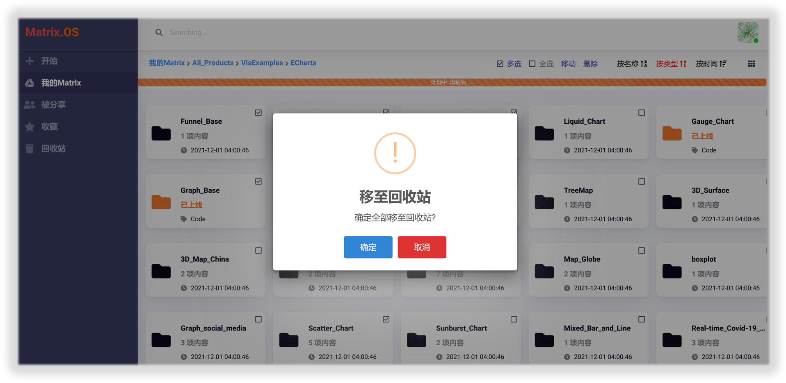

### 回收站

点击左侧导航栏中的`回收站`按钮，即进入Matrix.OS回收站页面，可以查看已删除的组件，如下图所示：

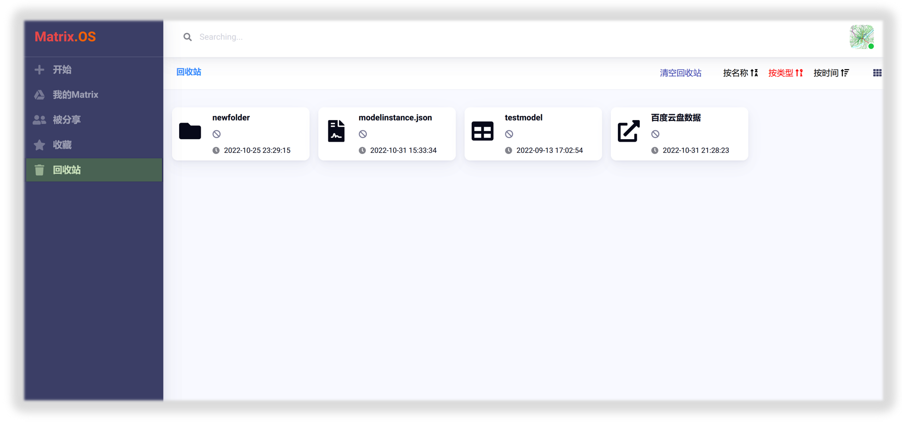

右键点击回收站中的组件，可以选择将组件"还原"或者"永久删除"，如下图所示：

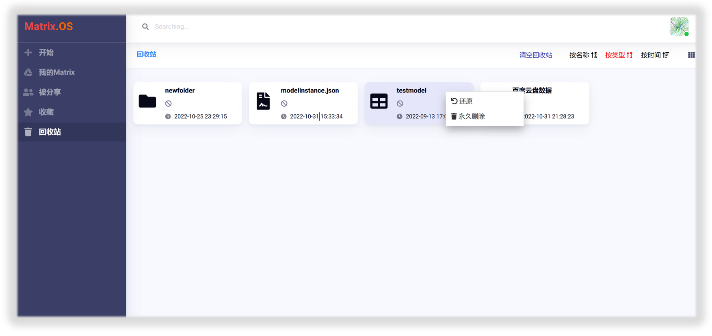

也可点击桌面右上角`清空回收站`按钮，将回收站中内容全部清空，如下图所示：

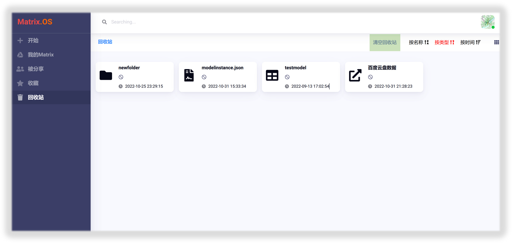

## 显示与排序

若要更改项目组件在Matrix.OS中的显示方式，请点击桌面右上角的显示模式切换按钮，可以在显示图标和列表之间进行选择，如下图所示：

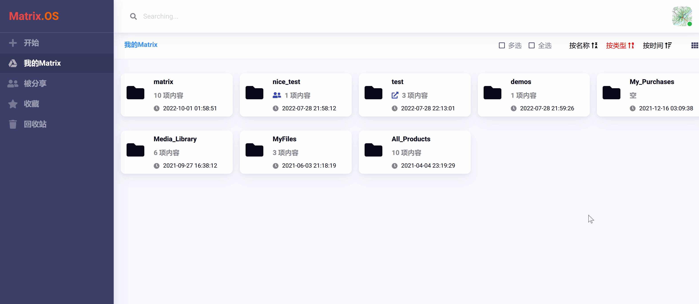

您也可以"按名称"、"按类型"和"按时间"对当前路径下的项目组件进行排序，如下图所示：

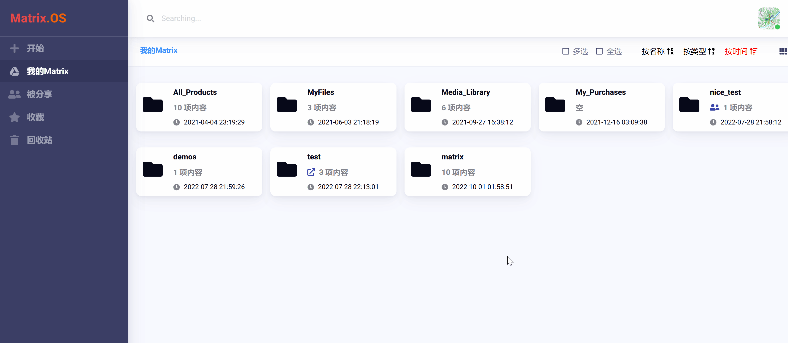

## 收藏

Matrix.OS提供了收藏功能，方便用户随时保存收藏感兴趣和常用的项目组件。右键点击要收藏的组件，在弹出菜单中选择`收藏`，即可将组件加入收藏夹，如下图所示：

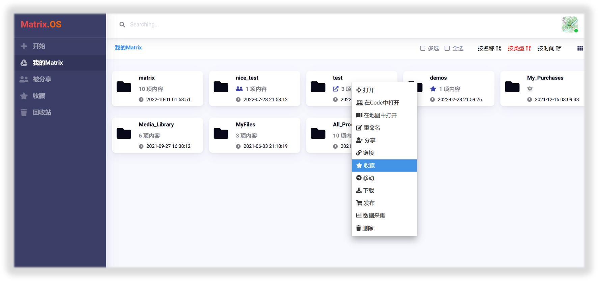

点击左侧导航栏中的`收藏`按钮，即进入Matrix.OS收藏夹页面，可以查看您所有收藏的组件，如下图所示：

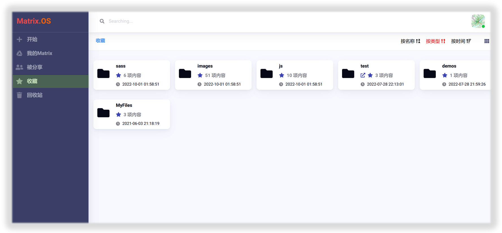