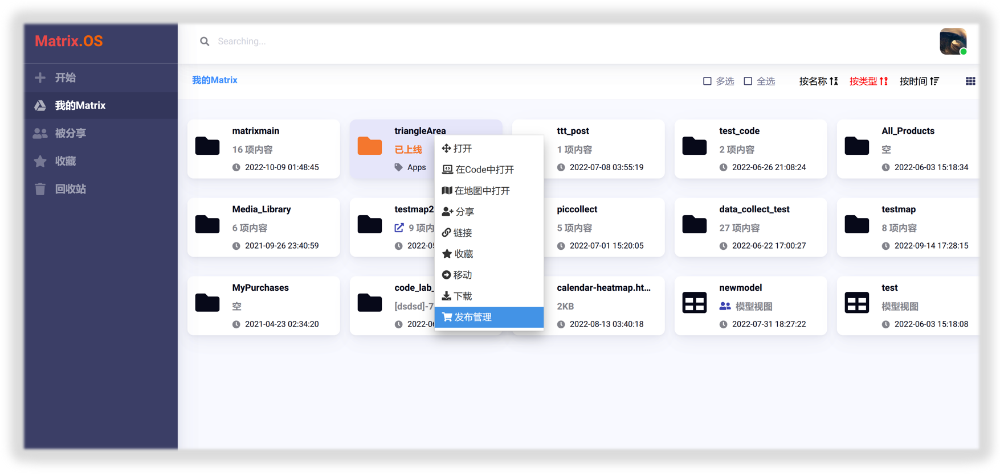
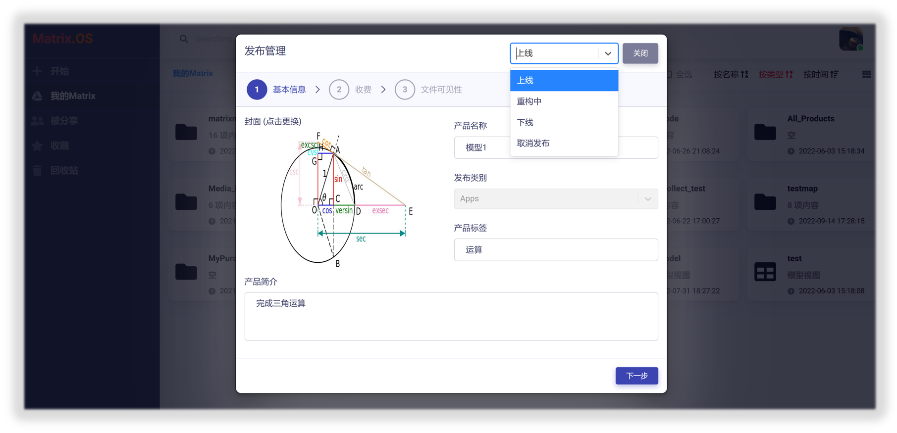
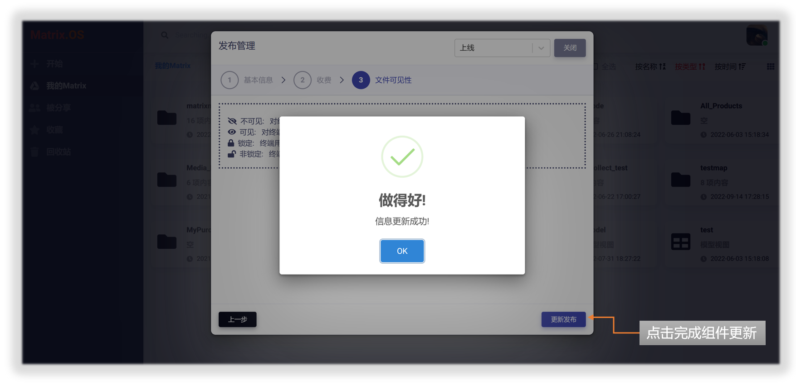
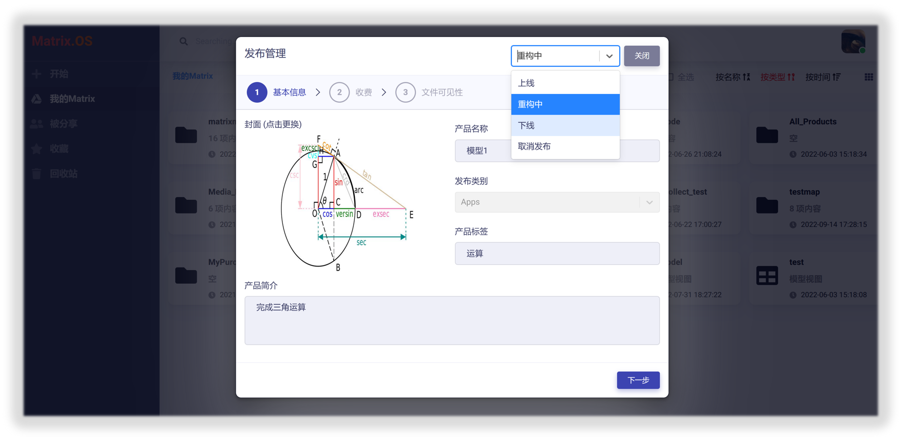
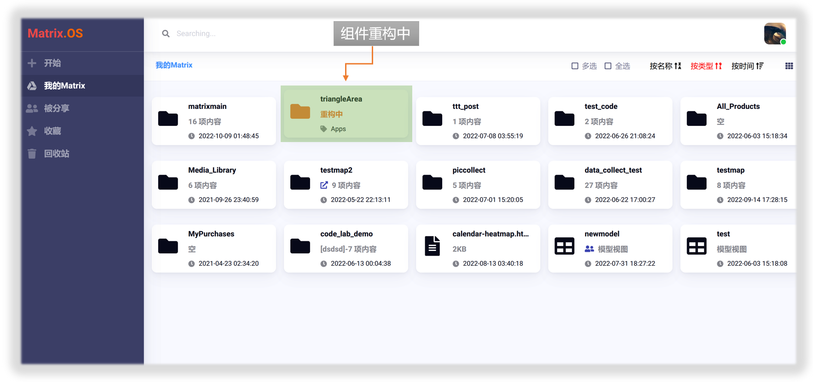
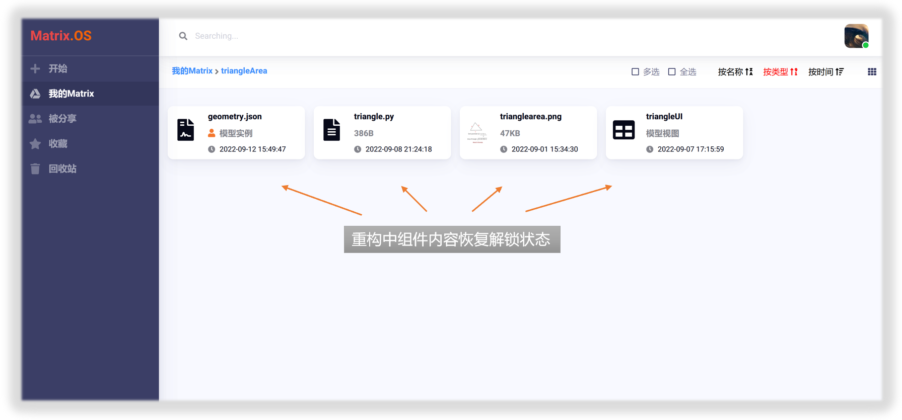

# 组件的运营与维护

组件发布到开放平台后，可以通过Matrix.OS的`发布管理`功能来对组件进行更新、重构、升级、与维护。

右键点击已发布的组件，选择`发布管理`，如下图所示：

## 组件的"状态"

点击"发布管理"对话框右上角下拉式菜单，可以设置组件不同的状态，如下图所示：

* "上线"：组件处于正常在线发布状态，可以在开放平台被所有用户订阅、使用、运行。全部组件内容被自动锁定，开发者不得再对其进行修改。
* "重构中"：开发者正在对组件进行重构和升级，不会影响已订阅该组件用户的使用，但是新用户暂时不能订阅该组件。组件内容解除锁定，开发者重新获得该组件的开发权限。
* "下线"：组件在开放平台下线，但是不会影响已订阅该组件用户的使用。
* "取消发布"：从开放平台彻底移除组件，终止全部用户对该组件的使用，组件重回私有化状态。

## 更新组件信息

组件发布上线后，开发者可以在不影响其上线状态和既有用户使用的情况下，对组件信息进行修改和更新。打开"发布管理"对话框，保持右上角下拉式菜单中的组件状态设置为"上线"，可以对以下组件信息进行修改：

* 封面图片
* 产品名称
* 产品标签
* 产品简介
* 收费机制和定价
* 折扣
* 组件内容可见性
* 用户对组件的操作权限

**注意：组件发布后，其"产品类别"无法进行修改。编辑修改组件信息不会影响已订阅该组件用户的使用。**

组件信息修改完成后，点击`更新发布`按钮，即完成组件更新并自动同步到开放平台，如下图所示：

## 组件维护、重构与升级

组件的重构通常是指开发者根据用户的反馈和建议来修复组件存在的错误、提升用户体验、或增添新的功能。这往往需要对组件进行代码层面和结构性的调整。为了不影响已订阅该组件用户的使用，开发者在对组件进行重构时，应暂时终止该组件的订阅，并将组件状态设置为"重构中"，如下图所示：

点击`关闭`按钮，退出"发布管理"，可以发现在Matrix.OS上，组件变为"重构中"状态，如下图所示：

单击进入该组件文件夹，可以发现，全部组件内容恢复为"解锁"状态，开发者就可以对其进行编辑修改或添加新的内容来重构组件。如下图所示：

完成对组件的重构，测试无误后，可再次打开"发布管理"对话框，点击右上角下拉式菜单，将组件状态重新设置为"上线"，然后关闭"发布管理"对话框，这样重构后的组件就成功上线了。

与此同时，所有组件的订阅用户都会收到组件升级通知。

## 组件下线

## 取消组件发布