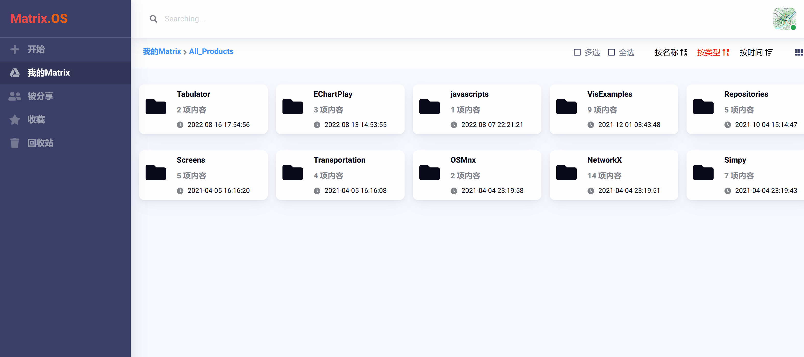
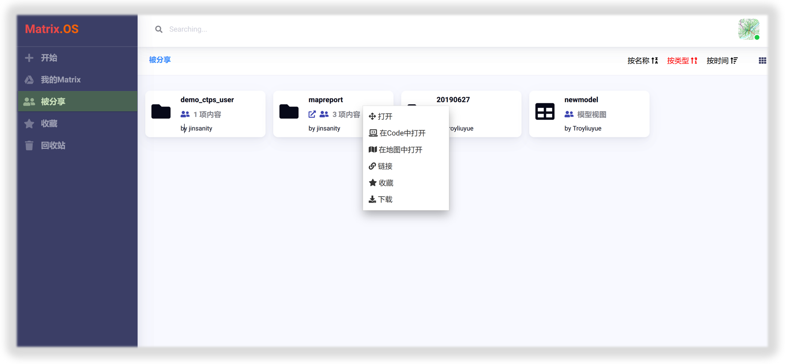
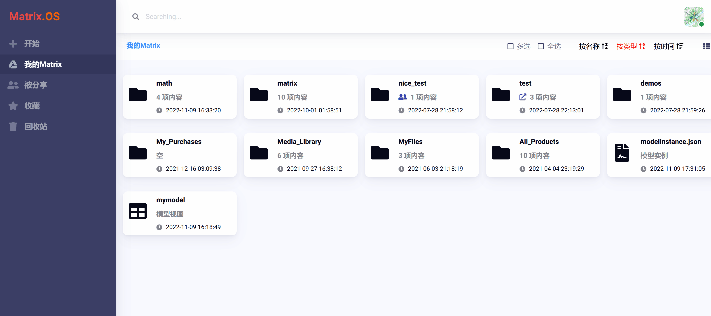
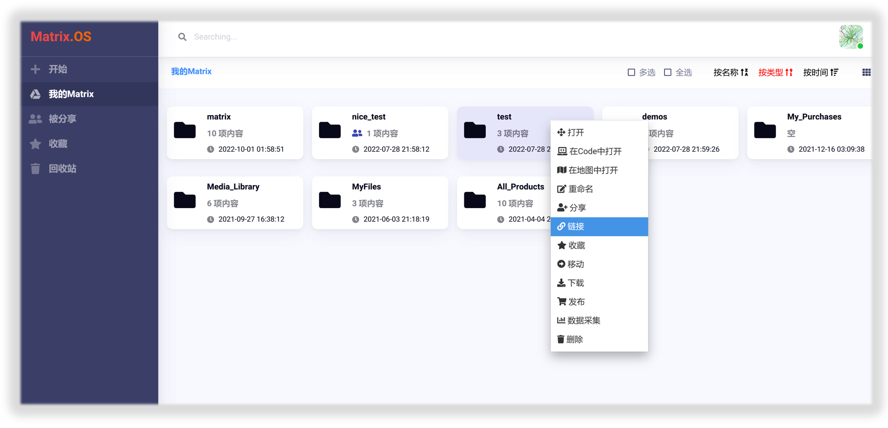
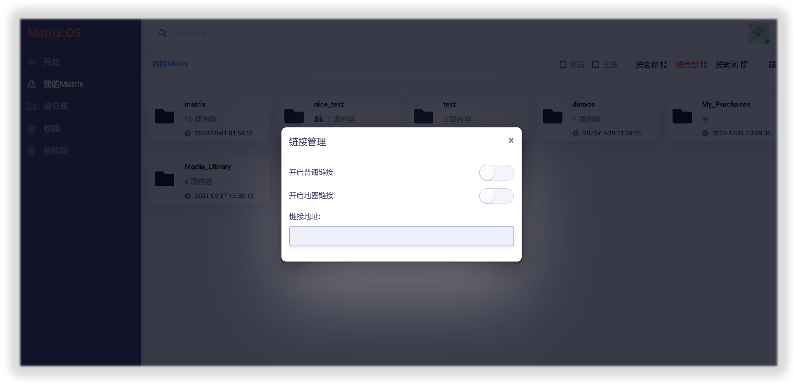
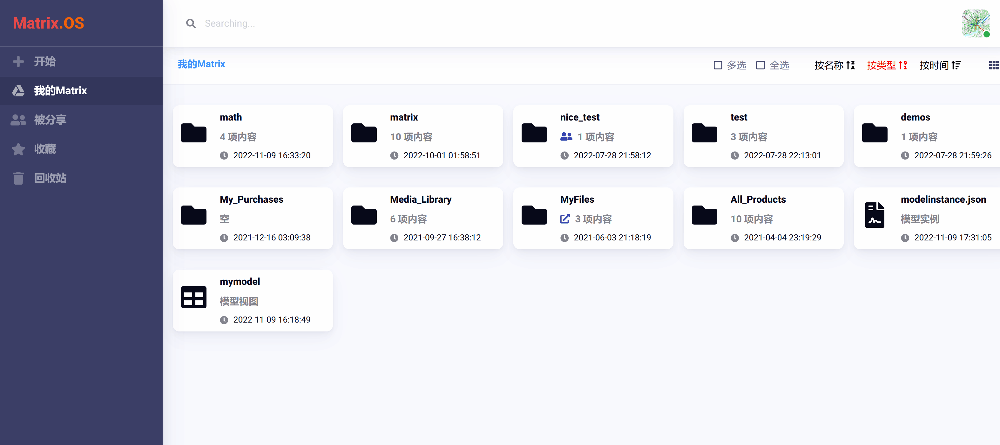
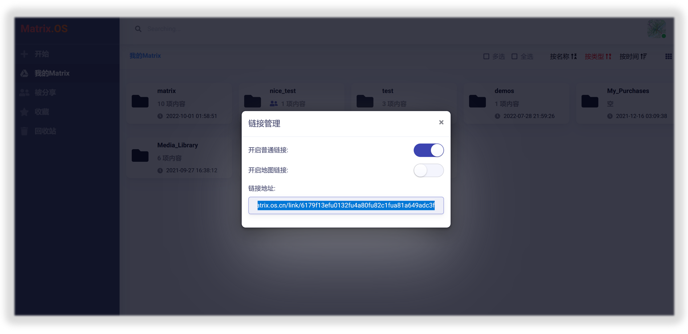
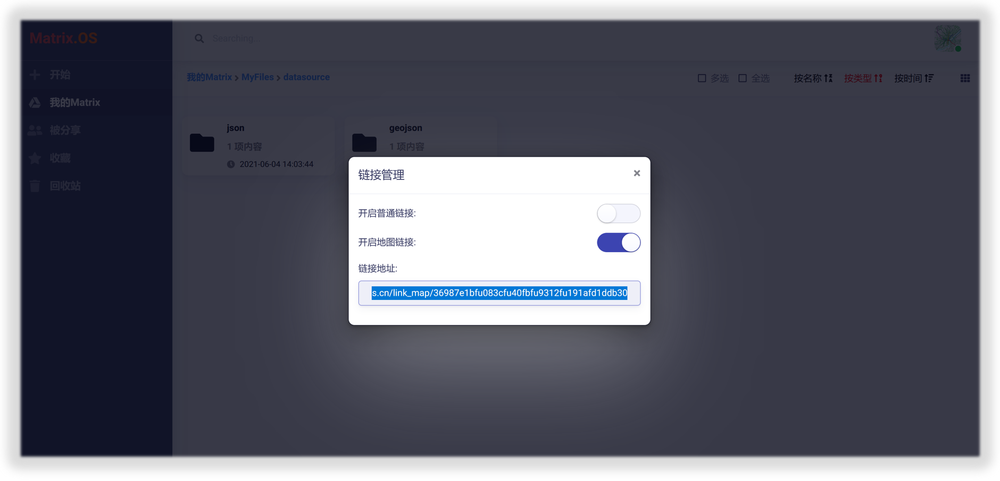
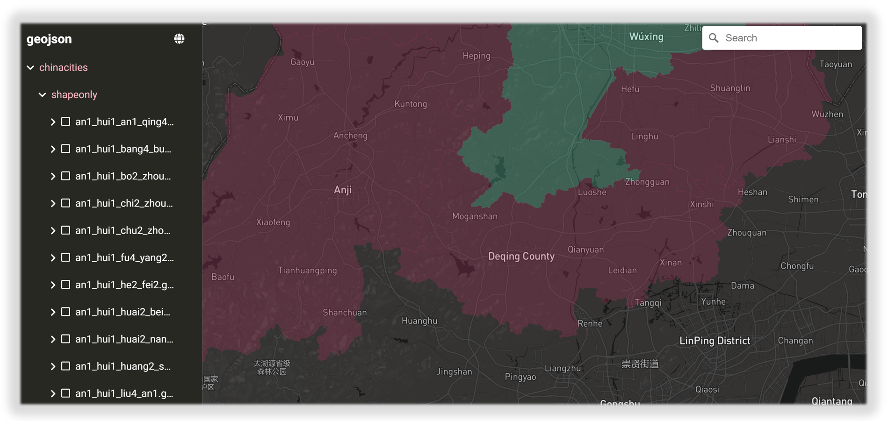

# 分享与链接

## 分享管理

您可以将Matrix.OS上的任何项目组件分享给伙伴或团队成员实现协同开发与交互，就像在云盘分享文件一样方便。右键点击项目组件在弹出菜单中选择`分享`，即打开"分享管理"对话框，如下图所示：

输入要分享的用户名，设置权限后，点击`添加`按钮，即可完成将用户添加到分享列表，如下图所示：

动图展示如下：

点击左侧导航栏中的`被分享`按钮，即可查看您参与和被分享的全部项目组件,并根据您被赋予的权限与其他工作伙伴协同工作，如下图所示：

## 链接管理

您也可以将Matrix.OS上的任何项目组件以链接形式公开分享给其它工作伙伴，收到分享链接的人不需要登录Matrix就可以查看分享组件。右键点击项目组件在弹出菜单中选择`链接`，即打开"链接管理"对话框，如下图所示：

动图展示如下：

### 普通链接分享

将"开启普通链接"右侧的滑块设置为"打开"状态，将生成的链接复制下来，发送给他人即可。被分享人通过链接可以从Matrix.OS的视角进入分享的组件，如下图所示：

### 地图链接分享

为了方便基于地理信息的组件应用分享与可视化，可将"开启地图链接"右侧的滑块设置为"打开"状态，将生成的链接复制下来，发送给他人即可。被分享人通过链接可以直接从地图视角进入分享的组件，如下图所示：

