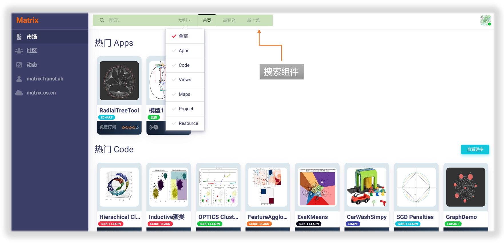
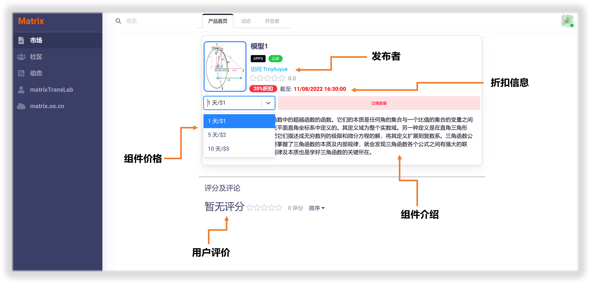
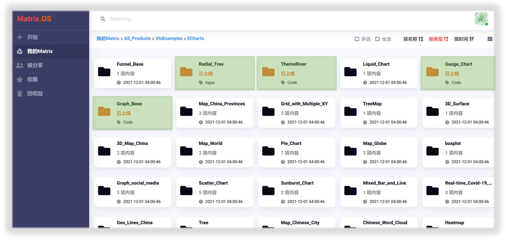
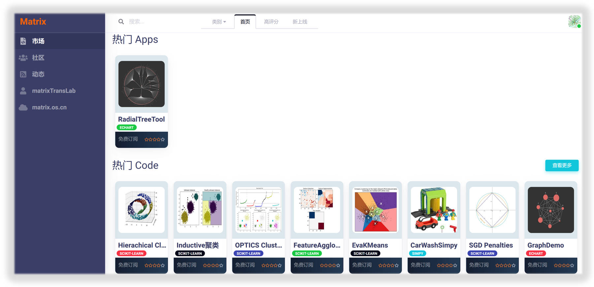
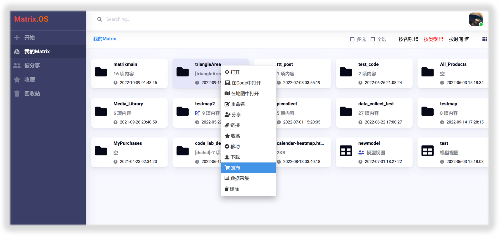

# 从开放平台订阅组件

您可以在Matrix开放平台订阅他人发布的组件，用以完成特定工作；或者定制、修改、重用、组合到自己开发的组件中实现高效的知识管理和团队协作。

进入Matrix开放平台"市场"页面，可以按类别、评分、和时间来检索组件，也可在页面左上角搜索栏输入关键字来搜索组件，如下图所示：

找到感兴趣的组件后，可以点击组件图标，进入组件主页，如下图所示：

## 开启发布

在Matrix.OS上，右键点击要发布的组件，选择`发布`，即开启组件发布流程，如下图所示：

## 基本信息设置

您可以通过弹出的"发布管理"对话框，完成发布基本信息设置，包括：