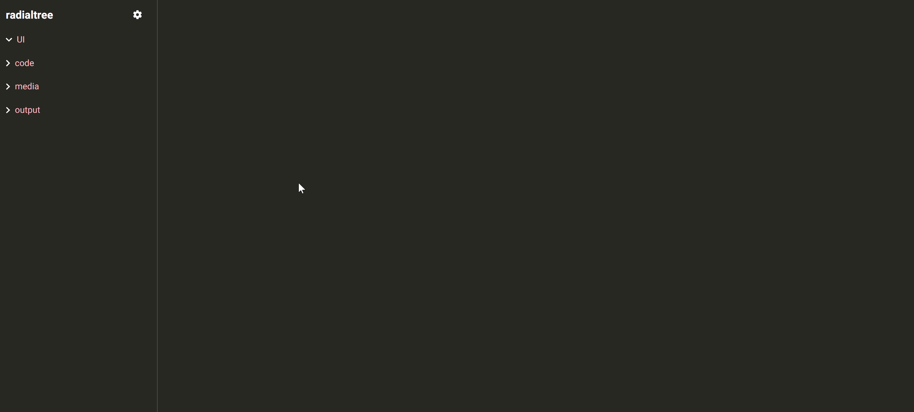
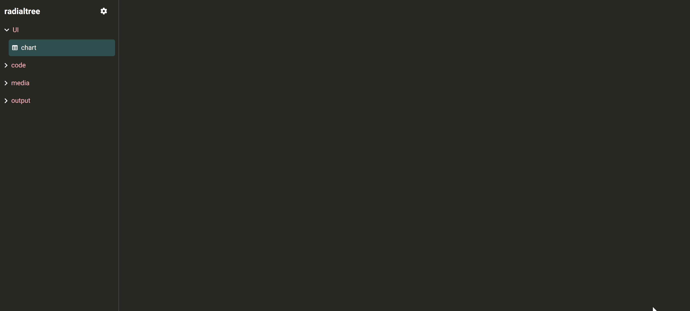
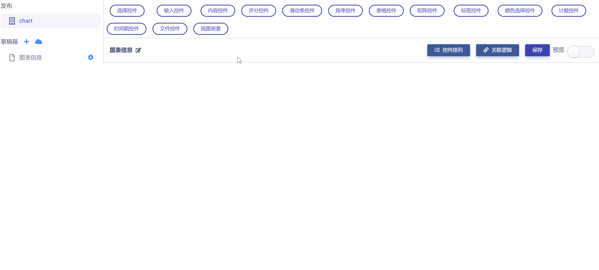
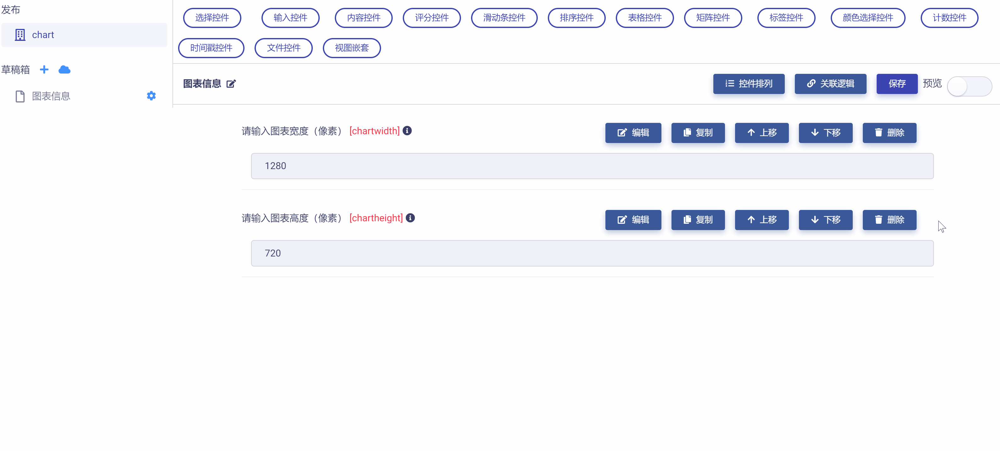
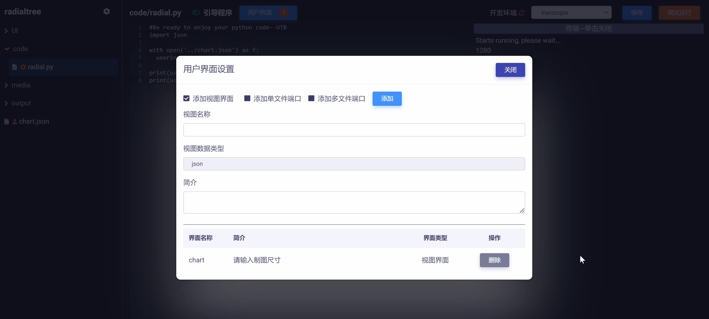
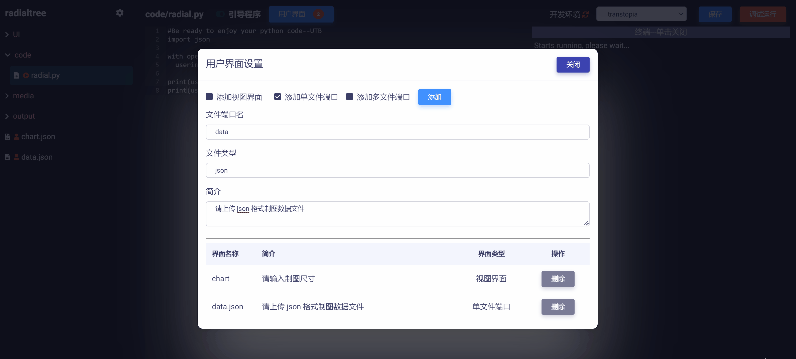

# 建立用户界面接口

用户界面接口是 Code 用来实现用户输入与应用引导程序交互的机制。主要包括两种类型：

* **模型视图接口**：用户使用一个或多个模型视图窗体与程序交互。
* **文件端口**：用户通过文件上传与程序交互。

在本例中，我们将同时使用以上两种接口类型。

## 模型视图接口

模型视图（Model-View）是 Matrix 用于实现数据标准化、前端 UI 设计、和交互接口功能的标准模型与可视化页面。关于模型视图的详细介绍和使用请参考教程《模型视图管理器》相关章节。

Code 支持开发者引入任意多个模型视图作为云应用前端来实现用户交互，并将每一个模型视图映射为独立的 json 接口文件 (显示在左侧导航栏中)，用于在代码中调用，如下图所示：


### 创建模型视图

在本例中，云应用根据用户输入的 "制图尺寸" 来自动绘制环状树图。为此，我们需要创建模型视图来作为用户的输入界面。具体步骤如下：

1）右键点击 `UI` 文件夹，选择创建 `模型视图`，将其命名为 "chart"，如下图所示：



2）打开 "chart"，创建一个视图页面草稿，取名为 "图表信息"，如下图所示：



3）在 "图表信息" 视图页面添加两个`整数输入控件`，分别对控件做以下设置：

* 控件ID："chartwidth"，控件文本："输入图表宽度（像素）" ，默认值： `1280`。
* 控件ID："chartheight"，控件文本："输入图表高度（像素）" ，默认值： `720`。

如下图所示：



注意：以上设置的控件 ID 将会在后面使用代码调用模型视图接口时用到。

4）保存视图草稿，然后将其`添加到发布`。然后进入`发布区`，在视图列表中，将 "图表信息" 视图 ID 设置为 "chartinfo" 并保存，如下图所示：



### 连接模型视图

完成模型视图的创建与编辑，我们返回 Code，现在要添加一个模型视图接口，用来连接 `UI`文件夹下刚刚编辑好的模型视图 "chart"，将它作为云应用的前端输入界面。 

1）点击  按钮，即打开`用户界面设置`对话框，如下图所示：


2）选中  复选框，需要设置：

* `视图名称`：所添加的模型视图接口文件名（也即模型视图对应的 json 格式数据节点树文件名）。
* `简介`：向用户介绍如何使用该视图界面的辅助性信息文字。

在这里，我们将视图接口名称设置为 "chart" (可以设置为任意名称)，将简介设置为 "请输入制图尺寸"，如下图所示：


3）点击  按钮，在对话框中选择要连接的模型视图 "chart"，点击  按钮，即可完成模型视图接口连接（出现在对话框下方列表中），如下图所示：


4）关闭对话框，可以发现在 Code 左侧导航栏出现一个新文件 "chart.json"，这个文件就是模型视图 "chart" 映射到 Code 中的接口文件 (带有  标记)，如下图所示：


5）点击  按钮，打开用户输入模块，可以测试模型视图接口文件内容，如下图所示：


可以发现，用户使用模型视图输入信息后，会更新到接口文件 "chart.json" 中，结构如下图所示：


### 调用模型视图接口

有了接口文件，我们可以非常方便地在代码中调用它来获取用户输入。

在 "radial.py" 中输入以下 python 代码，保存后调试运行。

```python
import json

with open('../chart.json') as f:  # 读取模型视图接口文件 chart.json（注意使用相对路径）
  userinput = json.load(f)        
  
print(userinput['chartinfo']['chartwidth'])   # 解析获取用户输入的制图宽度并打印
print(userinput['chartinfo']['chartheight'])  # 解析获取用户输入的制图高度并打印
```

以上代码读取模型视图接口文件 "chart.json"，将读取信息赋予 userinput 字符串。然后解析 userinput，获取模型视图中每个控件所对应的节点数据（也就是制图的宽与高），并打印出来。如下图示例：


以上我们展示了建立、连接、调用模型视图接口的方法。照此方法，开发者可以根据实际需要在 Code 中操作多个模型视图，实现更为复杂的功能。更多例子请参考：《[Matrix 玩法与案例应用：开发实践](zh-cn/demo/gallery.md)》。

## 文件端口

在本例中，云应用还允许用户自行上传数据文件，并根据用户数据来绘制环状树图。为此，我们还需要在应用中添加文件端口来实现这一功能。具体步骤如下：

### 创建文件端口

1）在`用户界面设置`对话框中，选中  复选框，需要设置：

* `文件端口名`：所添加的文件端口名（用于在代码中调用）。
* `文件类型`：限定用户上传文件的类型（文件扩展名，如 csv）。
* `简介`：向用户介绍上传文件的辅助性信息文字。

在这里，我们将文件端口名设置为 "data" (可以设置为任意名称)，文件类型设置为 "json"，简介设置为 "请上传 json 格式制图数据文件"。点击  按钮，即可完成文件端口创建（出现在对话框下方列表中），如下图所示：



2）关闭对话框，可以发现在 Code 左侧导航栏出现一个新文件 "data.json"，这就是刚刚创建的文件端口 (带有  标记)，如下图所示：



### 调用文件端口

建立好文件端口，我们可以非常方便地在代码中调用它来获取用户上传的文件。

将 "radial.py" 更新为以下代码并保存。

```python
import json

with open('../chart.json') as f:  # 读取模型视图接口文件 chart.json（注意使用相对路径）
  userinput = json.load(f)        
  
print(userinput['chartinfo']['chartwidth'])   # 解析获取用户输入的制图宽度并打印
print(userinput['chartinfo']['chartheight'])  # 解析获取用户输入的制图高度并打印

with open("../data.json", "r", encoding="utf-8") as f:  # 读取文件端口 data.json（注意使用相对路径）
    userdata = json.load(f)
  
print(userdata)   # 获取文件端口中的用户上传数据文件并打印
```

以上代码在之前基础上，增加了读取文件端口 "data.json" 功能，将读取的用户数据文件赋予 userdata 字符串，并在用户终端打印出来。

点击  按钮，打开用户输入模块，可以发现新增添的文件输入项。我们使用云桌面上的 "flare.json" 数据，测试运行如下图所示：


## 删除用户界面接口

注意：`用户界面设置`对话框下方列表展示了全部添加的用户界面接口，包含接口的文件名称、简介信息、界面类型等。

在`用户界面设置`对话框下方列表中找到要删除的模型视图接口，在操作栏点击  按钮，即可删除该模型视图接口，其映射的 json 接口文件也相应的从左侧导航栏移除，如下图所示：

