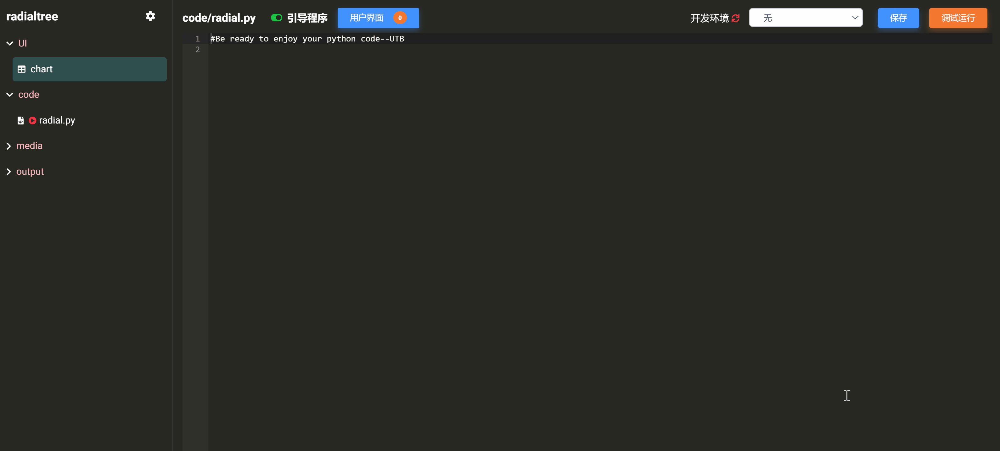

# 用户界面接口

用户界面接口是指用来实现用户输入与应用引导程序交互的机制。

Code 提供以下两种用户界面接口类型：

* **模型视图接口**：用户使用一个或多个模型视图窗体与程序交互。
* **文件接口**：用户通过文件上传与程序交互。

## 模型视图接口

模型视图（Model-View）是 Matrix 用于实现数据标准化、前端 UI 设计、和交互接口功能的标准模型与可视化页面。关于模型视图的详细介绍和使用请参考教程《模型视图管理器》相关章节。

Code 支持开发者引入任意多个模型视图作为云应用前端来实现用户交互，并将每一个模型视图映射为独立的 json 接口文件 (显示在左侧导航栏中)，用于在代码中调用，如下图所示：


下面，我们将使用一些简单例子来展示添加和调用模型视图接口的方法与过程。

### 添加模型视图接口

在例子中，我们将添加一个模型视图接口，用来连接云 OS 上的一个名为 "demo" 的简单模型视图 (见下图)，该视图接收用户输入的个人信息。


点击  按钮，即打开`用户界面设置`对话框，如下图所示：



选中  复选框，需要设置：

* `视图名称`：所添加的模型视图接口文件名（也即模型视图对应的 json 格式数据节点树文件名）。
* `简介`：向用户介绍如何使用该视图界面的辅助性信息文字。

我们将视图名称设置为 "person"，将简介设置为 "请输入个人信息"，如下图所示：


点击  按钮，在云桌面 OS 上选择要连接的模型视图 "demo"，点击  按钮，即可完成模型视图接口的添加（出现在对话框下方列表中），如下图所示：


关闭对话框，可以发现在 Code 左侧导航栏出现一个新文件 "person.json"，这个文件就是模型视图 "demo" 映射到 Code 中的接口文件 (带有  标记)，如下图所示：


### 调用模型视图接口

有了接口文件，我们可以非常方便地在代码中调用它来获取用户对模型视图的操作与输入。

点击  按钮，打开用户输入模块，可以测试模型视图输入与接口文件的反馈，如下图示例：


可以发现，用户使用模型视图输入个人信息后，信息会更新到接口文件 "person.json" 中，结构如下图所示：


在引导程序 "demo.py" 中输入以下 python 代码，保存后调试运行。

```python
import json

with open('person.json') as f:
  data = json.load(f)
  
print(data['personinfo']['name'])
print(data['personinfo']['age'])
print(data['personinfo']['height'])
```
以上代码读取接口文件 "person.json"，将文件信息赋予 data 字符串。然后，分级解析 data，获取模型视图中每个控件所对应的节点数据并打印出来，包括：姓名、年龄和身高。如下图示例：


通过以上简单例子，我们展示了模型视图接口的添加、设置和调用。使用该方法，开发者可以在代码中获取用户对多个模型视图的操作，实现更为复杂的功能。更多例子请参考：《[Matrix 玩法与案例应用：开发实践](zh-cn/demo/gallery.md)》

## 文件接口

开发者需要选择设置一个引导程序（主程序）文件来驱动所有的代码和资源。当然如果开发者只是以开源代码为目的的发布，则无需设置引导程序文件。


## 删除用户界面接口

注意：`用户界面设置`对话框下方列表展示了全部添加的用户界面接口，包含接口的文件名称、简介信息、界面类型等。

在`用户界面设置`对话框下方列表中找到要删除的模型视图接口，在操作栏点击  按钮，即可删除该模型视图接口，其映射的 json 接口文件也相应的从左侧导航栏移除，如下图所示：

