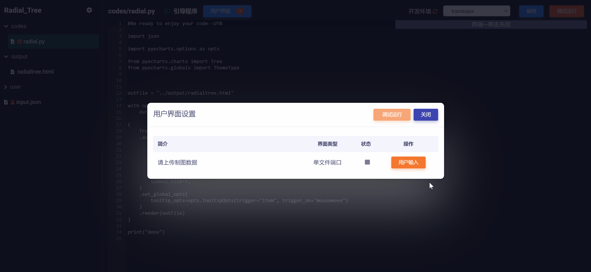
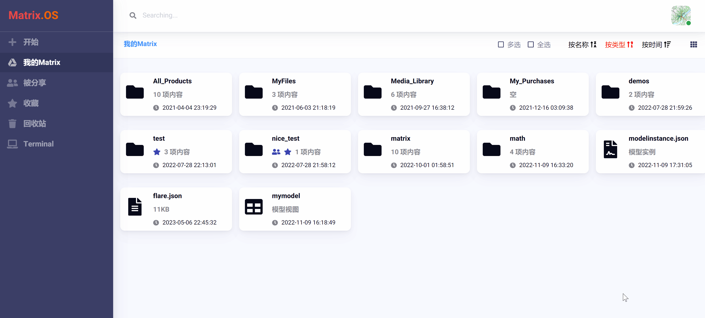
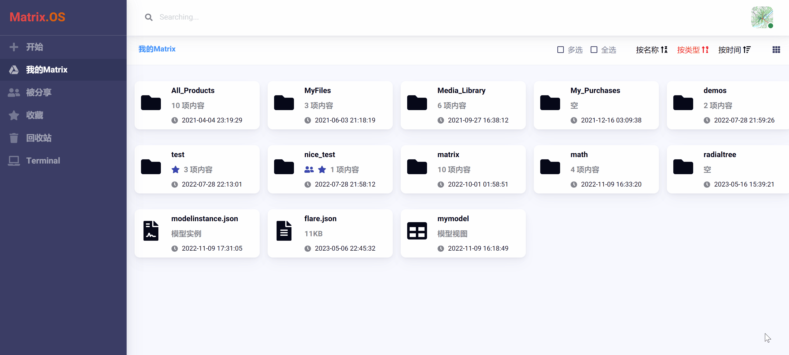
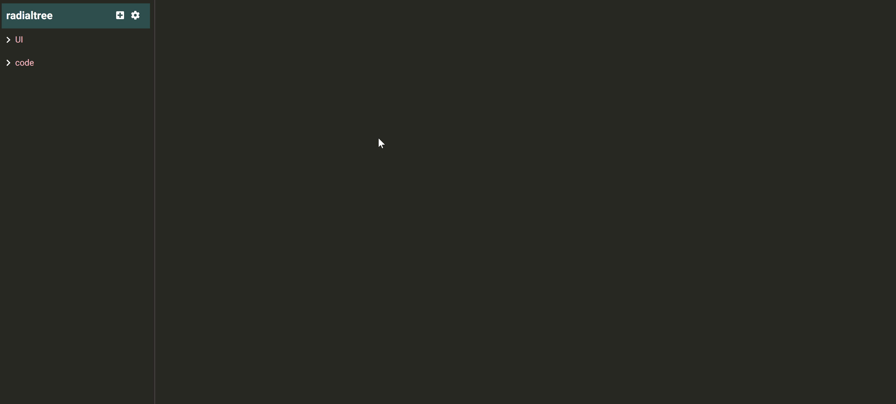
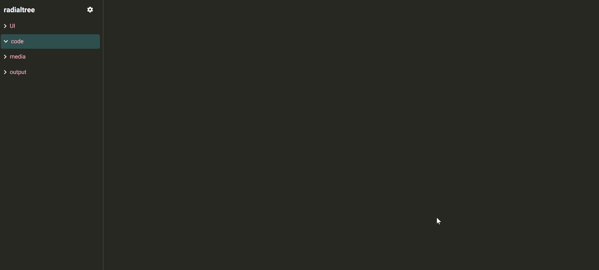

# 云应用开发起步

云应用（App）是指专门解决某类问题或者提供某种功能的程序、微服务、工具、算法模块等（见下图示例），具备一定的用户交互功能（比如接收用户输入信息或者上传文件等）并生成满足用户需求的运行结果。

本教程以`你的第一个云应用：环状树图制作工具`为例，帮助 Matrix 开发者快速上手云应用开发全过程。该应用可以根据用户上传的数据文件和输入信息使用 pyecharts 一键定制生成环状树图，如下图所示：

更多云应用开发案例请参考：《[Matrix 玩法与案例应用：开发实践](zh-cn/demo/gallery.md)》

## 新建应用

在云桌面上，点击左侧导航栏  按钮下的  (或右键单击云桌面空白处选择)，在弹出对话框中输入 "radialtree" （也就是应用的名称），点击  按钮，即可在 OS 当前路径下创建一个空白组件文件夹，如下图所示：

## 打开应用

右键点击 "radialtree" 组件，在弹出菜单中选择 ，即可在 Code 中打开组件，如下图所示：

## 创建组件文件夹

云应用一般由多个代码文件、多级模型视图以及资源文件通过 Code 组装编译而成。因此，可以创建不同文件夹来分别管理代码文件、前端模型视图、资源文件、以及输出结果等。在本例中，我们依次在 Code 中创建以下四个组件文件夹：

* `code` 文件夹：用来存放和管理代码文件
* `UI` 文件夹：用来存放和管理应用所需的前端模型视图
* `media` 文件夹：用来存放和管理应用中涉及的各种媒体素材资源
* `output` 文件夹：用来存放和管理应用输出结果

创建过程如下图展示：

## 导入或创建代码文件

如果代码已经在本地端写好，可以直接导入上传到 Code 中。当然，也可以创建代码文件并编码。在本例中，我们在 `code` 文件夹内新建一个 python 代码文件 "radial.py"，如下图所示：

到目前为止，我们完成了一个简单云应用的基本结构搭建，下面将详细介绍云应用开发的后续关键步骤，包括：引导程序设置、用户界面接口、输出设置等。