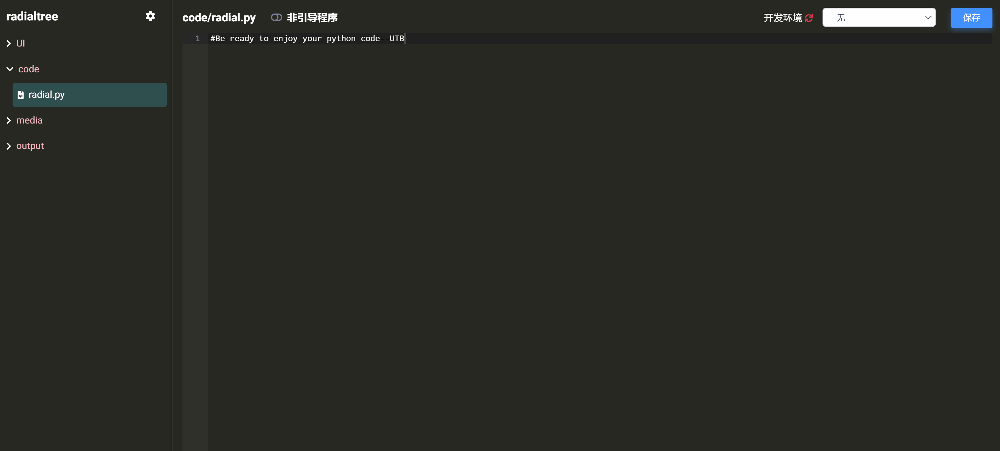
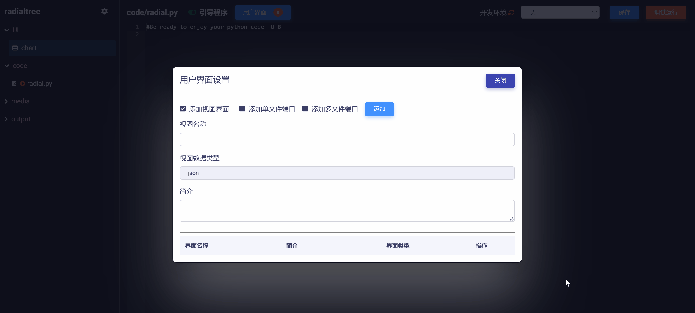

# 使用 Code 开发云应用

## 概要

云应用（App）是指专门解决某类问题或者提供某种功能的程序、微服务、工具、算法模块等（见下图示例），具备一定的用户交互功能（比如接收用户输入信息或者上传文件等）并据此生成运行结果。

使用 Code 开发云应用的关键在于通过用户界面接口来实现用户输入与后端代码的交互。下面将详细介绍建立不同类型用户界面接口并在代码中调用的过程。为了方便展示，将使用一些简单的例子来说明。

更多云应用开发案例请参考：《[Matrix 案例库：开发教学](zh-cn/demo/gallery.md)》

## 设置应用引导程序

云应用一般由多个代码文件、多级模型视图以及资源文件通过 Code 组装编译而成。开发者首先需要设置引导程序（main 程序）文件来驱动代码和用户界面接口。

### 激活引导程序设置

点击 Code 左侧导航栏上方的  图标，点击选中`存在引导程序`选项，这将激活 Code 中的引导程序设置功能，如下图所示：

### 指定引导程序文件

选中作为云应用引导程序的文件，拖动屏幕上方引导程序设置滑块，即可将选中的代码文件设置为引导程序（文件名前显示  标记），同时也激活了用户界面接口设置按钮 ，如下图所示：

## 设置用户界面接口

Code 提供以下两种用户界面接口类型：

* **模型视图接口**：实现用户对一个或多个模型视图窗体的输入及其与引导程序的交互。
* **文件接口**：实现一个或多个用户上传文件与引导程序的交互。

### 模型视图接口

模型视图（Model-View）是 Matrix 用于实现数据标准化、前端UI设计、和交互接口功能的标准模型与可视化页面。关于模型视图的详细介绍和使用请参考教程《模型视图管理器》相关章节。

Code 支持开发者引入任意多个模型视图来实现用户交互，并将每一个模型视图映射为 json 接口文件，用于在代码中调用。

**添加模型视图接口**

在下面例子中，我们将添加一个模型视图接口，用来对接一个简单的模型视图，该视图接收用户输入的个人信息。

点击  按钮，即打开用户界面接口设置对话框，如下图所示：

首先，选中`添加视图界面`复选框，需要设置：

* `视图名称`：所添加视图界面映射的 json 格式接口文件名（也即数据节点树文件名）。
* `简介`：向用户介绍如何使用该视图界面的辅助性信息文字。

在例子中，我们将视图名称设置为"person"，将简介设置为"请输入个人信息"，如下图所示：

然后，点击  按钮，在云桌面 OS 上选择要连接的模型视图（名为 "demo"），点击  按钮，即可完成模型视图接口的添加（可在对话框下方列表中找到），如下图所示：

### 文件接口

开发者需要选择设置一个引导程序（主程序）文件来驱动所有的代码和资源。当然如果开发者只是以开源代码为目的的发布，则无需设置引导程序文件。

关于终端的详细使用方法可参考:

《[使用网络终端](zh-cn/userguide/os/tools/terminals/webt.md)》
《[使用本地终端](zh-cn/userguide/os/tools/terminals/localt.md)》
《[使用Remote SSH](zh-cn/userguide/os/tools/terminals/remotessh.md)》