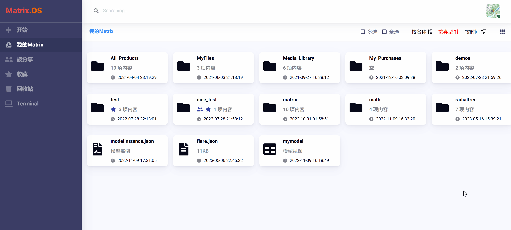

# (四) 功能实现与结果输出

在上一节教程中，我们完成了云应用的用户界面接口设置，实现了云应用接收用户输入信息和上传文件等功能。

本节教程将展示如何把接收的用户输入和文件上传在代码中集成，使用 pyecharts 实现云应用的主体绘图功能，并介绍如何设置云应用的结果输出以及如何查看运行结果。

在 Code 中选中 "radial.py"，将其更新为以下代码：

```python
import json

import pyecharts.options as opts
from pyecharts.charts import Tree
from pyecharts.globals import ThemeType

# 设置绘图结果输出为 "result.html" 保存到左侧导航栏 "output" 文件夹下 (输出路径可以由开发者任意指定)
outFile = "../output/result.html"

with open('../chart.json') as f:  # 读取模型视图接口文件 chart.json（注意使用相对路径）
  userinput = json.load(f)        
  
width = userinput['chartinfo']['chartwidth']   # 解析获取用户输入的制图宽度并赋给变量 width
height = userinput['chartinfo']['chartheight']  # 解析获取用户输入的制图高度并赋给变量 height

with open("../data.json", "r", encoding="utf-8") as f:  # 读取文件端口 data.json（注意使用相对路径）
    userdata = json.load(f)
(
    # 绘图使用了用户输入的 width 和 height 信息
    Tree(init_opts=opts.InitOpts(theme = ThemeType.DARK, width = width + "px", height = height + "px"))
    .add(
        series_name = "",
        data = [userdata],  # 用户上传数据文件被绘图调用
        pos_top = "18%",
        pos_bottom = "14%",
        layout = "radial",
        symbol = "emptyCircle",
        symbol_size = 7,
    )
    .set_global_opts(
        tooltip_opts=opts.TooltipOpts(trigger = "item", trigger_on = "mousemove")
    )
    .render(outFile)    # render输出绘图结果
)

# 提示用户程序运行结束，告知结果查看路径。
print("绘图完成，结果可在左侧导航栏 output 文件夹下查看。")
```

与之前的代码相比，以上代码调用了 pyecharts 开发包进行绘图，在绘图函数中则使用了用户界面接口传递的参数 "width"、"height"、和 "userdata"。其中，"width" 和 "height" 是从模型视图接口获取，"userdata" 则是从文件端口获取。

这样一来，对于用户输入的任何绘图尺寸和绘图数据，云应用都能生成满足用户需求的绘图结果，云应用的主体功能就实现了。

此外，从上面代码中可以注意到，我们使用了以下语句将绘图结果保存为一个名为 "result.html" 的文件并保存到左侧导航栏的 "output" 文件夹下。

```python
outFile = "../output/result.html"
```

所以，Code 对于云应用的结果输出格式并没有严格统一范式，开发者可以根据实际需要在代码中指定结果输出文件的类型和路径 (使用相对路径最为方便)，供用户在云桌面 OS 查看与下载。当然，也可以把运行结果直接 print 到右侧的终端窗口。

为了提升用户体验，开发者也可在代码的不同位置 print 提示性信息显示在右侧用户终端，提醒用户应用状态和查看结果，比如本例在代码最后加了以下提示性语句：

```python
print("绘图完成，结果可在左侧导航栏 output 文件夹下查看。")
```

下图展示了云应用的整体调试运行效果：


除了在 Code 左侧导航栏中查看结果，用户也可在云桌面 OS 的云应用文件夹下找到并查看运行结果。在本例中，我们可以在云桌面的 "我的Matrix/radialtree/output/" 下找到运行结果并点击查看，如下图所示：



在前面几节教程中，我们通过一个例子完整地展示了云应用的开发过程。您可以参照我们提供的例子来上手开发自己的云应用，将知识和技能工具化模块化，惠及更多用户。

更多云应用开发案例请参考：《[Matrix 玩法与案例应用：开发实践](zh-cn/demo/gallery.md)》。