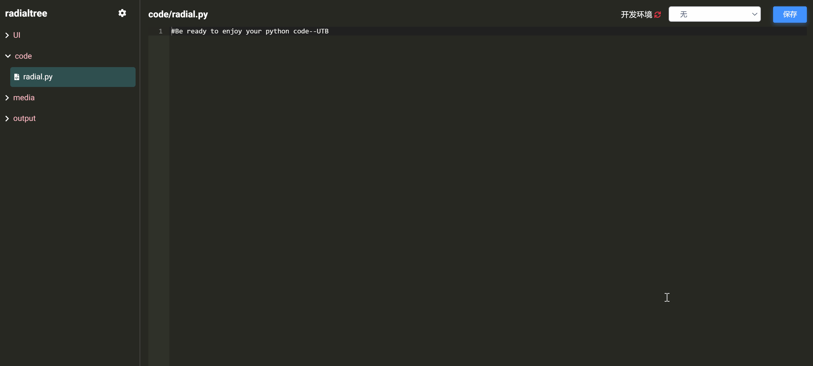
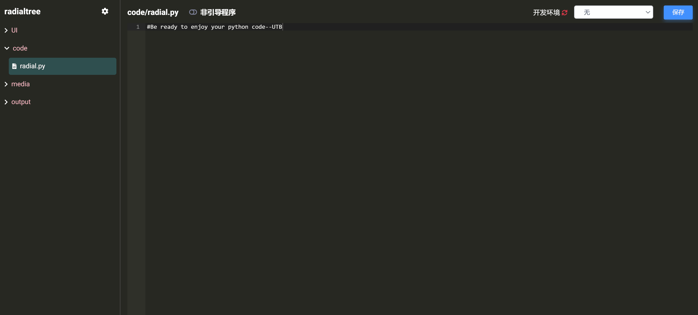

# 设置云应用引导程序

如前文所述，云应用由多个代码文件、多级模型视图以及资源文件通过 Code 组装编译而成。

我们首先需要设置 **引导程序（main 程序）文件** 来驱动各种程序组件 (如：代码、用户界面接口、输出模块)。具体分为以下两步：

## 激活引导程序设置

点击 Code 左侧导航栏上方的  图标，点击选中  复选框，这将激活应用的引导程序设置功能，如下图所示：

## 指定引导程序文件

点击选中 "radial.py" 代码文件，拖动激活  滑块，即可将该文件设置为引导程序（文件名前显示  标记），同时也激活了用户界面接口设置按钮 ，如下图所示：

