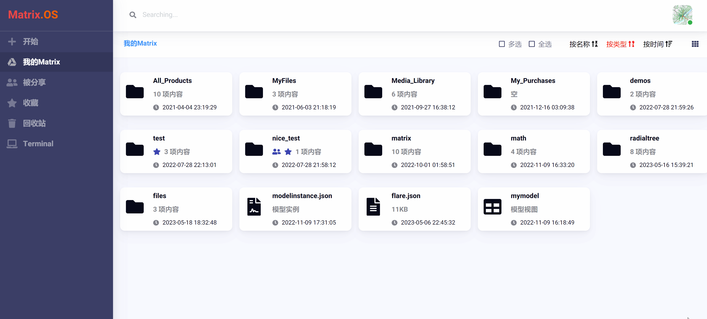
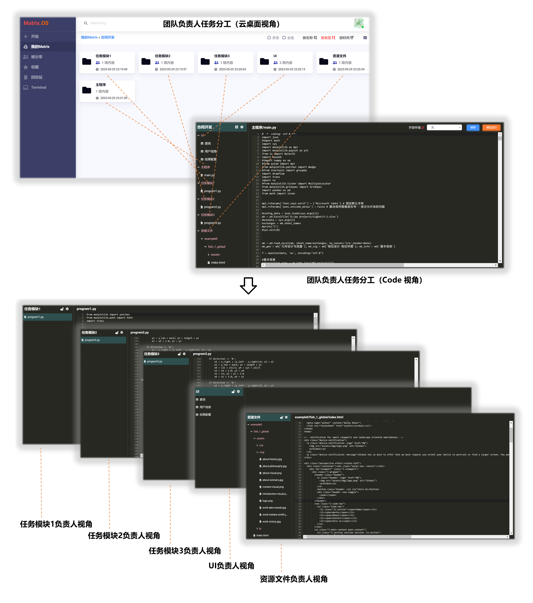
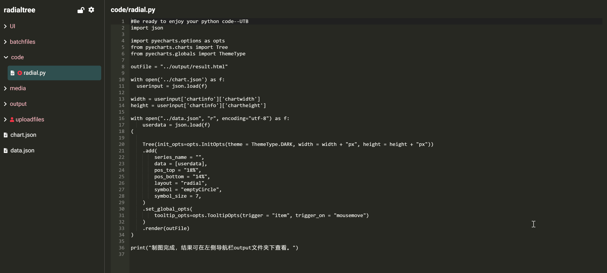

# 协同开发

您可以将开发的云应用或代码库分享给伙伴或团队成员。在 Matrix.OS，由于 Code 只是云组件的一种打开方式和应用视角，因此只要在云桌面对组件进行分享，就可以实现多人使用 Code 协同开发组件了。

## 分享 Code

在云桌面，右键点击要分享的组件文件夹，在弹出菜单中选择 ，即打开`分享管理`对话框。

输入要分享的用户名，设置权限后，点击  按钮，即可完成将用户添加到分享列表。

分享成功后，被分享的组件上则会显示  图标。如下图所示：

这时，您只需要把分享的组件文件夹  就可以和伙伴一起使用 Code 编辑开发组件了。

## 分工协作

基于分享功能，多个团队成员可以使用 Code 协同完成开发工作，具体通过以下步骤实现：

- 团队负责人将开发任务分解，在云桌面项目文件夹内创建相应的任务子文件夹。

- 将任务子文件夹分享给不同的团队成员，这样每个团队成员都可以在各自云桌面用 Code 打开被分配的任务子文件夹进行开发工作而不互相干扰。

- 团队负责人使用 "管理员权限" 在 Code 中随时查看每项任务的工作进度并进行整合与调试。

举例说明，下图展示了团队负责人将开发工作分解为三个任务模块，分别分享给三个团队成员负责，以及不同团队成员在各自云桌面 Code 中的任务分解视角。

## 管理员权限

在协同开发时，为了避免多人整合调试可能导致的数据错误，Code 提供了 "管理员权限锁定" 功能。

组件在 Code 中被管理员锁定后，其他成员对该组件仅有`只读`权限，直到锁定的权限被释放。

点击 Code 导航栏顶部  或  图标，可以锁定或释放管理员权限 (可以发现锁定前后的变化)，如下图所示：

