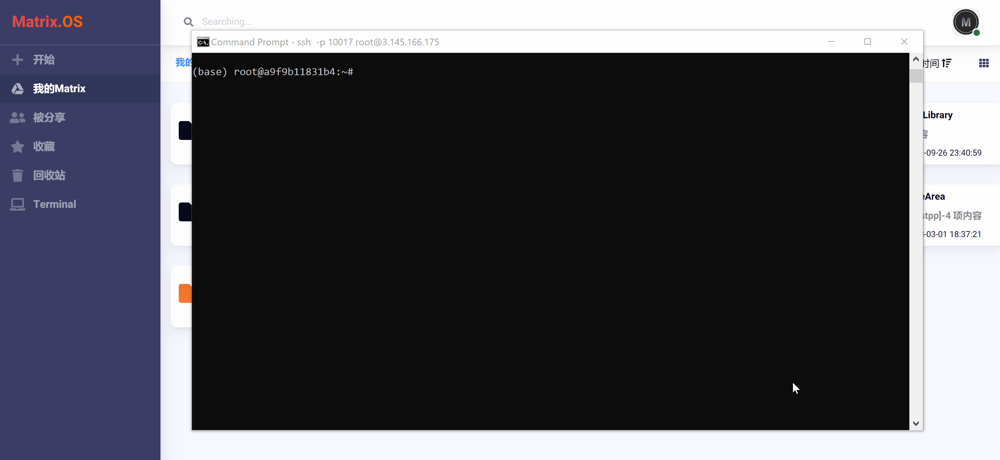
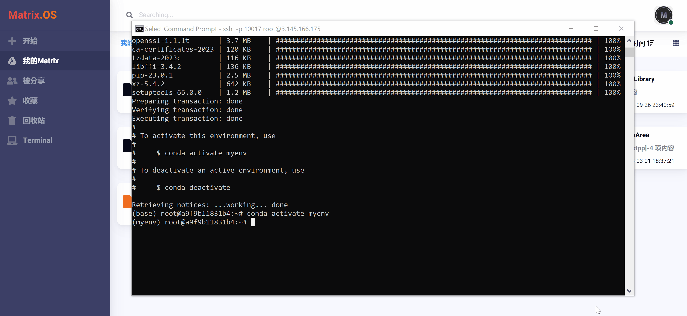

# Matrix Code 开发环境配置

您可以使用终端来完成 Code 开发环境的创建、删除、安装、配置、升级、维护等一系列操作。

关于终端的详细使用方法可参考:

《[使用网络终端](zh-cn/userguide/os/tools/terminals/webt.md)》
《[使用本地终端](zh-cn/userguide/os/tools/terminals/localt.md)》
《[使用Remote SSH](zh-cn/userguide/os/tools/terminals/remotessh.md)》

本教程简要展示使用本地终端，通过 Conda 对开发环境进行管理与配置的常用操作。

Conda 是一个开源跨平台的包管理、环境管理工具，起初专为 Python 开发而设计，目前适用于 Python、R、Lua、Scala、Java、JavaScript、C/C++、FORTRAN 等多种开发语言。使用 Conda 可以轻松创建、保存、加载和切换开发环境，并快速安装、运行和更新包及其依赖项。

官方 Conda 使用文档详见：《[Conda User Guide](https://conda.io/projects/conda/en/latest/user-guide/index.html)》

使用 Conda 来管理配置开发环境详见：《[Conda Managing Environments](https://conda.io/projects/conda/en/latest/user-guide/getting-started.html#managing-environments)》

使用 Conda 来管理配置安装包详见：《[Conda Managing Packages](https://conda.io/projects/conda/en/latest/user-guide/getting-started.html#managing-packages)》

## Conda 管理

### 确认 Conda 安装和版本

使用以下命令确认 Conda 安装和版本信息，如下图所示：

```
conda --version
```


### 更新 Conda 版本

使用以下命令更新 Conda 安装和版本，如下图所示：

```
conda update conda
```


### 回退 Conda 版本

使用以下命令可以将 Conda 回退到指定版本：

```
conda install -n root conda=<版本号> 
```

## 开发环境管理

### 默认开发环境

每一用户都会被自动分配一个默认的开发环境名为"base"，使用本地终端通过SSH连接到 Matrix 后，会自动进入默认开发环境，如下图所示：


### 列出可用开发环境

使用以下命令查看所有已经创建的开发环境，如下图所示：

```
conda env list
```



### 创建开发环境

以下命令创建了一个 python 3.9 的开发环境，如下图所示：

```
conda create --name <环境名> python=3.9
```


### 激活开发环境

使用以下命令可以激活开发环境，如下图所示：

```
conda activate <环境名>
```


### 在 Code 中选择开发环境

点击 Code 右上角`开发环境`下拉式菜单，可以选择开发环境（如：python、java、C、R、Matlab等），如下图所示：


### 其它常用环境管理命令

* 删除开发环境及环境内所有包：```conda remove -n <环境名> -all```
* 设置默认开发环境：```set default env```
* 用配置文件创建新的虚拟环境：```conda env create -f environment.yaml```

## 安装包管理

### 列出全部安装包

使用以下命令可以列出当前开发环境所有安装包，如下图所示：

```
conda list
```



### 安装包

使用以下命令在当前开发环境安装开发包：

```
conda install <安装包名称>
```

下图展示了使用 conda install 安装 matplotlib 包：


### 其它常用包管理命令

* 搜索包：```conda search --full-name <包名称>```
* 安装 requests 包: ```conda install requests```
* 卸载包：```conda remove <包名称>```
* 导出当前环境的包信息：```conda env export > environment.yaml```