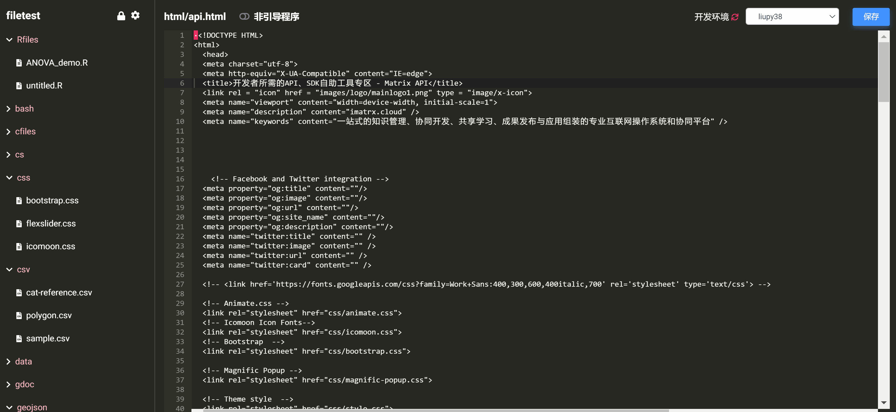
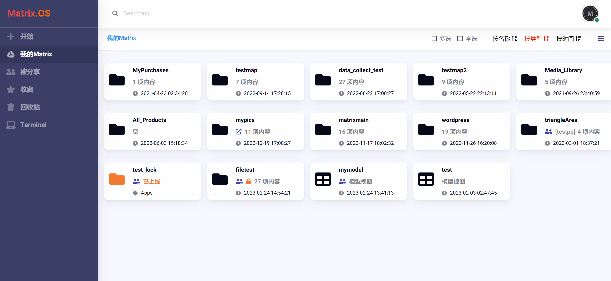
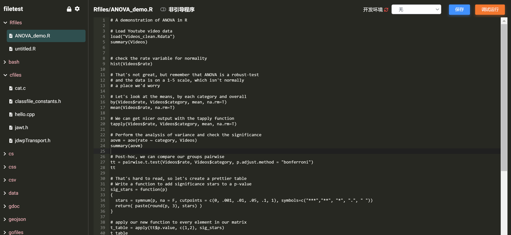
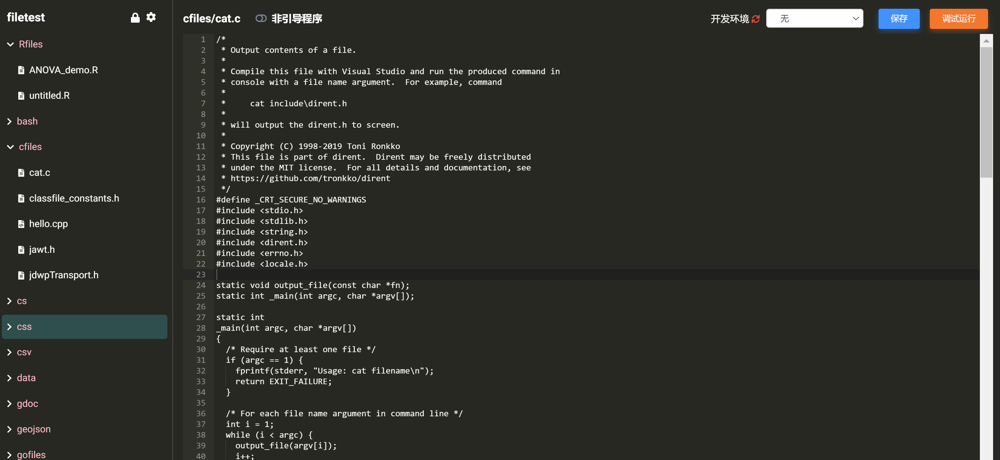
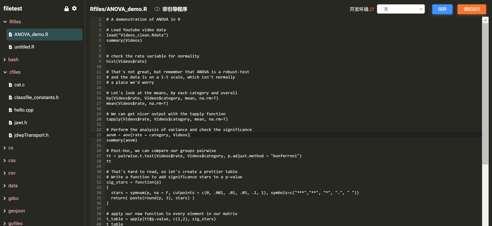
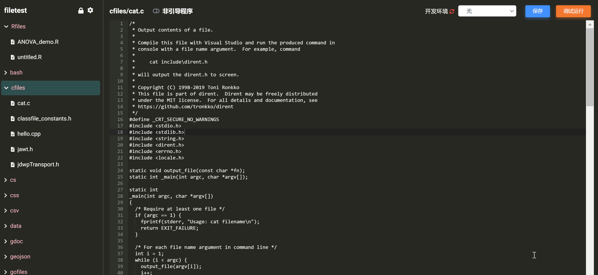
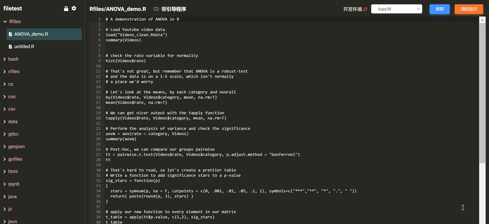
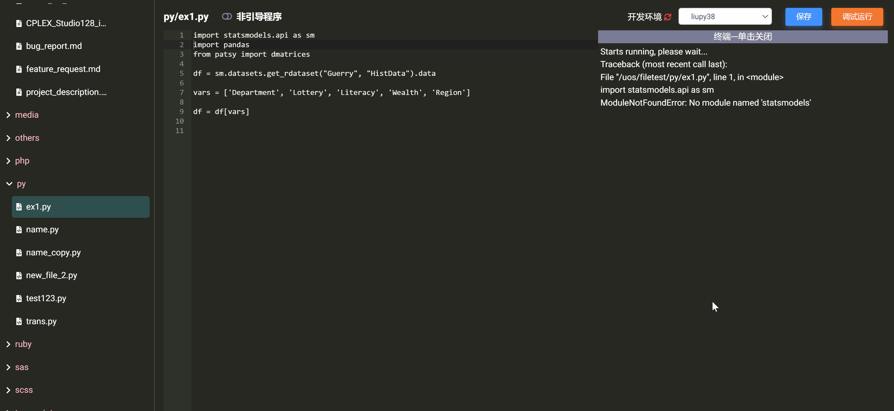

# Matrix Code 概览与基本操作

Code 是内生于 Matrix.OS 的轻型云端集成开发工具，它可以用于打开和编码任何 Matrix.OS 组件内容（例如代码、数据、地图、模型、项目、资源、素材等等），实现云端组件组装，开发发布云端应用程序等。如下图所示：

## 打开 Code

在云桌面右键点击任一 Matrix.OS 组件，在弹出菜单中选择`在Code中打开`，即可打开 Code，如下图所示：

## 创建组件

单击 Code 左侧导航栏上方选中组件文件夹，然后点击`+`按钮，即可在组件文件夹根目录创建新组件，如下图所示：

也可右键点击任一子文件夹，在弹出菜单中选择`创建`，即可在相应子文件夹内创建新组件，如下图所示：

可以发现，在 Code 中创建组件与在云桌面 OS 创建组件没有任何不同，Code 完全使用了 Matrix.OS 的文件管理系统。

## 文件/文件夹操作

### 文件操作菜单

右键点击任一文件，即打开文件操作菜单，如下图所示：

可以对文件进行以下操作：

* 重命名
* 复制
* 移动
* 下载
* 删除

### 文件夹操作菜单

右键点击任一文件夹，即打开文件夹操作菜单，如下图所示：

可以对文件夹进行以下操作：

* 创建
* 刷新
* 重命名
* 移动
* 下载
* 删除

### 文件保存

点击 Code 右上角`保存`按钮，可以对当前编辑文件进行保存，如下图所示：

## 运行代码文件

在左侧导航栏点击代码文件，即可打开该文件并进行编辑，点击右上角`调试运行`按钮，可以运行该代码，运行结果显示在右侧终端窗口中，如下图所示：

