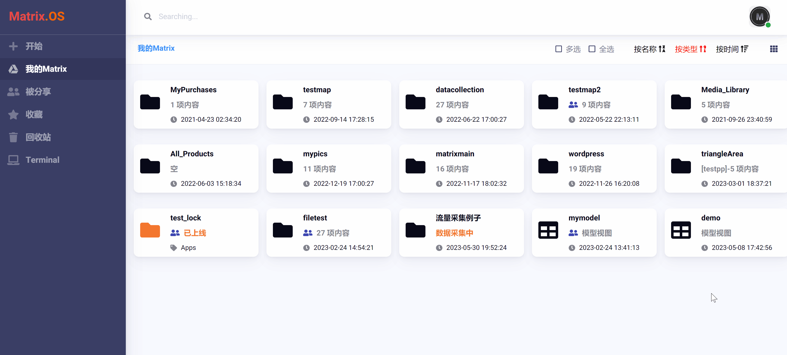

# 数据管理器 (Data Explorer)

数据管理器是 Matrix.OS 用来创建、编辑、管理、发布数据采集任务的工具之一。它可以与任何模型视图或文件类型绑定满足多样化数据采集需求，可一键生成各种调查与数据收集 App 并同步到移动端，可部署于 Map 实现基于地图的应用，也可与 Code 结合实现数据成果的处理与可视化。

在云桌面上右键单击任一文件夹，在菜单中选择 ，即可打开 `数据采集管理` 对话框。如下图所示：

数据管理器支持两种类型的任务：

- 数据采集 (如：问卷调查、众包任务、现场踏勘、外业采集等)
- 文件采集 (指定格式的文件收集)

您可以在 `数据采集管理` 对话框顶部的下拉式菜单中选择采集类型，如下图所示：

## 数据采集与管理

数据采集任务可以广泛地为各种问卷调查、众包任务、现场踏勘、外业采集等提供一体化解决方案。下面，我们使用一个简单的例子 (车流量采集) 来展示数据采集任务创建、设置、发布、管理的详细过程，希望起到 "抛砖引玉" 的作用。仿照此例，您可以自行定制各种数据采集应用，并在云桌面和移动端 (无须App) 实现同步。

1）建立任务文件夹

首先，我们在云桌面创建一个空白的文件夹用来执行数据采集任务，在例子中，我们将其命名为 "流量采集例子"，如下图所示：

2）绑定模型视图

数据采集任务的关键在于数据标准化，而模型视图（Model-View）作为 Matrix 用于实现数据标准化、对象化和可视化的标准模型恰恰满足这一需求。在这一步，我们需要将任务文件夹与模型视图进行绑定。

- 我们先在云桌面创建一个名为 "车辆计数器" 的模型视图，该模型视图可以让调查人员输入姓名、调查位置、时间日期、车流流向等信息，并分车型记录指定流向的车辆到达，如下图所示：

模型视图的创建与设计方法参见《模型视图管理器》和《模型视图控件》等相关教程，在此不再赘述。

- 完成模型视图的设计后，我们右键点击任务文件夹，在菜单中选择 ，打开 `数据采集管理` 对话框。

点击  按钮，可以在云桌面选择要绑定的模型视图，在这里我们选择刚刚在云桌面完成的模型视图 "车辆计数器"，点击  即完成绑定，如下图所示：

3）可选任务属性 (非必须设置)

- `采集截止时间`：选中 ，可进一步设置数据采集任务的结束时间 (一般多适用于问卷调查或众包任务)，如下图所示：

- `最大采集次数`：也可根据实际需要设置数据采集次数上限 (0 为默认值，代表无限制)，如下图所示：

4）发布任务

完成任务设置后，点击  按钮，即关闭 `数据采集管理` 对话框，成功完成任务发布 (任务文件夹状态变为 `数据采集中`)，如下图所示：

5）管理任务

当任务文件夹处于 `数据采集中` 状态时，右键点击任务文件夹，选择 ，可再次打开 `数据采集管理` 对话框对任务进行管理。包括：

- 查看视图模型：点击  按钮，可以查看当前数据采集任务绑定的模型视图 (即终端数据采集页面)，如下图所示：

- 随时调整修改任务结束时间和采集数量上限。

- 获取任务二维码和链接：任务发布后，系统会自动生成任务二维码与链接，以便在不同设备和移动端开展数据采集工作。例如，可以使用手机微信扫码打开数据采集页面开展工作而无需安装任何 App，如下图所示：

 
 

6）终止任务

当数据采集任务完成或过程中出现问题时，点击  按钮，即可终止当前数据采集任务，如下图所示：

当前任务终止后，已经采集的数据不会受到影响，依然保存于任务文件夹中。

7）查看成果

无论是在任务进行中还是任务结束后，您可以随时在云桌面打开任务文件夹，查看最新数据采集成果。

任务文件夹内完整的保存了每一份收集的原始数据文件，文件均为 JSON 格式并以采集设备的 IP 地址+序号命名，点击任一文件都可以用模型视图查看数据，如下图所示：

也可使用 Code 打开任务文件夹，编写代码实现对采集数据文件的批量处理、分析和可视化，如下图所示：

根据实际应用需要，还可以使用 Map 打开任务文件夹，以实现面向采集数据的地图相关应用，如下图所示：

综上所述，数据管理器与 Code 和 Map 的结合，**允许用户任意定制数据的采集方式、处理工具和应用场景，实现了对使数据从采集、处理、到应用的无缝衔接和多视角整合**。

8）多次绑定

任务文件夹可以无限次绑定不同模型视图来执行数据采集工作。

在实际项目中，数据采集需求随时变化，您只需调整或修改模型视图，然后将其重新绑定到任务文件夹即可快速完成数据采集任务的更新和部署。

也就是说，用户只要在个人云桌面维护不同类型和版本的模型视图，通过简单的绑定操作，就可以随时开展各种类型的数据采集任务了。

## 文件采集与管理

文件采集任务的设置、发布和管理流程与数据采集任务非常相似，在这里我们只介绍其不同点，其它相似步骤不再赘述，可参考前一节教程。

与数据采集任务不同，文件采集任务需要设置：

- `采集文件类型`：输入文件扩展名按回车键，即可限定采集文件的类型 (可输入多个扩展名)。

- `采集文件大小限制`：输入数字可限定单个采集文件的大小 (KB)。

如下图所示：

