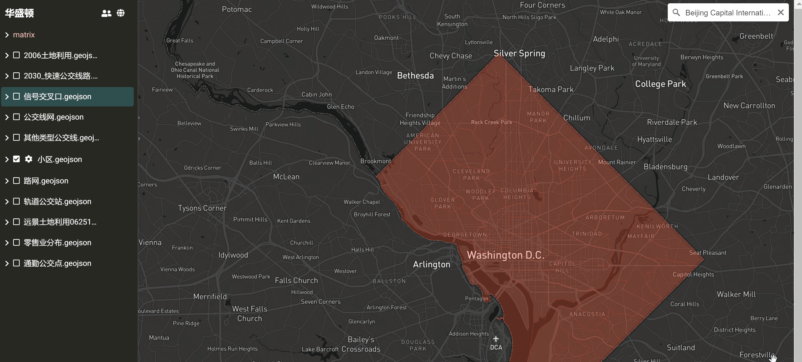

# Map 图层管理

图层是 Map 的基本构成与组织元素，也是实现地图交互与可视化、组件拼接与集成、团队协同工作与管理的基本功能单元。对图层的主要操作包括：

## 图层文件操作

Map 中的图层信息遵从 GeoJSON 数据格式，因此您可以上传自行编辑或转换的 GeoJSON 数据文件到自己的云桌面组件文件夹，用 Map 打开即可查看对应的图层了。

关于 GeoJSON 数据格式的介绍参见：《[GeoJSON](https://doc.arcgis.com/zh-cn/arcgis-online/reference/geojson.htm)》。

很多 GIS 软件工具都支持创建编辑 GeoJSON 文件，或者将其它地理信息数据格式文件转为 GeoJSON 格式，在此不再赘述。

可见，Map 中的每一个图层都是对云桌面 OS 上相应 GeoJSON 文件的映射和可视化展示，因此在 Map 中对图层的管理实质上就是对云桌面 OS 中对应 GeoJSON 文件的管理。您可以进行下列图层文件操作：

* `重命名`：对 GeoJSON 文件重命名会同步到 Map 对应的图层名
* `移动`：移动图层 GeoJSON 文件到云桌面新位置，不会影响图层在 Map 中的数据关联和可视化展示
* `分享`：分享不同图层给不同团队成员便于分工协作
* `下载`：下载图层 GeoJSON 文件
* `在 Kepler.gl 中打开`：用 Kepler.gl 打开图层文件（详见后续教程）

下图展示了在 Map 中右键点击某一 GeoJSON 图层文件，可进行的菜单操作：

## 显示/隐藏图层

点击选中图层名称前面的 ，即可在 Map 右侧显示该图层，再次点击则隐藏该图层，如下图所示：

## 设置图层属性

如前文所述，Map 的重点并不在可视化和渲染能力上，因此对图层属性做了最大程度的简化，仅保留最基本的属性设置。

在图层显示状态，点击图层名称前面的  按钮，可以对图层属性做简要设置，如下图所示：

## 嵌套与绑定

图层中的组件嵌套和绑定是以 Map 为场景容器实现 "积木式" 系统拼装与应用的重要机制。在 Map 中，您可以在任何图层上分级嵌套绑定多种云组件，方法如下：

### 选定工作图层

由于 Map 同时显示多个图层，在嵌套绑定组件前，首先应该选定工作图层。

在左侧导航栏单击图层名称即可选定工作图层，同时这也将激活该图层元素的鼠标捕捉模式 (鼠标滑过图形元素时高亮或放大显示)。如下图所示，我们在左侧导航栏选择 "小区" 为工作图层，滑动鼠标可以捕捉图层中的每个小区：

### 选择图层元素

左键单击高亮显示的图层元素，即可选中并弹出操作菜单，如下图所示：

### 嵌套组件

在操作菜单中选择 ，输入文件夹名点击确定后，则在图层选定区域创建了一个新的组件文件夹，在左侧导航栏和地图相应位置都出现了组件文件夹图标，如下图所示：

也可以在操作菜单中选择  或 ，则在图层选定区域上传文件或文件夹，如下图所示：

在左侧导航栏右键点击嵌套的组件 (带有  标记)，或在地图上左键点击组件图标，可以对嵌套的组件进行进一步编辑 (如：打开使用、增添新内容、用 Code 开发、在新窗口用 Map 打开等)，如下图所示：

### 绑定组件

绑定组件是指建立图层元素与云 OS 中既有组件的关联，以便像 "插件" 一样在地图中使用组件。

下图示例中，我们在图层选定区域绑定了一个云 OS 上的应用 "radialtree" (也就是在前面教程中展示开发的环状树图制作工具)。通过绑定，我们非常方便地在地图应用中添加了环状树图可视化功能，不再需要进行重复开发，从而大大提升工作效率减少重复劳动。

在左侧导航栏右键点击绑定的组件 (带有  标记)，或在地图上左键点击组件图标，即可使用绑定的组件，如下图所示：

通过嵌套与绑定，我们可以在地图中集成各种不同的云组件以满足不同需求。

**Map 作为沙盒式场景容器，组件作为功能模块，经过 "积木式" 的拼接形成各种系统应用。**

采用此模式，系统应用是完全 "开放" 并不断 "生长" 的。随着用户需求的不断变化，开发者对系统功能的增减只需通过绑定和解绑提供相应功能的云组件就可以快捷完成，而系统功能的升级则只需对个别组件功能进行重构升级即可，并不会对整个系统进行大的改动，从而大大降低系统开发、维护、升级成本。

值得一提的是，组件绑定对于组件的类型和绑定数量没有限制。您可以把自己开发的组件和从 Matrix 开放平台购买的组件绑定到 Map 中，同一个组件也可以被绑定到多个 Map 中。

绑定的组件可以是应用、代码、数据、项目、文件、服务等各种类型，这使得您可以在 Map 中部署云应用、编译运行代码、进行计算分析、采集分享数据、协同管理项目等等，从而大大扩展 Map 应用的外延和生态系统。

更多 Map 拼接应用案例参见《[Matrix 玩法与案例应用：Map 应用](zh-cn/demo/gallery.md)》。