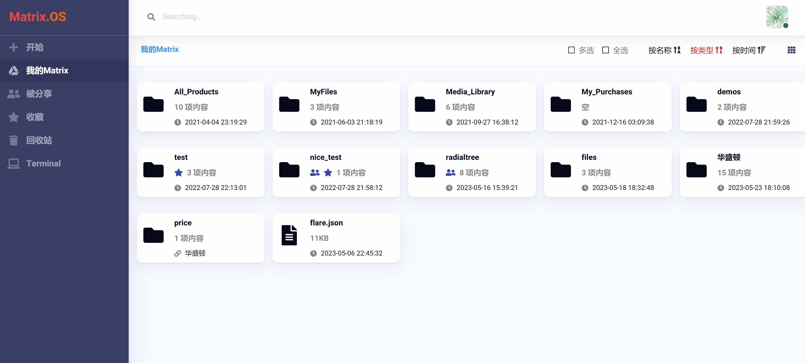
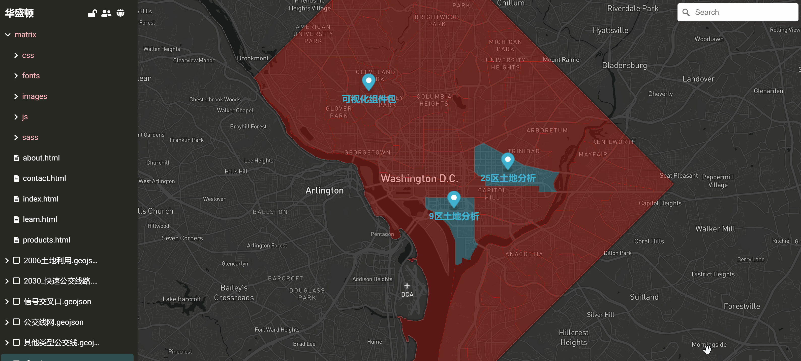
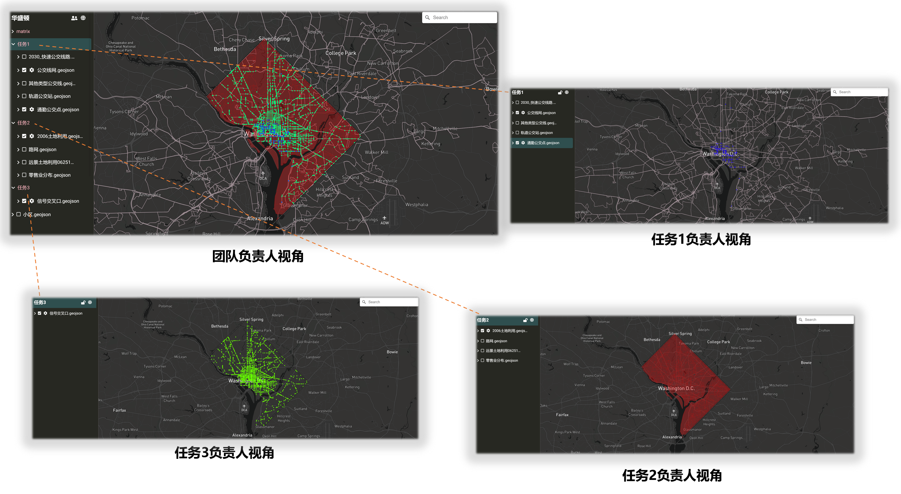
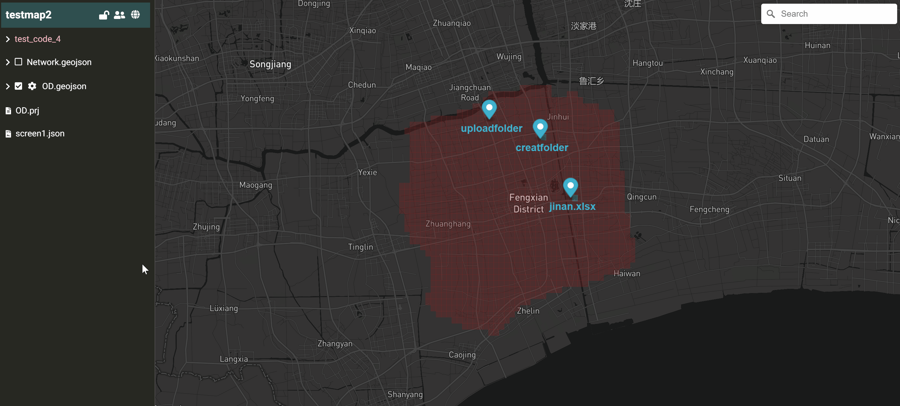

# 分享与协同

您可以将地图分享给伙伴或团队成员。在 Matrix.OS，由于 Map 只是云组件的一种打开方式和应用视角，因此只要在云桌面对组件进行分享，就可以实现多人使用 Map 协同工作了。

## 分享 Map

在云桌面，右键点击要分享的组件文件夹，在弹出菜单中选择 ，即打开`分享管理`对话框。

输入要分享的用户名，设置权限后，点击  按钮，即可完成将用户添加到分享列表。

分享成功后，被分享的组件上则会显示  图标。如下图所示：

这时，您只需要把分享的组件文件夹  就可以和伙伴一起编辑和使用地图了。

此外，您也可以在 Map 内进行分享，点击左侧导航栏上方的  按钮，即打开`分享管理`对话框，其余步骤同前，如下图所示：

## 分工协作

基于分享功能，多个团队成员可以使用 Map 协同工作，具体通过以下步骤实现：

- 团队负责人将工作任务分解，在云桌面 Map 文件夹内创建相应的任务子文件夹。

- 将任务子文件夹分享给不同的团队成员，这样每个团队成员都可以在各自云桌面用 Map 打开被分配的任务子文件夹并独立开展工作而不互相干扰。

- 团队负责人使用 "管理员权限" 在 Map 中随时查看每项任务的工作进度并进行整合。

举例说明，下图展示了团队负责人在 Map 中将工作分解为三个任务子文件夹，分别分享给三个团队成员负责，以及不同团队成员在各自云桌面 Map 中的任务分解视角。

## 管理员权限

在协同工作时，为了避免多个成员同时操作可能导致的数据错误，Map 提供了 "管理员权限锁定" 功能。

Map 被管理员锁定后，其他成员对该地图仅有`只读`权限，直到锁定的权限被释放。

点击 Map 导航栏顶部  或  图标，可以锁定或释放管理员权限，如下图所示：

