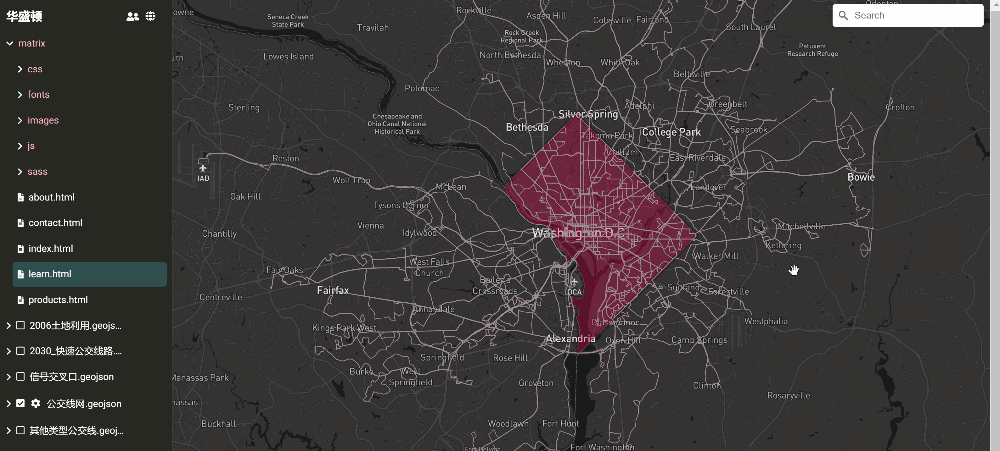

# Map 常用操作

## 打开 Map

在云桌面右键点击任一 Matrix 组件，在弹出菜单中选择 ，即可进入 Map，如下图所示：

从 Map 左侧导航栏可以发现，Map 实际上是云桌面 OS 文件管理系统的地图视角。

除此以外，Map 还将组件文件夹下的所有 "geojson" 格式文件自动解析为图层。下图对比了云桌面文件管理器和 Map 两种不同视角对同一组件文件夹内容的展示：

## 在 Map 中创建组件

单击 Map 左侧导航栏上方选中组件文件夹，然后点击  按钮，即可在 Map 中组件文件夹的根目录创建新组件，如下图所示：

也可右键点击任一子文件夹，在弹出菜单中选择 ，即可在相应子文件夹内创建新组件，如下图所示：

## 文件/文件夹操作

### 文件操作菜单

右键点击任一文件，即打开文件操作菜单，如下图所示：

可以对文件进行以下操作：

* 打开
* 重命名
* 复制
* 移动
* 下载
* 分享
* 删除

### 文件夹操作菜单

右键点击任一文件夹，即打开文件夹操作菜单，如下图所示：

可以对文件夹进行以下操作：

* 创建
* 打开
* 在 Code 中打开 (在地图中与 Code 交互)
* 在 Map 中打开 (在地图中嵌套地图)
* 重命名
* 移动
* 分享
* 下载
* 删除

### 设置地图样式

单击 Map 左侧导航栏上方  按钮，可以在下拉菜单中选择地图样式 (支持标准、暗黑色、和卫星图)，如下图所示：

