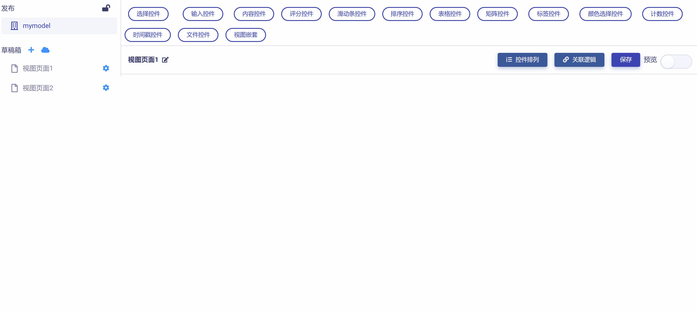
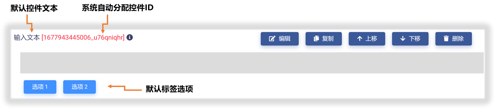
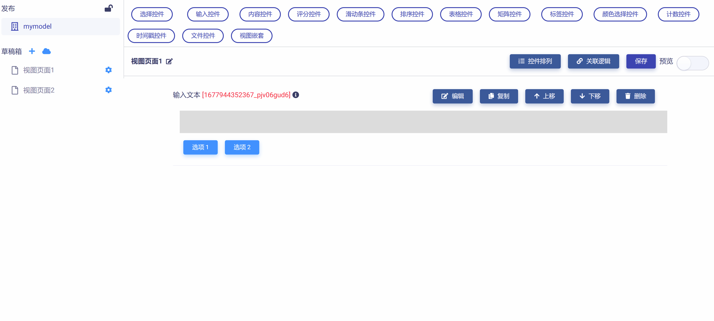
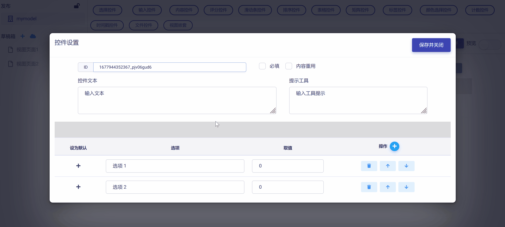
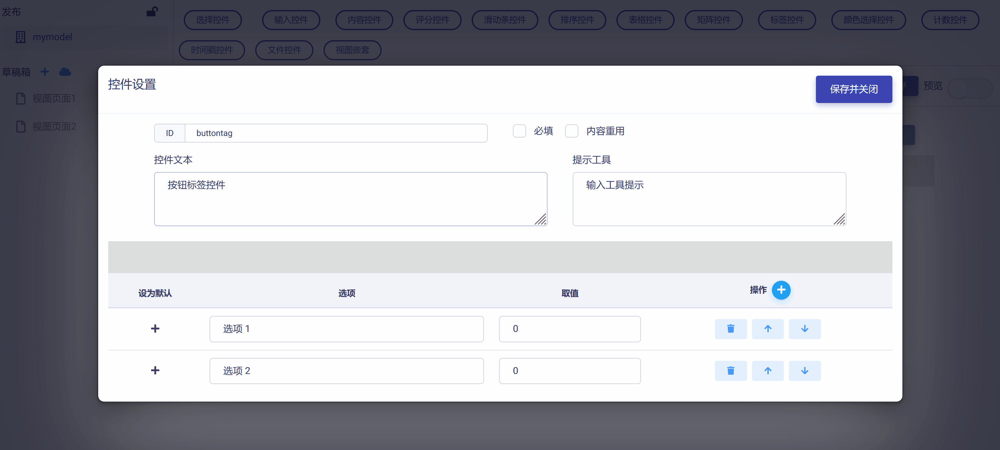
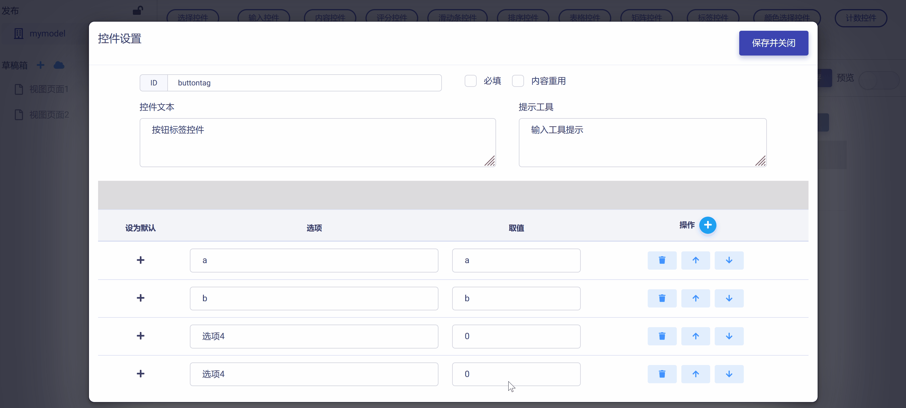
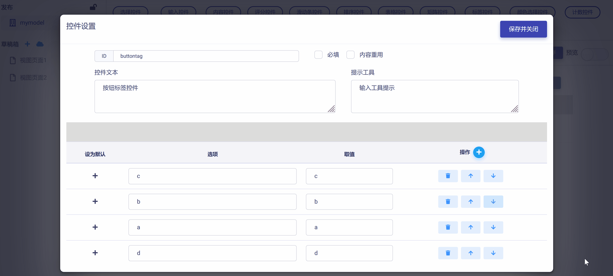
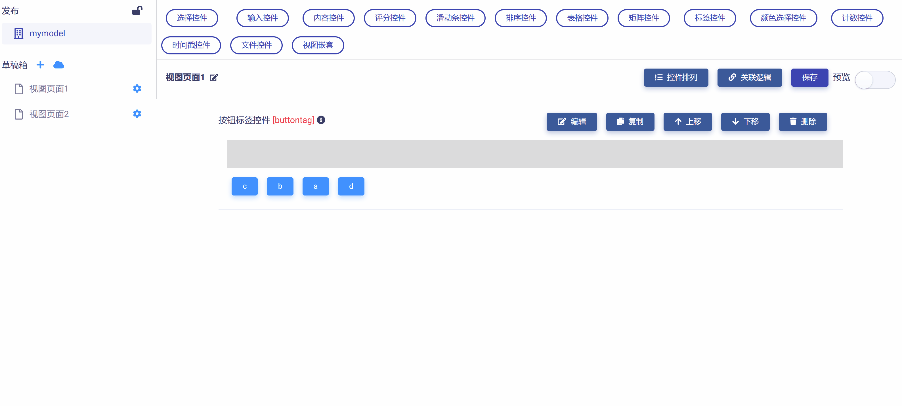

# 按钮标签控件 (Button Tags)

按钮标签控件是指从一组给定的标签选项中，选中一个或多个标签（可重复选择）来满足标识或分类需求的用户交互形式。在多种应用场景被使用到，具有下列属性：

* ID：控件的唯一标识，由开发者赋予，代表控件在数据节点树中的键值 (支持数值、英文字符，和中文)。

* 控件文本：与控件一起显示的标题性文字。

* 提示工具：当用户悬停在控件上时，显示的提示性文本。

* 标签选项文字：标签选项显示的文字。

* 标签选项取值：由开发者赋予，在数据节点树中标识该标签选项的键值 (支持数值、英文字符，和中文)。

* 默认选项：设置选项为默认标签。

* 必填：强制用户输入。

* 内容重用：反复多次使用按钮标签控件时保留上一次填写内容。

## 添加按钮标签控件

在视图页面草稿中，点击工作区顶部  按钮，在下拉菜单中选中`按钮标签`，即可完成按钮标签控件添加，如下图所示：

新添加的按钮标签控件使用系统默认设置，如下图所示，开发者可以对其进一步修改和定制。

## 编辑按钮标签控件

点击控件右侧  按钮，即可打开`控件设置`对话框，对按钮标签控件的属性进行编辑与设置，如下图所示：

首先，可以对 "控件ID" 和 "控件文本" 进行编辑，如下图示例：

然后，可以使用   和   对标签选项数目进行设置，根据实际需要增加或减少，如下图示例：

进而，可以对标签选项文字和对应的键值进行设置，如下图示例：

如果需要对标签选项次序进行调整，可以使用选项右侧操作栏的  和  来完成，如下图所示：

完成所有设置后，点击  按钮，即保存设置并返回视图页面，可以查看控件的编辑与设置结果，如下图示例：

## 预览测试

滑动工作区右上角  滑块，进入视图页面 "预览模式"，可以对按钮标签控件的操作和数据反馈正确性进行测试，在下图示例中，数据节点树 JSON 文件中的控件属性和选项键值都正确响应了对按钮标签控件的操作。

