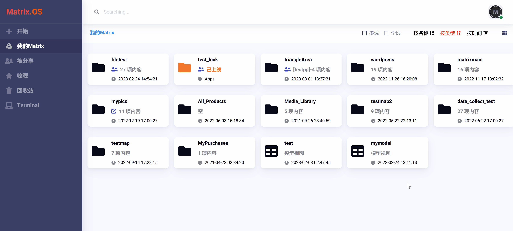
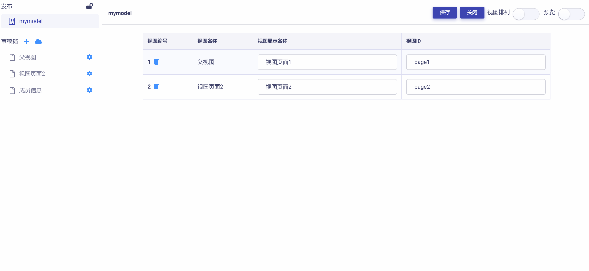

# 协同设计

您可以将模型视图分享给伙伴或团队成员实现协同设计。

## 分享视图

右键点击要分享的视图，在弹出菜单中选择 ，即打开`分享管理`对话框。

输入要分享的用户名，设置权限后，点击  按钮，即可完成将用户添加到分享列表。

分享成功后，被分享的模型视图上则会显示  图标。如下图所示：

## 锁定/释放编辑权限

视图分享后，为了避免多个用户对视图中同一控件同时进行操作所导致的数据错误，视图模型管理器提供了 "编辑权限锁定" 功能。

视图被某一用户锁定后，其他成员对该视图仅有`只读`权限，直到锁定的权限被释放。

点击`发布区`右侧的  或  图标，可以锁定或释放模型视图的编辑权限，如下图所示：

## 分工与集成

当多个用户协同完成模型视图设计时，不同用户可独立在各自的云桌面 OS 并行完成所分配的设计任务，形成视图页面草稿。

进而通过锁定对协同视图的编辑权，将各自编辑的视图草稿导入到协同视图中进行集成即可。

导入视图草稿的方法参见《[导入页面到草稿箱](zh-cn/userguide/os/tools/modelview/draftbox.md)》。

