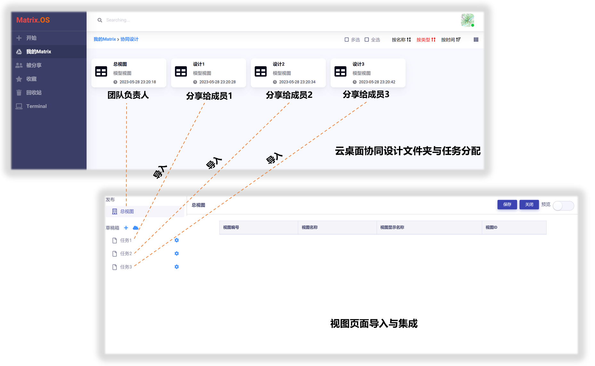

# 协同设计

您可以将模型视图分享给伙伴或团队成员实现协同设计。

## 分享视图

在云桌面，右键点击要分享的视图，在弹出菜单中选择 ，即打开`分享管理`对话框。

输入要分享的用户名，设置权限后，点击  按钮，即可完成将用户添加到分享列表。

分享成功后，被分享的模型视图上则会显示  图标。如下图所示：

## 分工与集成

基于分享功能，多个团队可以协同完成模型视图设计，具体通过以下步骤实现：

- 团队负责人在云桌面建立协同设计文件夹，在文件夹内建立多个空白模型视图代表不同设计任务。

- 将不同任务的模型视图分享给不同的团队成员，每个团队成员可独立在各自的云桌面完成所分配的视图页面设计任务而不互相干扰。

- 团队负责人使用 "管理员权限" 将每个团队成员完成的视图草稿导入集成到最终总体视图中。

举例说明，下图展示了团队负责人在云桌面文件夹内将设计工作（"总视图"）分解为三个子任务模型视图（"设计1"、"设计2"、"设计3"），分别分享给三个团队成员负责，并在模型视图管理器中进行集成。

导入视图草稿的方法参见《[导入页面到草稿箱](zh-cn/userguide/os/tools/modelview/draftbox.md)》。

## 管理员权限

在协同设计时，为了避免多个成员同时操作同一视图页面导致的数据错误，视图模型管理器提供了 "管理员权限锁定" 功能。

视图被管理员锁定后，其他成员对该视图仅有`只读`权限，直到锁定的权限被释放。

点击`发布区`右侧的  或  图标，可以锁定或释放模型视图的管理员权限，如下图所示：

