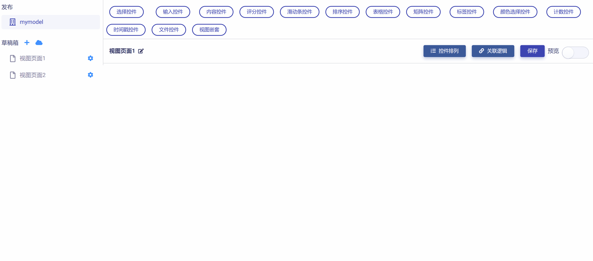
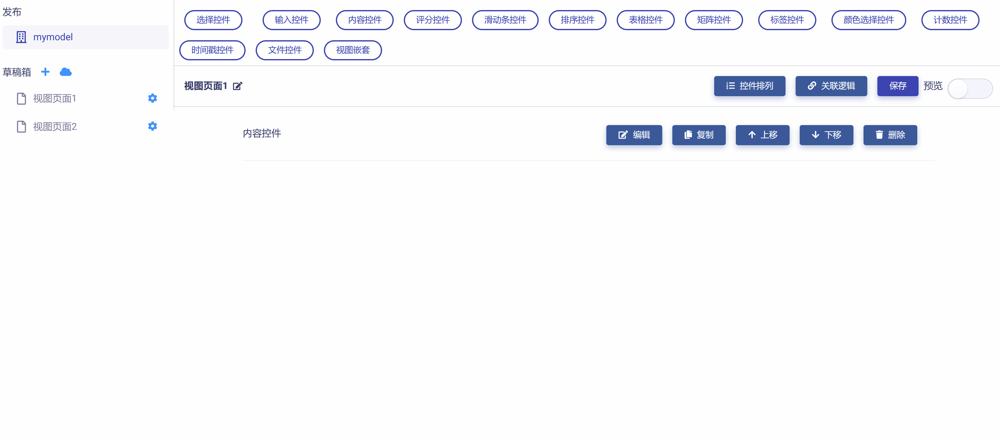
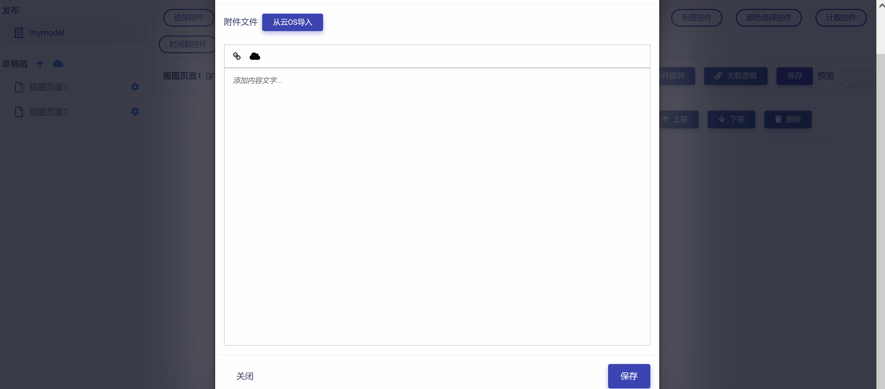
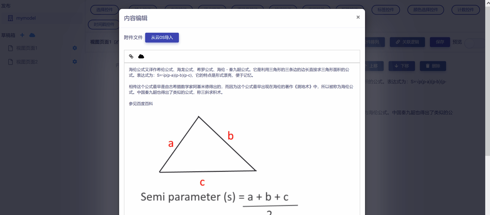
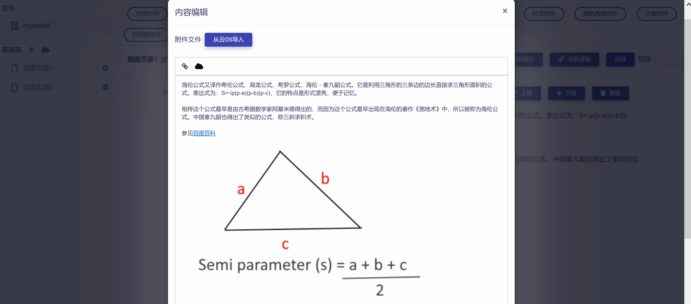
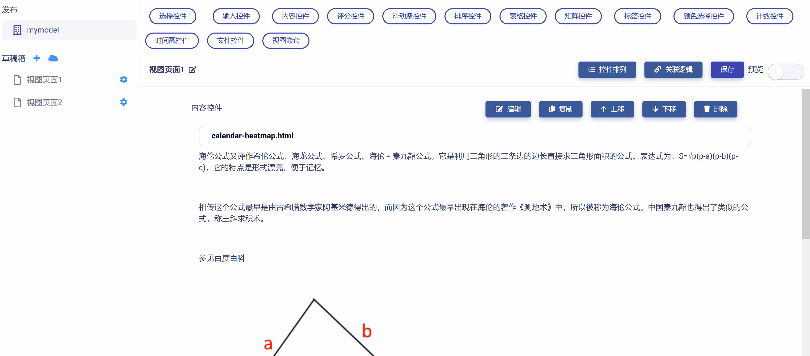

# 内容控件 (Contents)

内容控件一般用于在视图页面以文字、视频、图片、或文件的形式向用户提供说明性或介绍性信息，方便用户更好地使用视图页面完成交互。与其他控件不同的是，内容控件不需要指定控件ID，一般包括以下常用操作：

## 添加

在视图页面草稿中，点击工作区顶部`内容控件`按钮，即可完成内容控件的添加，如下图所示：

## 编辑

点击控件右侧`编辑`按钮，即可打开`控件设置`对话框，对内容控件的属性进行编辑与设置，如下图所示：

可以在内容控件中添加说明性文字、设置外部链接、插入图片和视频、以及添加文件附件等。以下举例说明：

添加说明性文字：

从云OS导入配图：

设置外部链接：

添加文件附件（如示例数据文件、代码、图片、视频等）：

## 预览测试

滑动工作区右上角`预览`滑块，进入视图页面"预览模式"，可以对内容控件进行测试和效果预览，如下图所示：

