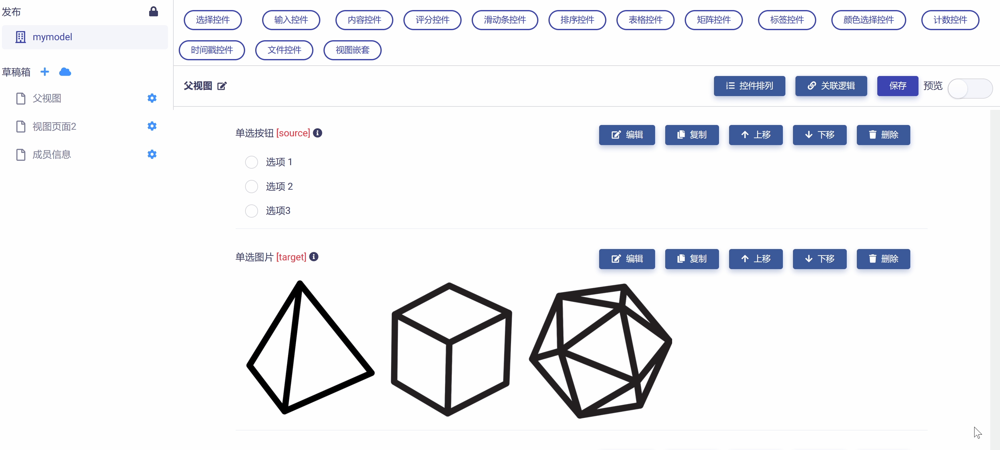
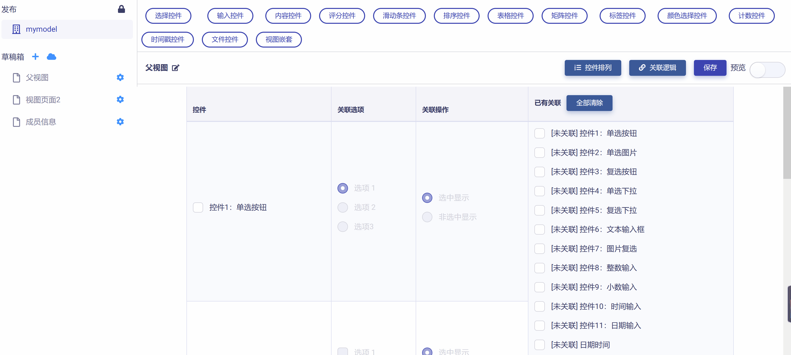
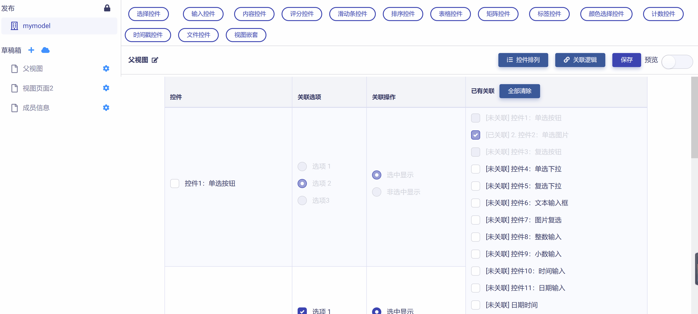
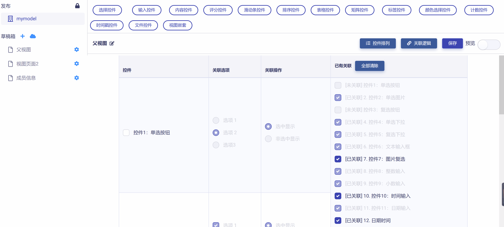

# 控件关联

控件关联是指将视图页面上某些控件的显示与否关联到另一些控件的指定选项或操作，见下图示例：

## 设置关联

点击视图页面右上角`关联逻辑`按钮，即可打开控件关联设置页面，再次点击该按钮，即返回视图页面。如下图所示：

可以发现，控件关联设置页面以列表形式展示并管理视图页面中全部控件之间的关联逻辑关系，表格包含以下四列：

* 控件：列出当前视图页面中可设置关联的控件。

* 关联选项：列出每一可设置关联的控件所包含的选项。

* 关联操作：列出可设置关联控件选项的可行操作。

* 已有关联：列出全部已建立的关联逻辑关系。

利用关联逻辑列表，可以设置多组控件间的关联逻辑关系。以下举例说明：

例1：当`控件1(单选按钮)`的`选项2`被选中时，`控件2(单选图片)`才显示，见下图示例：

例2：当`控件3(复选按钮)`的`选项1`和`选项2`同时被选中时，`控件4(单选下拉)`和`控件5(复选下拉)`才显示，见下图示例：

参照上面示例，即可根据需要依次完成各控件间的关联逻辑设置，点击`保存`按钮完成对最新设置的保存。

## 清除关联

清除单组关联逻辑设置，只需重新点选需要清除的关联控件，然后将被关联控件前的复选框设置为"未选中"即可，见下图示例：

如果要清除全部控件间的关联逻辑，只需点击关联逻辑列表"已有关联"列上方的`全部清除`按钮即可，见下图示例：

