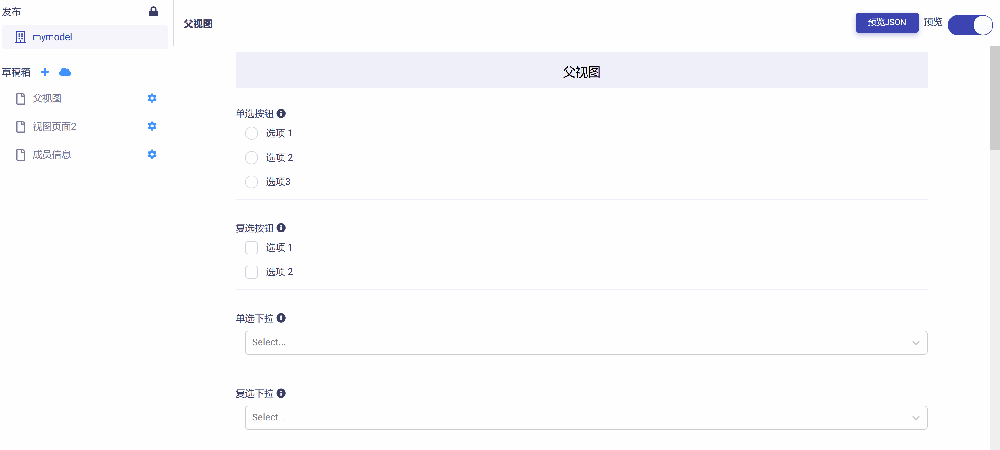
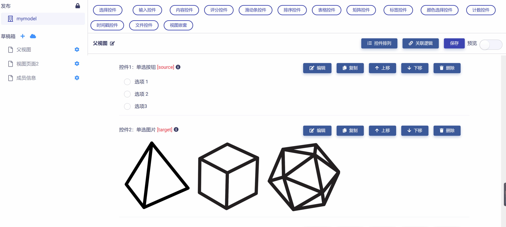

# 控件关联

控件关联是指将视图页面上某些控件的显示与否关联到另一些控件的指定选项或操作，见下图示例：

## 设置关联逻辑

点击视图页面右上角`关联逻辑`按钮，即可打开关联逻辑设置页面，如下图所示：

可以发现，该页面以列表形式展示并管理视图页面中全部控件之间的关联逻辑关系，表格包含以下四列：

* 控件：列出当前视图页面中可设置关联逻辑的控件。

* 关联选项：列出每一可设置关联逻辑的控件所包含的选项。

* 关联操作：列出可设置关联逻辑控件选项的可行操作。

* 已有关联：列出全部已建立的关联逻辑。

## 清除关联逻辑

一个复杂的数据对象可以被分解为多个简单的数据对象加以描述和建模，而整个建模过程只需要简单的“拖放”操作就能完成。用户也可以在 Matrix 开放平台获取其他用户开发的数据对象，再加以重用，大大提升了工作效率。

## 模型视图与数据接口

每一个模型视图都被 Matrix 自动映射为 json 格式的数据节点树（如下图例子）。

这种机制便于各种组件程序代码读取和解析对应节点的数据流并实施操作逻辑。也就是说在 Matrix 中，任何复杂 UI 中的单个控件，都存在与其逐一对应的数据节点属性。对UI的任何改动和变化，都会精准的反馈到数据节点树中的对应位置，并被后端代码捕捉。

## 小结

简单总结一下，一个模型视图具有以下特征和功能：

1. **可拼接性**：一个模型视图能够很方便地与其他模型视图一起配合使用，或者嵌套在另一模型视图内部。一个复杂的模型视图可以拆分成多个简单的模型视图。

2. **可重用性**：每个模型视图都是具有独立功能的模块单元，可以在任意多个 UI 场景重复使用。

3. **可维护性**：每个模型视图仅仅包含自身的完整逻辑，容易被理解和维护。

4. **可实体化性**：每个模型视图都可以在 Matrix 被实体化为模型实例，从抽象模型到实体化对象的转变将革命性的地改变数据标准化方式、采集方式和处理方式。