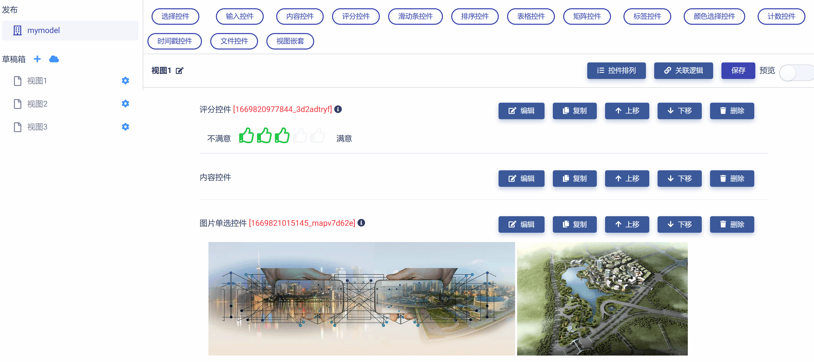
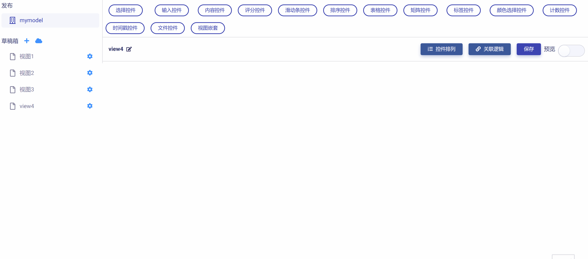
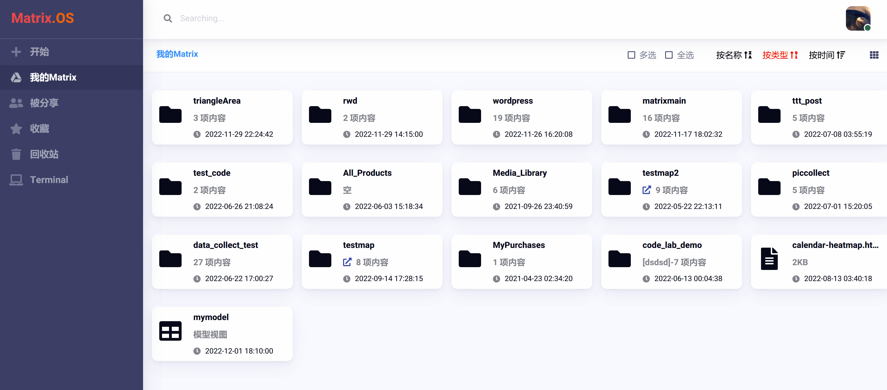
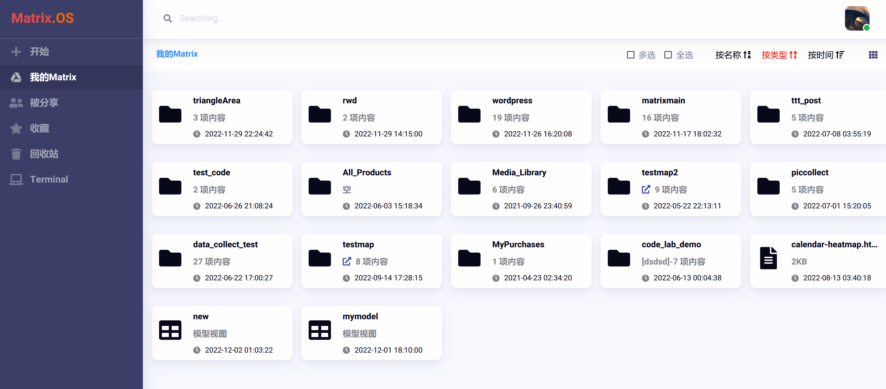
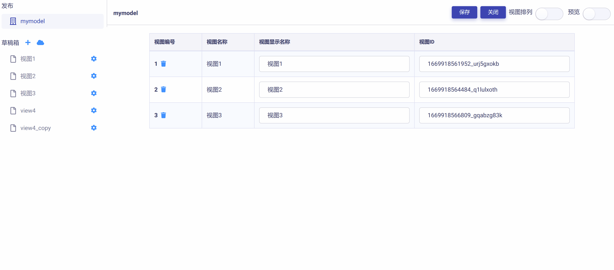

# 草稿管理

## 页面草稿箱

Matrix模型视图一般由单个或多个视图页面组成，以满足不同应用场景的需求（见下图示例）。草稿箱可以方便地实现对不同视图页面及其不同版本的创建、编辑与管理。

## 创建页面草稿

点击视图管理器左侧导航栏`草稿箱`旁边的  按钮，即可在草稿箱中创建一个新视图页面，将其命名为"mymodel"并保存。如下图所示：

## 删除页面草稿

在左侧导航栏草稿箱中，点击视图页面右侧的  按钮，在弹出菜单中选择`删除`，点击`确定`即可删除该视图页面。如下图所示：

## 复制页面草稿

在左侧导航栏草稿箱中，点击视图页面右侧的  按钮，在弹出菜单中选择`复制`，即可制作该视图页面的副本。如下图所示：

## 导入页面到草稿箱

Matrix模型视图管理器提供了"云OS导入"功能，便于将既有模型视图中的视图页面导入重用到另一模型视图中，从而大大提升灵活性与效率。具体步骤举例说明如下：

我们首先在云OS上创建一个新模型视图，名为"new"，如下图所示：

在前面教程中，我们已经在云桌面创建好了一个模型视图名为"mymodel"。在这里，我们将演示如何将"mymodel"中的视图页面导入到"new"中来。

点击"new"，打开模型视图管理器，点击左侧导航栏`草稿箱`旁边的  按钮，则打开视图页面云导入对话框。

根据对话框导引，从云桌面选中要导入的模型视图"mymodel"，进而选择所要导入的页面（点选页面前的复选框即可），最后点击`导入`按钮，则成功地将"mymodel"中选定的视图页面导入到"new"中的草稿箱了。如下图所示：

## 添加到发布

在草稿箱中，完成对视图页面的编辑并定稿后，可以将其"添加到发布"，也就是将视图页面草稿正式添加到模型视图发布版本中。

在左侧导航栏草稿箱中，点击视图页面右侧的  按钮，在弹出菜单中选择`添加到发布`，即可完成添加工作。

在下图例子中，我们将页面"view4"添加到发布。然后点击`发布`栏下的模型视图"mymodel"，即可在右侧工作区"mymodel"的视图页面列表中发现刚刚添加的"view4"。

