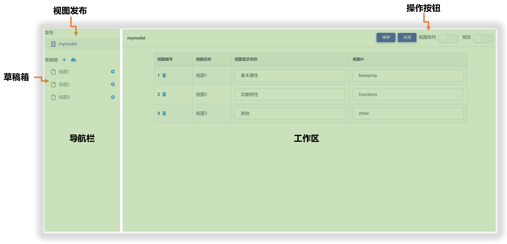

# 视图管理器布局与功能

## 开启视图管理器

在Matrix.OS上单击任一模型视图，即可打开视图管理器来编辑和管理模型视图。下图展示了用模型管理器打开一个新创建的模型视图：

## 功能模块布局

模型视图管理器由左侧"导航栏"和右侧"工作区"组成，基本布局如下图所示：

其中：

* **发布**：用于展示模型视图的最终发布版本及其视图页面列表。
* **草稿箱**：创建、编辑、管理模型视图页面草稿。
* **工作区**：查看和管理视图页面列表，完成视图页面设计、控件拖放与组装、预览测试等工作。

