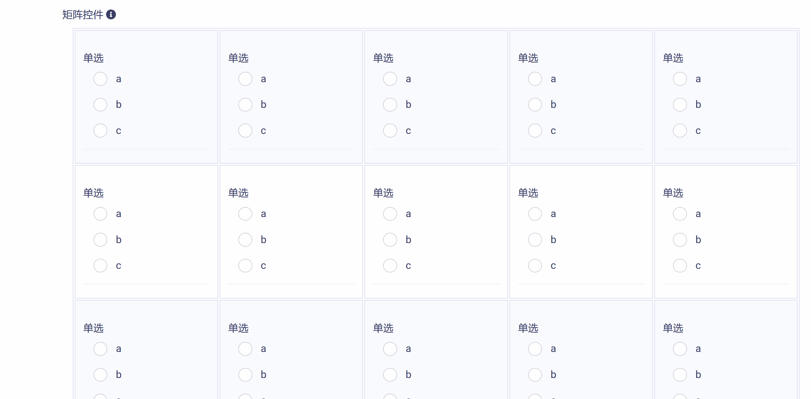

# 矩阵控件 (Matrices)

矩阵控件可以将同类型的多个控件按行列进行拼接组合，具有类似表格的外观。开发者可以根据实际应用需要设置矩阵的行数与列数，然后将编辑好的控件模板批量应用到矩阵。矩阵控件包含下列属性和功能模块：

* ID：控件的唯一标识，由开发者赋予，代表控件在数据节点树中的键值 (支持数值、英文字符，和中文)。

* 控件文本：与控件一起显示的标题性文字。

* 提示工具：当用户悬停在控件上时，显示的提示性文本。

* 矩阵设置工具：用于设置矩阵行列数和创建应用控件模板。

* 必填：强制用户输入。

## 添加矩阵控件

在视图页面草稿中，点击工作区顶部  按钮，即可完成矩阵控件的添加，如下图所示：

新添加的矩阵控件使用系统默认设置，如下图所示，开发者可以对其进一步修改和定制。

## 基本属性设置

点击控件右侧  按钮，即可打开`控件设置`对话框，对矩阵控件的基本属性进行设置，如下图所示：

需要对 "控件ID" 和 "控件文本" 进行编辑，如下图示例：

## 矩阵设置

### 设置行数与列数

在`行数`和`列数`输入框中输入矩阵的行数与列数，点击  按钮，即可改变矩阵的大小，如下图所示：

### 内置控件模板

开发者可以创建内置控件模板，用于批量应用到整个矩阵。首先点击`内置控件`下拉式菜单，选择控件类型，然后点击  按钮，即可创建一个控件模板。如下图所示：

紧接着点击右侧  按钮，即可打开`控件设置`对话框，对控件模板进行编辑，如下图所示：

控件编辑的方法已经在前面教程中详细介绍了，在此不再赘述。完成编辑后，点击  按钮，即保存模板并返回，如下图所示：

### 应用控件模板

点击控件模板右上方的  按钮，即可将该控件模板应用到整个矩阵，如下图所示：

矩阵内不同单元格中的控件文字描述可以存在差异，单击单元格可以对其中控件文字进行编辑，如下图所示：

### 重置矩阵

如果矩阵设置不满足要求，可点击  按钮对矩阵控件进行重置，将清空全部内置控件，如下图所示：

## 预览测试

完成所有矩阵设置后，点击  按钮，即保存并返回视图页面，可以查看矩阵控件的编辑与设置结果，如下图所示：

滑动工作区右上角  滑块，进入视图页面"预览模式"，可以对矩阵控件的操作和数据反馈正确性进行测试，如下图所示：

注意：在矩阵控件对应的数据节点树 JSON 文件中，每个单元格所对应的数据块是通过 “单元格ID” 进行索引的，即由行号（1,2,3,...）和列号（A,B,C,D,...）组合而成的 ID（例如：1A, 2B, 3C等等），这与表格控件的单元格索引方式完全相同，在此不再赘述。