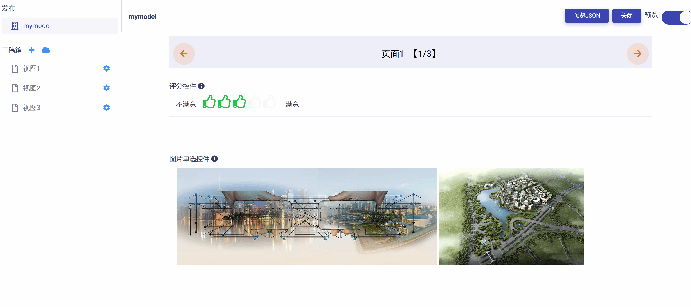
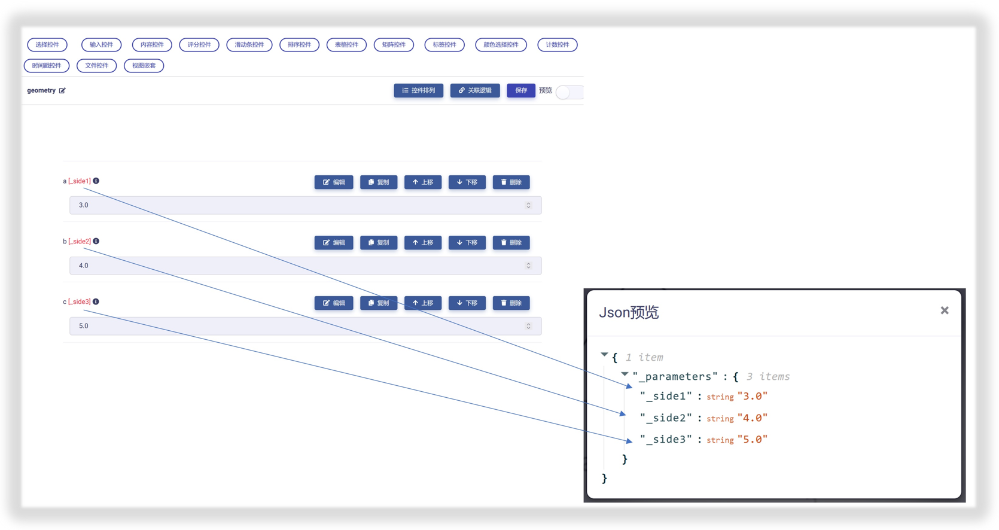

# Matrix 模型视图简介

模型视图（Model-View）是 Matrix 用于实现数据标准化、前端UI设计、和交互接口功能的标准模型与可视化页面。一般由单个或多个视图页面组成，以满足不同应用场景的需求，如下图所示：

## 模型视图与UI设计

模型视图将每一个功能相对独立的UI模块封装为控件（controls），然后将小的控件通过简单“拖放”操作，组合或者嵌套构成更大规模的控件。

此外，用户也可以将自行开发的模型视图与从开放平台获取的模型视图进一步嵌套组合形成新的模型视图，从而衍生出无限的可能性和多样性。

所以，**模型视图的本质就是各种控件与子模型视图的重用、拼接、嵌套与组合**。基于这一理念，UI设计也转变为一系列模型视图的重用、拼接、嵌套和组合操作，就像拆装“乐高”玩具一样，这将大大提高设计效率和成果的可复用性。

## 模型视图与数据标准化

模型视图的理念非常契合于面向对象编程的思想，即把对象作为操作数据的基本单元。这样一来，Matrix 通过模型视图的重用、拼接、嵌套与组合实现对各种数据对象建模的可视化与标准化。

一个复杂的数据对象可以被分解为多个简单的数据对象加以描述和建模，而整个建模过程只需要简单的“拖放”操作就能完成。用户也可以在 Matrix 开放平台获取其他用户开发的数据对象并加以重用，从而大大提升工作效率。

## 模型视图与数据接口

每一个模型视图都被 Matrix 自动映射为 json 格式的数据节点树（如下图例子）。

这种机制便于各种组件程序代码读取和解析对应节点的数据流并实施操作逻辑。也就是说在 Matrix 中，任何复杂 UI 中的单个控件，都存在与其逐一对应的数据节点属性。对UI的任何改动和变化，都会精准反馈到数据节点树中的对应控件节点，并被后端代码捕捉。

## 小结

简单总结一下，一个模型视图具有以下特征和功能：

1. **可拼接性**：一个模型视图能够很方便地与其他模型视图一起配合使用，或者嵌套在另一模型视图内部。一个复杂的模型视图可以拆分成多个简单的模型视图。

2. **可重用性**：每个模型视图都是具有独立功能的模块单元，可以在任意多个 UI 场景重复使用。

3. **可维护性**：每个模型视图仅仅包含自身的完整逻辑，容易被理解和维护。

4. **可实体化性**：每个模型视图都可以在 Matrix 根据应用场景被实体化为模型实例(model instance)，这将大大简化数据的标准化方式、采集方式和处理方式。