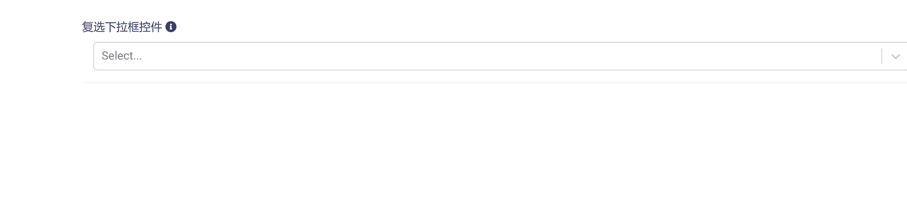
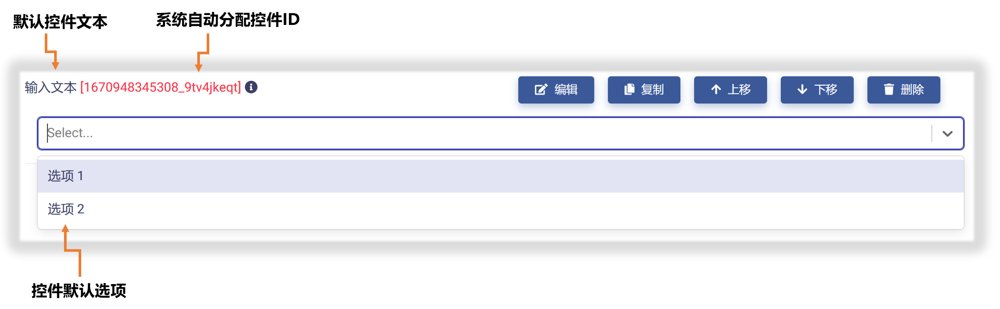
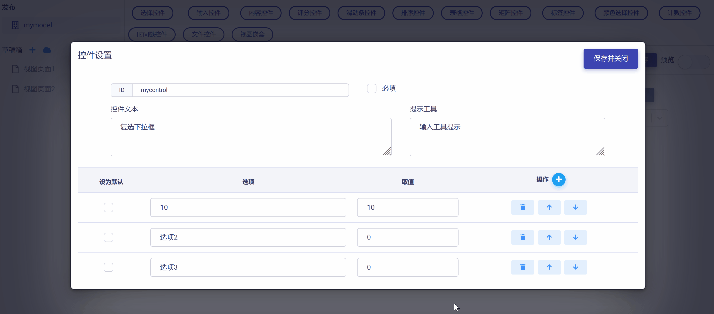
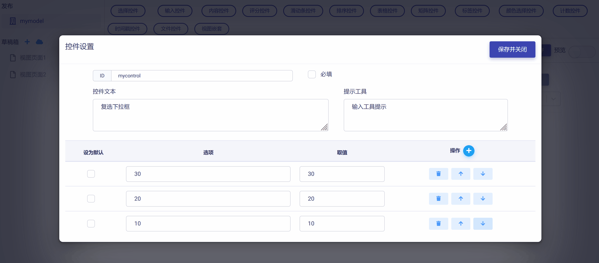

# 复选下拉框控件 (Dropdown CheckBox)

复选下拉框控件与复选框控件非常类似，但是在不同场景下可能会产生不同的用户体验，更适用于选项个数较多且存在一定相似性的情景。复选下拉框控件具有下列属性：

* ID：控件的唯一标识，由开发者赋予，代表控件在数据节点树中的键值 (支持数值、英文字符，和中文)。

* 控件文本：与控件一起显示的标题性文字。

* 提示工具：当用户悬停在控件上时，显示的提示性文本。

* 选项文字：选项显示文字。

* 选项取值：由开发者赋予，在数据节点树中标识该选项的键值 (支持数值、英文字符，和中文)。

* 默认选项：设置选项为默认选中。

* 必填：强制用户输入。

## 添加复选下拉框控件

在视图页面草稿中，点击工作区顶部`选择控件`按钮，在下拉菜单中选中`复选下拉框`，即可完成复选下拉框控件添加，如下图所示：

新添加的复选下拉框控件使用系统默认设置，如下图所示，开发者可以对其进一步修改和定制。

## 编辑复选下拉框控件

点击控件右侧`编辑`按钮，即可打开`控件设置`对话框，对复选下拉框控件的属性进行编辑与设置，如下图所示：

首先，可以对"控件ID"和"控件文本"进行编辑，如下图示例：

然后，可以对复选下拉框控件的选项数目进行设置，根据实际需要增加或减少选项，如下图示例：

进而，可以对选项文字和对应的键值进行设置，如下图示例：

如果需要对选项次序进行调整，可以使用选项右侧的`操作`栏的上/下箭头按钮来完成，如下图所示：

完成所有设置后，点击`保存并关闭`按钮，即保存设置并返回视图页面，可以查看控件的编辑与设置结果，如下图示例：

## 预览测试

滑动工作区右上角`预览`滑块，进入视图页面"预览模式"，可以对复选下拉框控件的操作和数据反馈正确性进行测试，在下图示例中，数据节点树 JSON 文件中的控件属性和选项键值都正确响应了对复选下拉框控件的操作。

