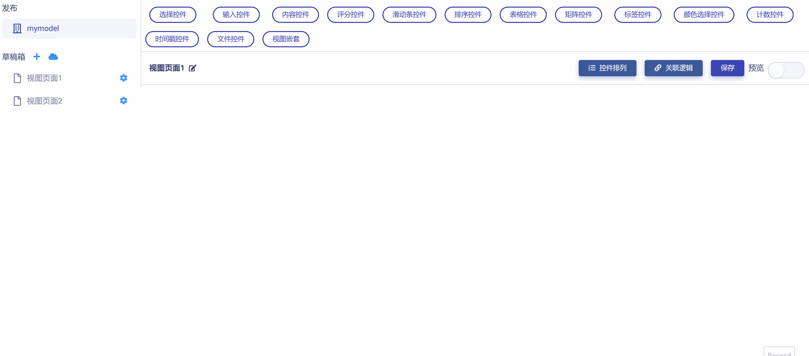
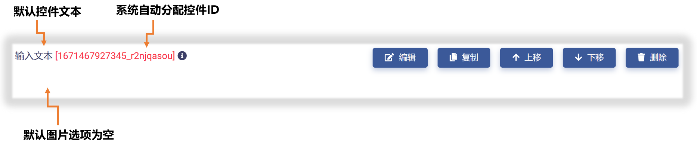
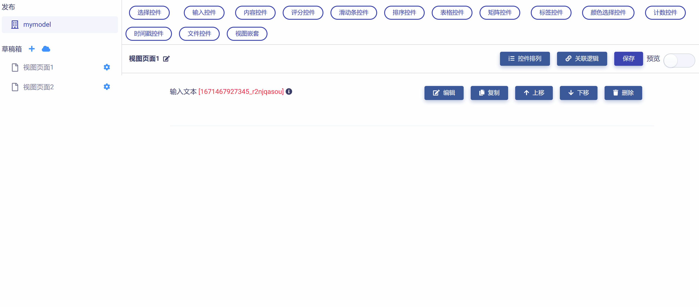
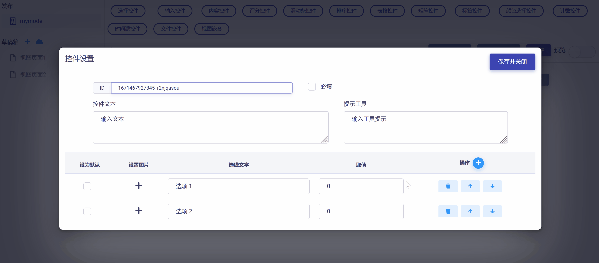
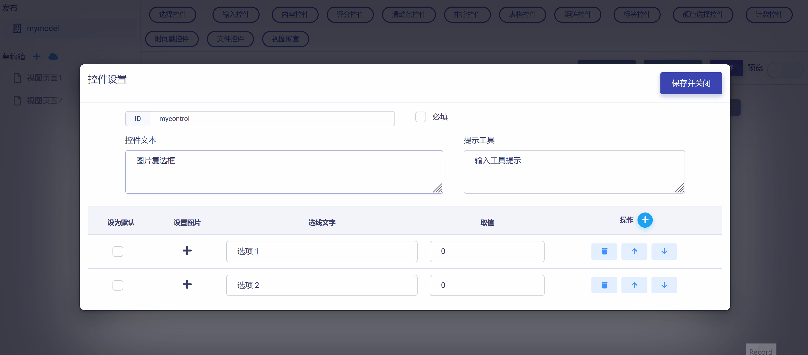
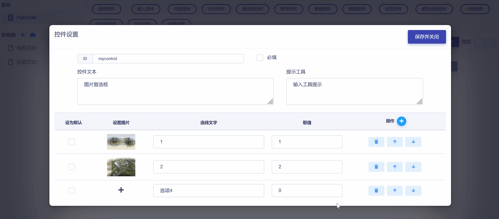
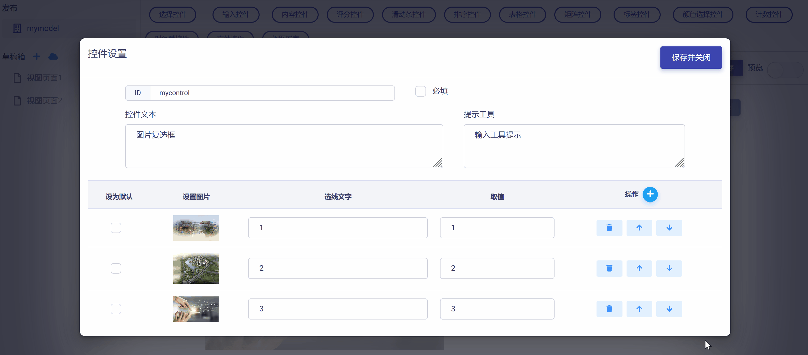
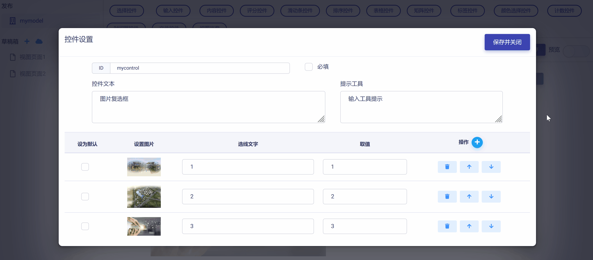
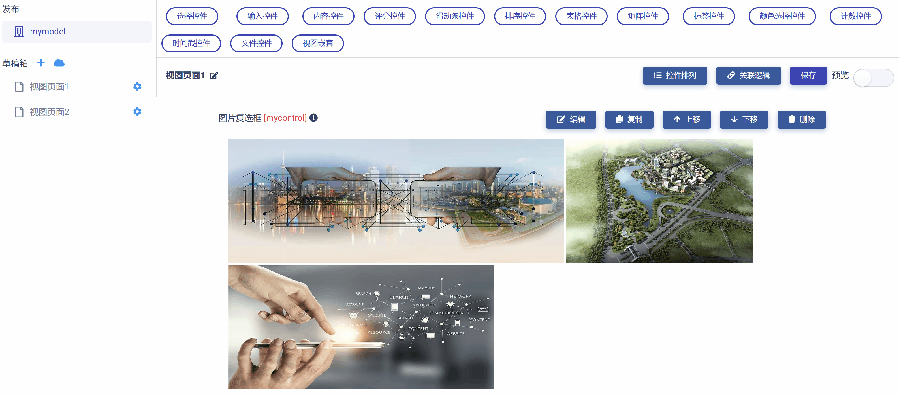

# 图片复选框控件 (Picture Checkbox)

图片复选框控件与复选框控件类似，只是将文字选项替换成了图片，以求在特定应用场景下提升用户体验。图片复选框控件具有下列属性：

* ID：控件的唯一标识，由开发者赋予，代表控件在数据节点树中的键值 (支持数值、英文字符，和中文)。

* 控件文本：与控件一起显示的标题性文字。

* 提示工具：当用户悬停在控件上时，显示的提示性文本。

* 设置图片：导入并设置选项对应的图片。

* 选项文字：选项显示文字。

* 选项取值：由开发者赋予，在数据节点树中标识该选项的键值 (支持数值、英文字符，和中文)。

* 默认选项：设置选项为默认选中。

* 必填：强制用户输入。

## 添加图片复选框控件

在视图页面草稿中，点击工作区顶部  按钮，在下拉菜单中选中`图片复选框`，即可完成图片复选框控件添加，如下图所示：

新添加的图片复选框控件使用系统默认设置，如下图所示，开发者可以对其进一步修改和定制。

## 编辑图片复选框控件

点击控件右侧  按钮，即可打开`控件设置`对话框，对图片复选框控件的属性进行编辑与设置，如下图所示：

首先，可以对 "控件ID" 和 "控件文本" 进行编辑，如下图示例：

然后，可以使用   和   对图片复选框控件的选项数目进行设置，根据实际需要增加或减少选项，如下图示例：

进而，可以对选项图片、文字和对应的键值进行设置。如下图示例：

从上图可以发现，设置选项图片可直接调用链接个人云OS上的图片资源，只要通过文件浏览对话框选中对应图片资源即可。注意：云OS上的任一图片都可无限复用到不同的模型视图和控件中，这在后面《使用Matrix.OS媒体素材库》中会详细介绍。

如果需要对选项次序进行调整，可以使用选项右侧操作栏的  和  来完成，如下图所示：

完成所有设置后，点击  按钮，即保存设置并返回视图页面，可以查看控件的编辑与设置结果，如下图示例：

## 预览测试

滑动工作区右上角  滑块，进入视图页面 "预览模式"，可以对图片复选框控件的操作和数据反馈正确性进行测试，在下图示例中，数据节点树 JSON 文件中的控件属性和选项键值都正确响应了对图片复选框控件的操作。

