# 视图嵌套控件 (Nested Model View)

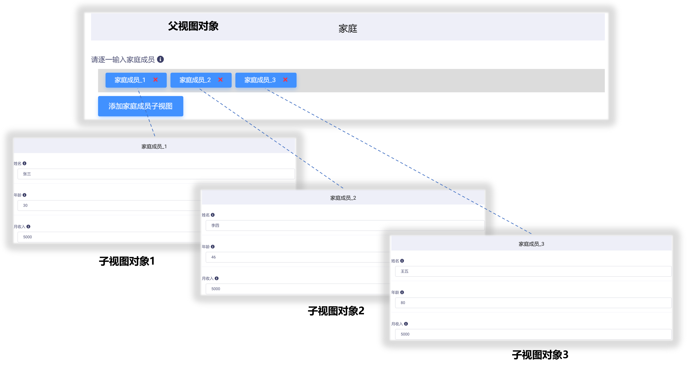
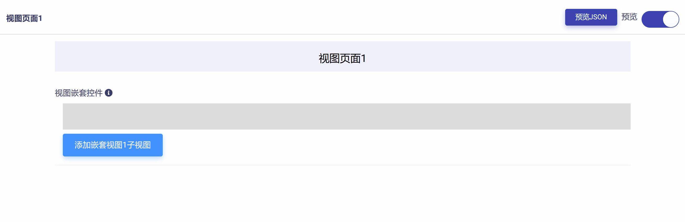

模型视图完全遵从面向对象编程的思想，允许开发者进行重用、拼接、嵌套与组合操作。

视图嵌套控件就是为实现这一机制而设计，它可以把其他模型视图作为子对象嵌入到控件中来。

视图嵌套控件包含下列属性和功能模块：

* ID：控件的唯一标识，由开发者赋予，代表控件在数据节点树中的键值 (支持数值、英文字符，和中文)。

* 控件文本：与控件一起显示的标题性文字。

* 提示工具：当用户悬停在控件上时，显示的提示性文本。

* 子视图模型设置：用于子视图模型导入与设置。

* 必填：强制用户输入。

## 添加视图嵌套控件

在视图页面草稿中，点击工作区顶部  按钮，即可完成视图嵌套控件的添加，如下图所示：

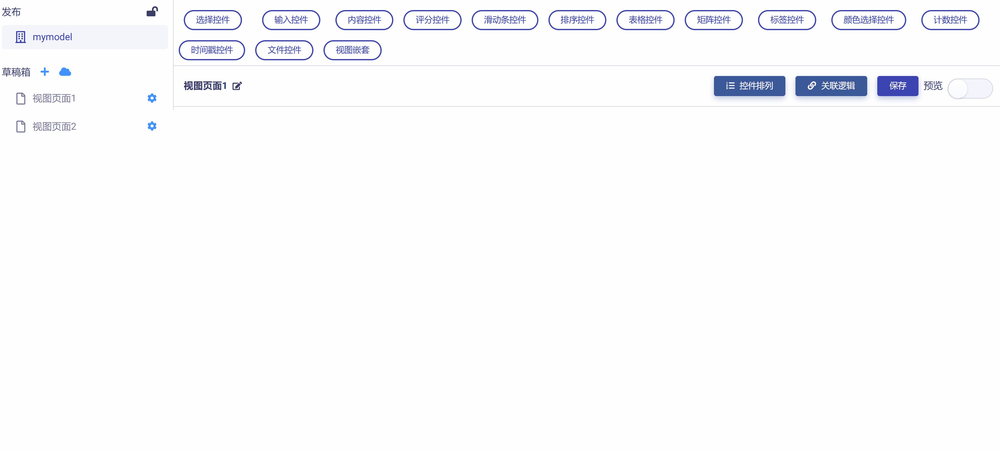

新添加的视图嵌套控件默认设置如下图所示，开发者可以对其进一步修改和定制。

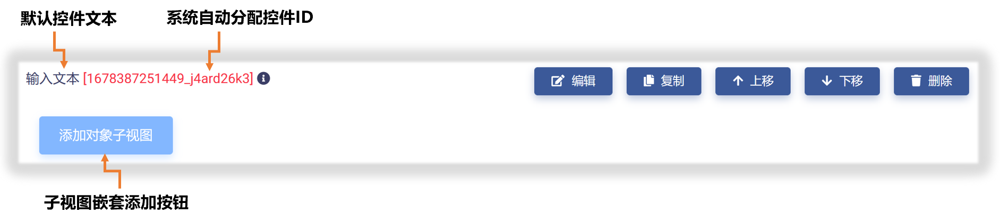

## 基本属性设置

点击控件右侧  按钮，即可打开`控件设置`对话框，对视图嵌套控件的基本属性进行设置，如下图所示：

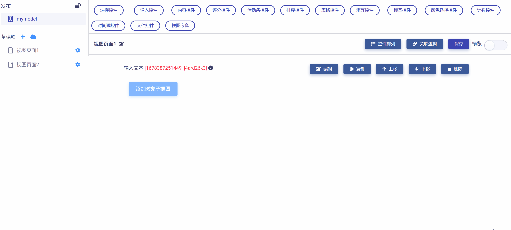

需要对 "控件ID" 和 "控件文本" 进行编辑，如下图示例：

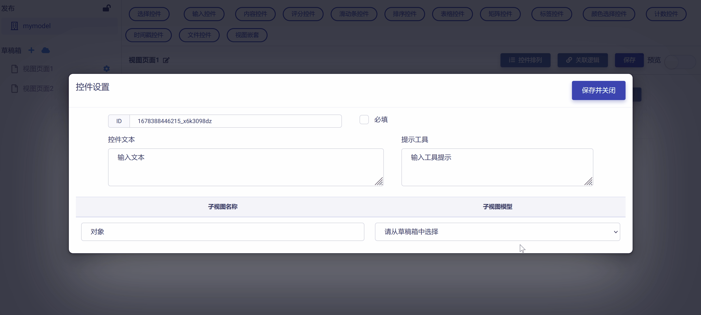

## 子视图模型设置

子视图模型是指作为 "成员对象" 嵌入到控件的子视图类型。

举例说明，假如控件作为 "父对象" 代表一个家庭，那么每个家庭成员则是嵌入该控件的 "子对象"。使用视图嵌套控件可以非常方便的实现多层级视图关系。

点击`子视图模型`下拉式菜单，可以发现草稿箱中全部可用于嵌套的视图模型。因为我们要嵌入的子对象是 "家庭成员"，故而在下拉菜单中选择 "成员" 视图作为子视图模型，同时在`子视图名称`输入框中输入子视图对象的名称为 "家庭成员"。如下图示例：

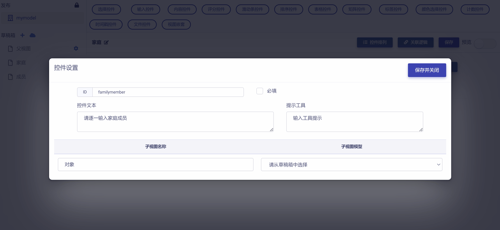

如果所需要的子视图模型不在草稿箱中，可以选择在草稿箱中新建或导入所需要的模型视图，参见《[使用模型视图草稿箱](zh-cn/userguide/os/tools/modelview/draftbox.md)》。

点击  按钮，即保存设置并返回视图页面。

## 预览测试

滑动工作区右上角  滑块，进入视图页面 "预览模式"，可以对视图嵌套控件进行测试。

在例子中，我们依次添加 "张三"、"李四"、"王五" 三个家庭成员子对象。每次点击  按钮，都会新建并打开 "成员" 子视图，输入家庭成员信息并点击  后，即可将该家庭成员作为子对象添加到控件中，如下图示例：

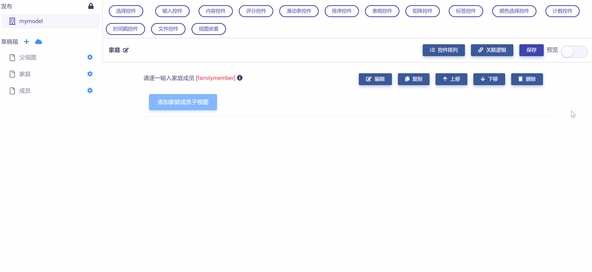

点击任一子视图对象，可以重新编辑对象属性并保存，如下图所示：

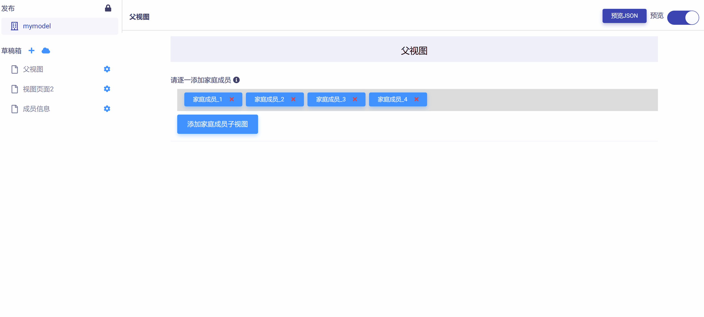

点击子视图对象右侧的 `X`，可以移除该子对象，如下图所示：

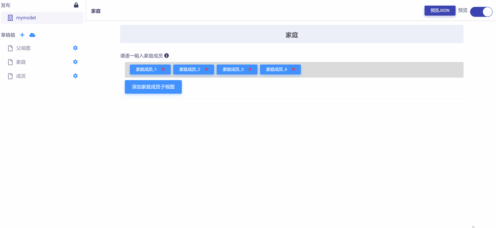

点击  按钮，打开数据节点树 JSON 文件，可以查看并校验每一子视图对象的属性，如下图所示：

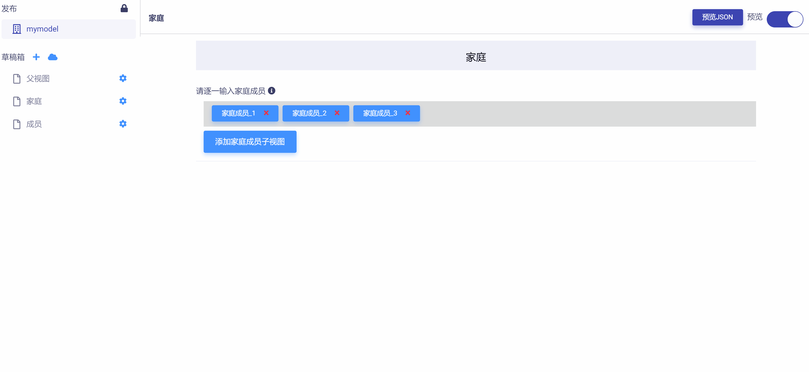