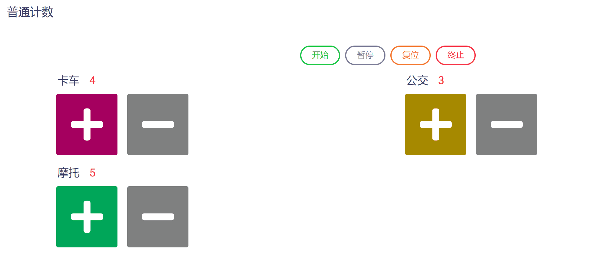

# 普通计数控件 (Normal Counter)

普通计数控件主要用于满足用户在多场景下对多个对象或事件（如：人数、车辆数、设施数等等）的发生频次或数量进行记录的需求，可以方便地部署于移动端和各种云端装备中，完成各种数据采集任务。

与计时计数控件不同，普通计数控件不受任务时间和任务方式的约束，具有下列属性：

* ID：控件的唯一标识，由开发者赋予，代表控件在数据节点树中的键值 (支持数值、英文字符，和中文)。

* 控件文本：与控件一起显示的标题性文字。

* 提示工具：当用户悬停在控件上时，显示的提示性文本。

* 计数单位：计数采用的计量单位（例如：人、位、个、辆等等）。

* 计数间隔：计数器累加步长（例如：计数间隔设置为5，则单击一次计数器等效于累加计数5次）。

* 计数器名称：由开发者自行定义的计数对象名称。

* 计数器显示类型：可以设置为“按钮型”与“图片型”两种类型。

* 计数器键值：代表计数器在数据节点树中的键值 (支持数值和英文字符)。

* 必填：强制用户输入。

普通计数器的添加、编辑、设置和预览测试与计时计数器基本相同，详见《[计时计数控件](zh-cn/userguide/os/tools/modelview/timingcount.md)》，在此不再赘述。

