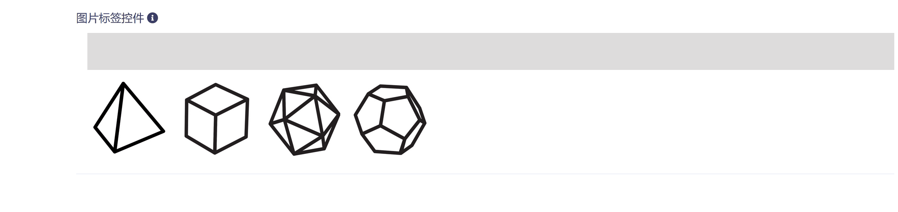
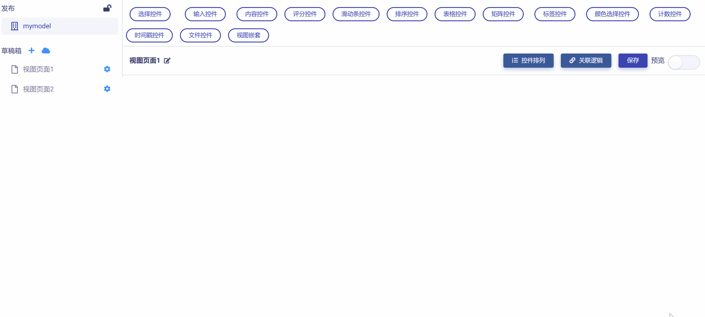
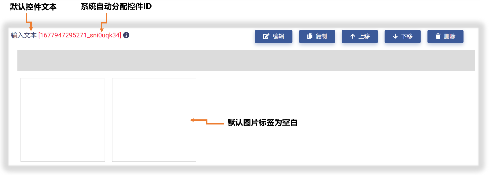
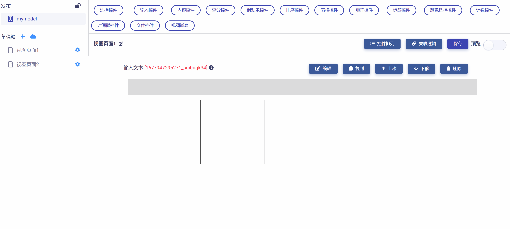
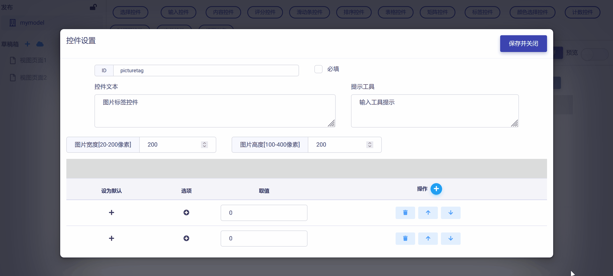
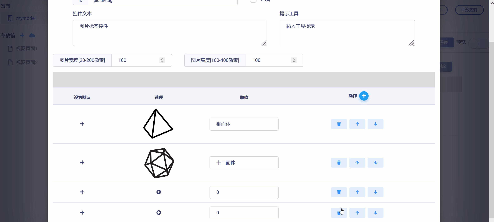
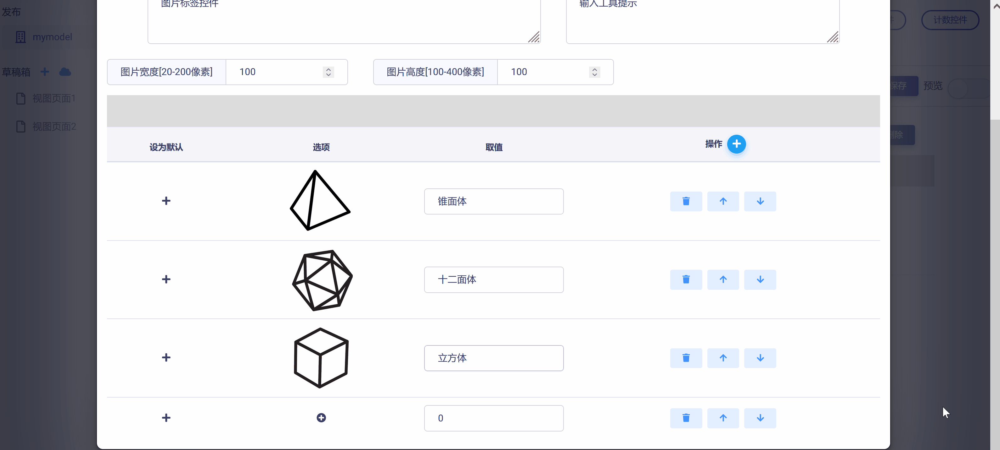
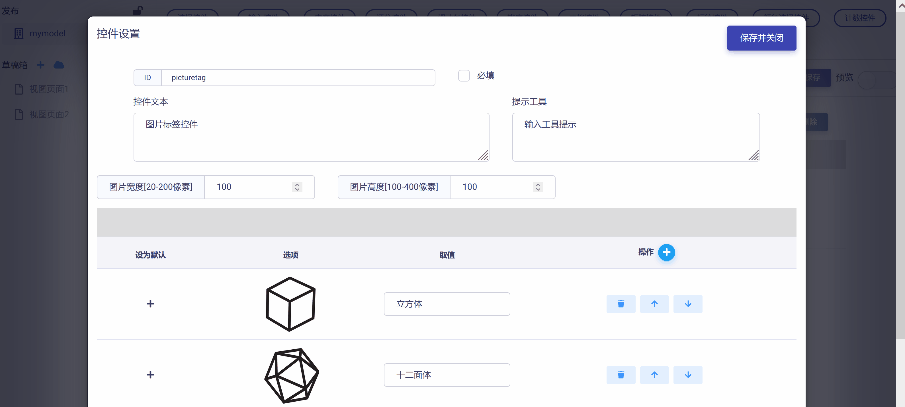
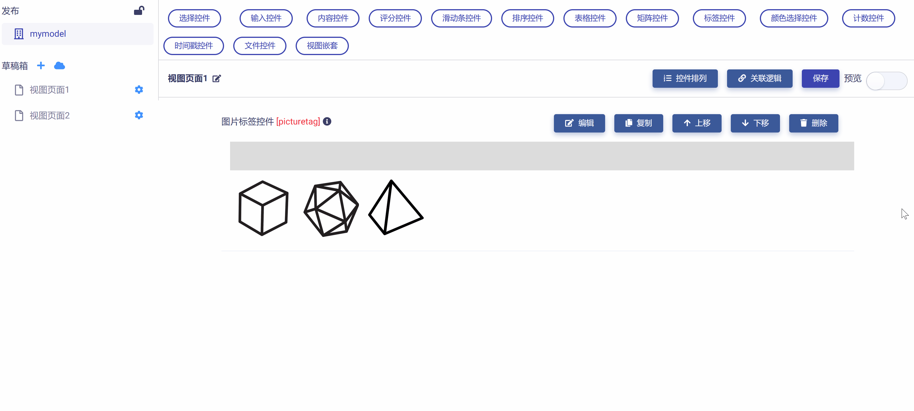

# 图片标签控件 (Picture Tags)

图片标签控件与按钮标签控件类似，只是将标签文字替换成了图片，以求在特定应用场景下提升用户体验。图片标签控件具有下列属性：

* ID：控件的唯一标识，由开发者赋予，代表控件在数据节点树中的键值 (支持数值、英文字符，和中文)。

* 控件文本：与控件一起显示的标题性文字。

* 提示工具：当用户悬停在控件上时，显示的提示性文本。

* 图片大小设置：设置图片宽度和高度（单位：像素）

* 设置图片：导入并设置标签选项对应的图片。

* 选项取值：由开发者赋予，在数据节点树中标识图片标签的键值 (支持数值、英文字符，和中文)。

* 默认设置：设置标签为默认选中。

* 必填：强制用户输入。

## 添加图片标签控件

在视图页面草稿中，点击工作区顶部`标签控件`按钮，在下拉菜单中选中`图片标签`，即可完成图片标签控件添加，如下图所示：

新添加的图片标签控件使用系统默认设置，如下图所示，开发者可以对其进一步修改和定制。

## 编辑图片标签控件

点击控件右侧`编辑`按钮，即可打开`控件设置`对话框，对图片标签控件的属性进行编辑与设置，如下图所示：

首先，可以对"控件ID"和"控件文本"进行编辑，如下图示例：

然后，可以对图片标签数目进行设置，根据实际需要增加或减少，如下图示例：

进而，可以对标签图片和对应的键值进行设置。如下图示例：

从上图可以发现，设置标签图片可直接调用链接个人云OS上的图片资源，只要通过文件浏览对话框选中对应图片资源即可。注意：云OS上的任一图片都可无限复用到不同的模型视图和控件中，这在后面《使用Matrix.OS媒体素材库》中会详细介绍。

如果需要对标签次序进行调整，可以使用选项右侧的`操作`栏的上/下箭头按钮来完成，如下图所示：

完成所有设置后，点击`保存并关闭`按钮，即保存设置并返回视图页面，可以查看控件的编辑与设置结果，如下图示例：

## 预览测试

滑动工作区右上角`预览`滑块，进入视图页面"预览模式"，可以对图片标签控件的操作和数据反馈正确性进行测试，在下图示例中，数据节点树 JSON 文件中的控件属性和选项键值都正确响应了对图片标签控件的操作。

