# 排序控件 (Ranking)

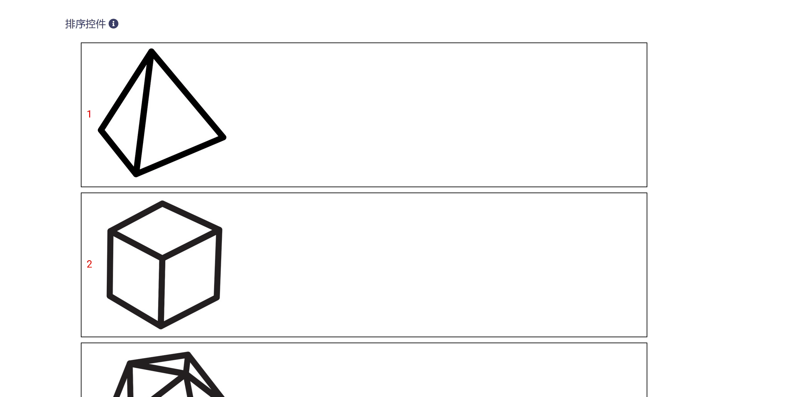

排序控件让用户通过拖放与移动操作实现对选项的次序调整，可以接受文字或图片形式的选项，包含下列属性：

* ID：控件的唯一标识，由开发者赋予，代表控件在数据节点树中的键值 (支持数值、英文字符，和中文)。

* 控件文本：与控件一起显示的标题性文字。

* 提示工具：当用户悬停在控件上时，显示的提示性文本。

* 选项格式（文本或图片）：设置选项显示的文字或图片。

* 选项取值：由开发者赋予，在数据节点树中标识该选项的键值 (支持数值、英文字符，和中文)。

* 必填：强制用户输入。

* 内容重用：反复多次使用控件时保留上一次设置。

## 添加

在视图页面草稿中，点击工作区顶部`排序控件`按钮，即可完成排序控件的添加，如下图所示：

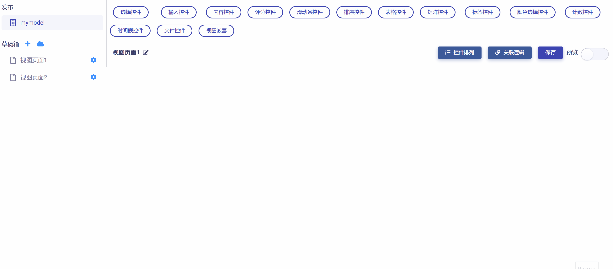

新添加的排序控件使用系统默认设置，如下图所示，开发者可以对其进一步修改和定制。

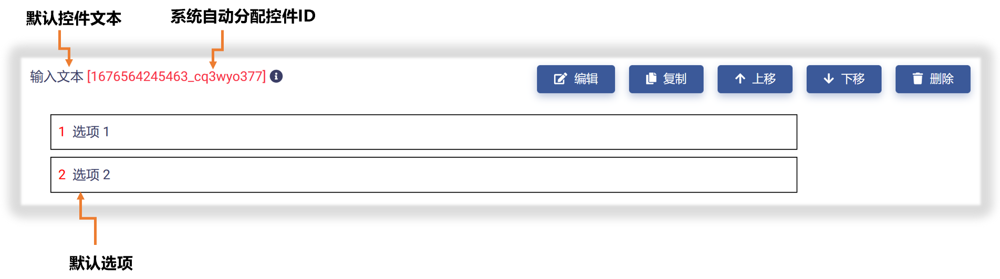

## 编辑

点击控件右侧`编辑`按钮，即可打开`控件设置`对话框，对排序控件的属性进行编辑与设置，如下图所示：

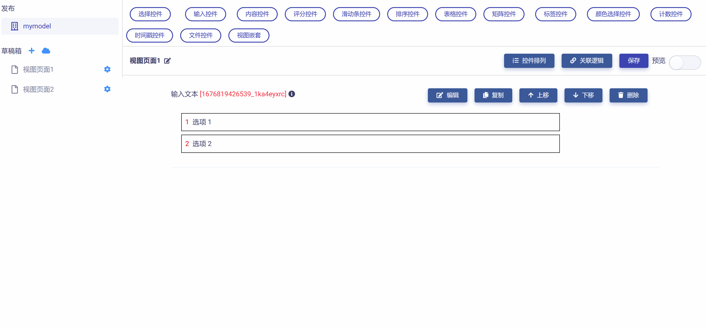

首先，可以对"控件ID"和"控件文本"进行编辑，如下图示例：

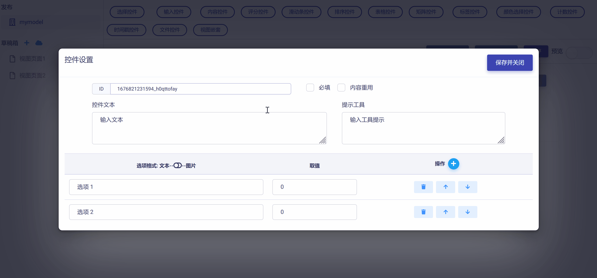

然后，可以对排序控件的选项数目进行设置，根据实际需要增加或减少选项，如下图示例：

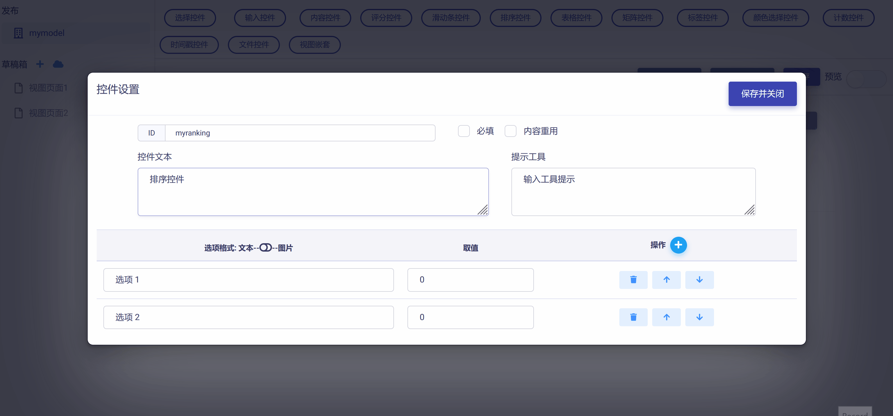

排序选项可以是文字格式或图片格式，可以使用`选项格式`滑块来切换，如下图所示：

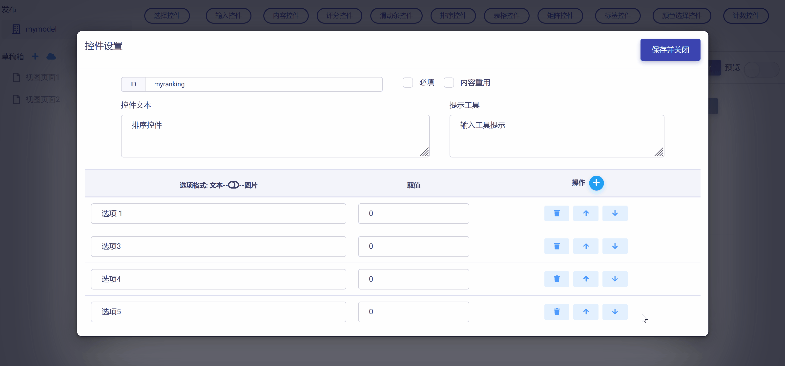

如果选择文字格式选项，则需要设置选项文字和对应的键值，如下图示例：

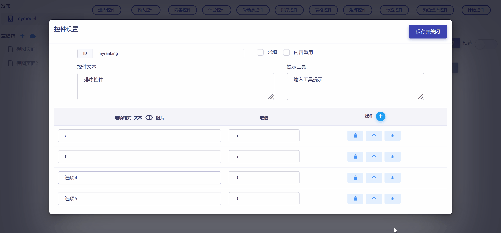

如果选择图片格式选项，则需要设置选项图片和对应的键值，如下图示例：

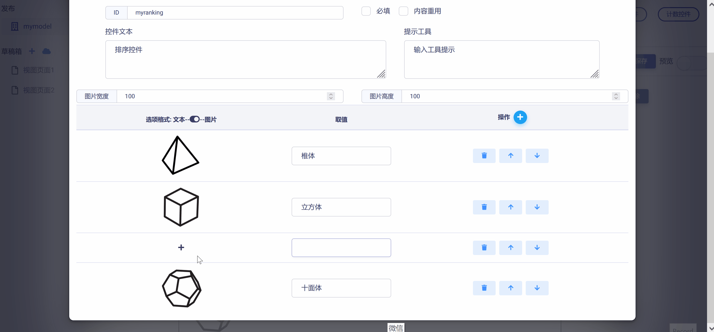

从上图可以发现，设置选项图片可直接调用链接个人云OS上的图片资源，只要通过文件浏览对话框选中对应图片资源即可。注意：云OS上的任一图片都可无限复用到不同的模型视图和控件中，这在《使用Matrix.OS媒体素材库》中会详细介绍。

如果需要对选项次序进行调整，可以使用选项右侧的`操作`栏的上/下箭头按钮来完成，如下图所示：

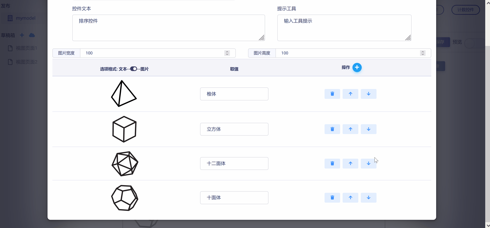

完成所有设置后，点击`保存并关闭`按钮，即保存设置并返回视图页面，可以查看控件的编辑与设置结果，如下图示例：

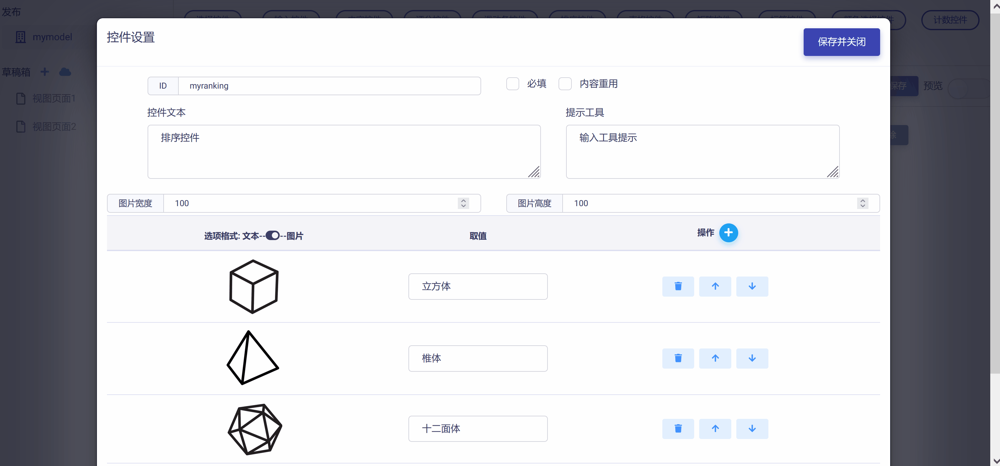

## 预览测试

滑动工作区右上角`预览`滑块，进入视图页面"预览模式"，可以对排序控件的操作和数据反馈正确性进行测试，在下图示例中，数据节点树 JSON 文件中的控件属性值正确响应了对排序控件的操作。

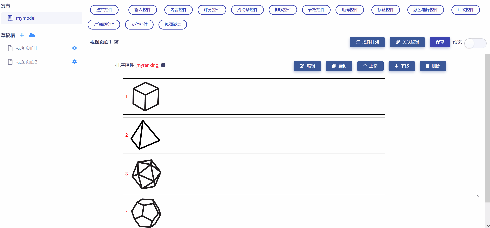