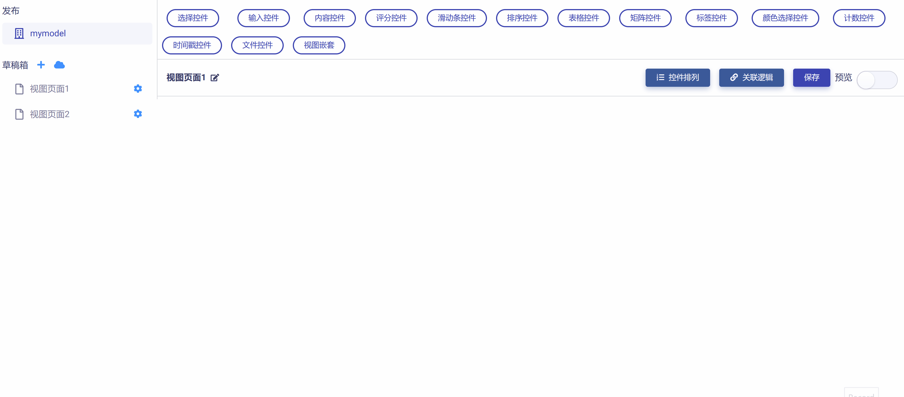
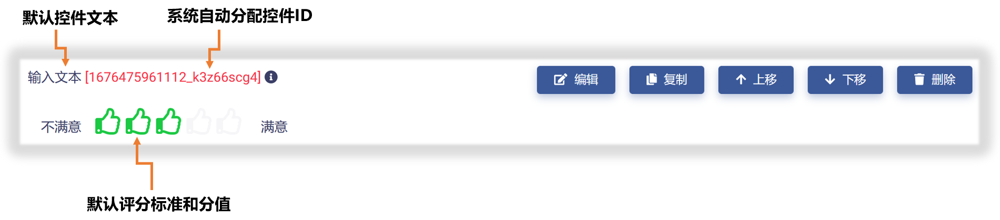
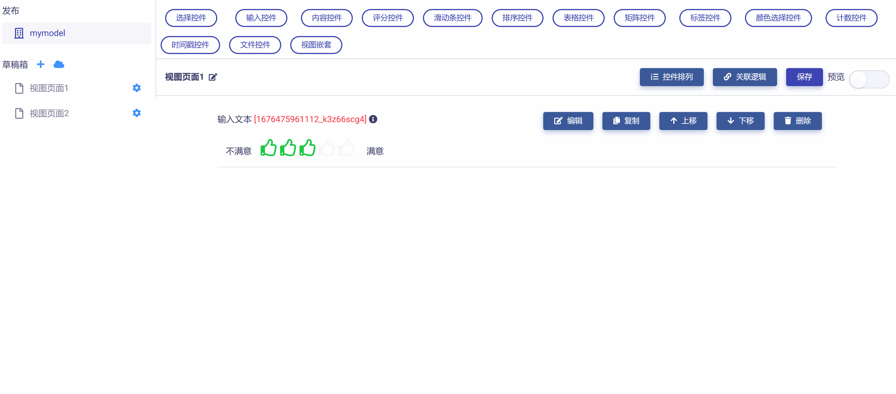
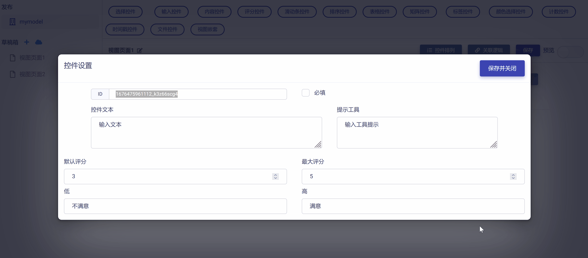
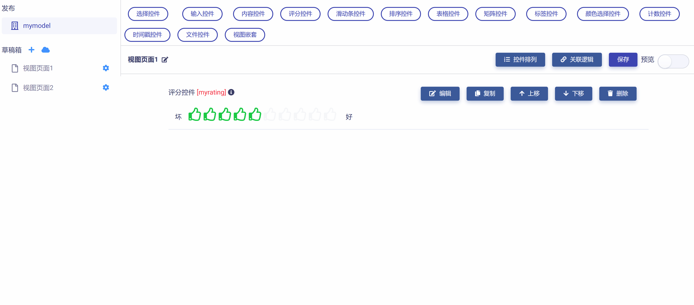

# 评分控件 (Rating)

评分控件一般通过打分的方式衡量用户对某事物的态度，包含下列属性：

* ID：控件的唯一标识，由开发者赋予，代表控件在数据节点树中的键值 (支持数值、英文字符，和中文)。

* 控件文本：与控件一起显示的标题性文字。

* 提示工具：当用户悬停在控件上时，显示的提示性文本。

* 默认评分：控件缺省评分值。

* 最大评分：控件最大可接受评分值。

* 语义差异量表：对选项态度的定性描述，一般使用一系列形容词及它们的反义词，比如“好”与“坏”、“喜欢”与“不喜欢”等。

* 必填：强制用户输入。

## 添加评分控件

在视图页面草稿中，点击工作区顶部`评分控件`按钮，即可完成评分控件的添加，如下图所示：

新添加的评分控件使用系统默认设置，如下图所示，开发者可以对其进一步修改和定制。

## 编辑评分控件

点击控件右侧`编辑`按钮，即可打开`控件设置`对话框，对评分控件的属性进行编辑与设置，如下图所示：

首先，可以对"控件ID"和"控件文本"进行编辑，如下图示例：

然后，可以对评分控件的默认评分和最大评分进行设置，如下图示例：

进而，可以对评分控件的语义差异量表进行设置，如下图示例：

完成所有设置后，点击`保存并关闭`按钮，即保存设置并返回视图页面，可以查看控件的编辑与设置结果，如下图示例：

## 预览测试

滑动工作区右上角`预览`滑块，进入视图页面"预览模式"，可以对评分控件的操作和数据反馈正确性进行测试，在下图示例中，数据节点树 JSON 文件中的控件属性值正确响应了对评分控件的操作。

