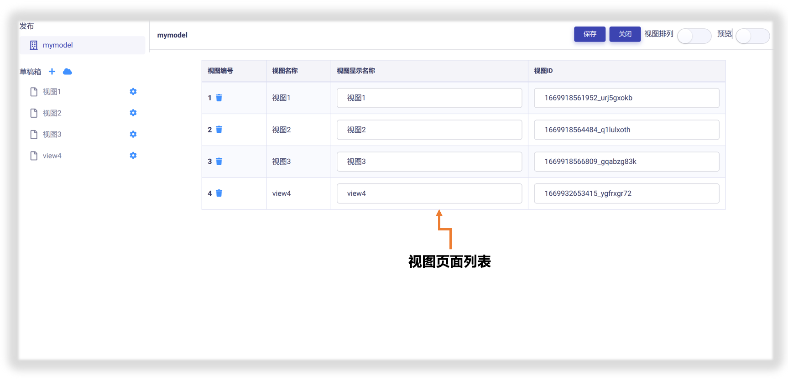
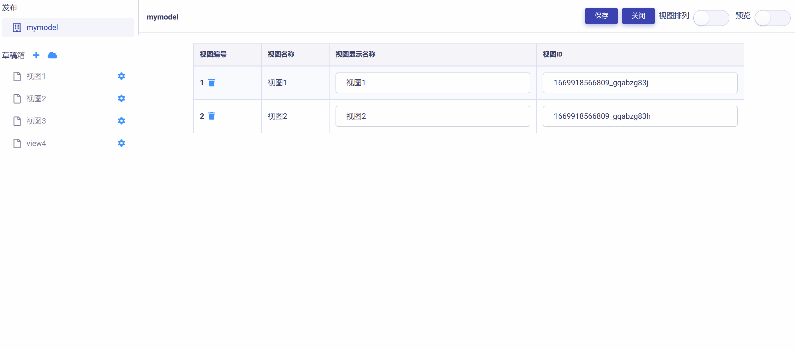
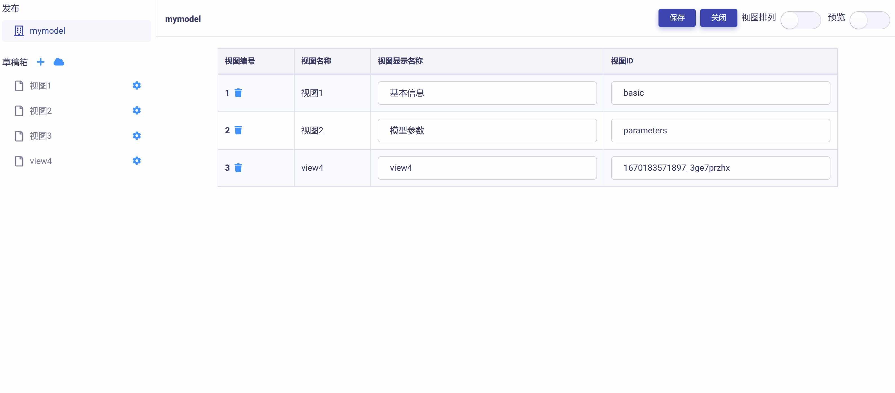
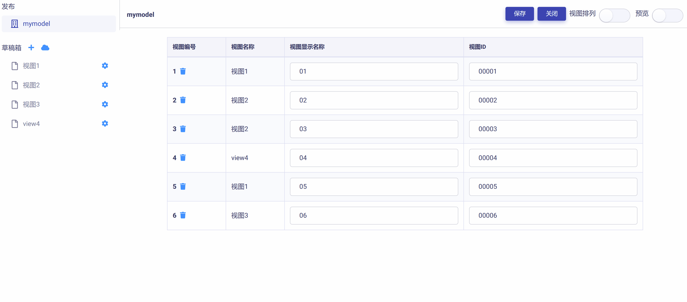
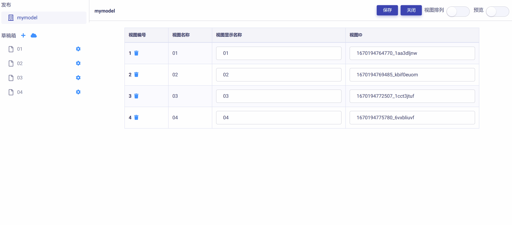
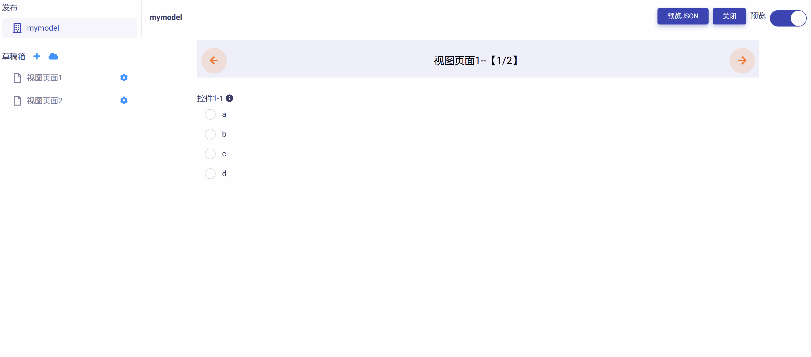
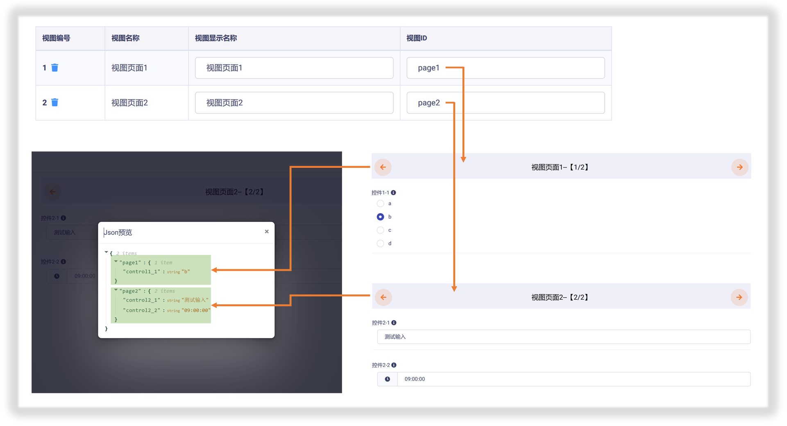

# 发布区

发布区用来管理模型视图的发布页面，主要包括以下功能：

## 编辑页面

进入发布区，在右侧工作区会显示待发布的视图页面列表。该列表包含了由草稿箱添加到发布区的所有视图页面。如下图所示：

列表中每个视图页面都有各自的编号、名称、显示名、和 ID (键值)。具体而言：

* **编号**：是指视图页面按照添加到发布区的次序被赋予的序号。
* **视图名称**：是指视图页面创建时的命名。
* **视图显示名称**：是指视图页面作为 UI 展示给使用者的显示名称。
* **视图ID**：是指在"数据节点树"文件中唯一标识该视图页面的键值(由字母、数字或下划线组成)，系统会自动分配一个随机键值，但最好由模型视图开发者指定，以便于识别和在代码中引用。

通过编辑 "视图显示名称" 和 "视图ID"，可以更加方便视图页面的用户交互和数据接口解析。见下图示例：

## 移除页面

在视图页面列表中，点击页面编号右侧的  按钮，即可将该视图页面从发布区移除，如下图所示：

**注意：将页面从发布区移除并未删除该页面，页面本体和内容依然保存在草稿箱中，以便于重新编辑和发布。**

## 视图排列

视图排列是指调整模型视图中不同页面的先后次序，滑动操作区右上角 ，进入 "视图排列模式"，即可通过拖放操作完成对页面次序的调整。次序调整完成后，再次滑动滑块即可退出 "视图排列模式"。如下图所示：

## 预览测试

滑动操作区右上角 ，进入 "预览模式"，即可逐一测试视图页面用户交互功能和数据反馈机制的正确性，如下图所示：

## 查看数据节点树文件

正如在《[模型视图基本概念](zh-cn/userguide/os/tools/modelview/modelview.md)》中所提到的，每一模型视图都被自动映射为 json 格式的**数据节点树**，作为与后端程序代码的数据操作交互接口，详细使用方法参见《[使用Code开发云应用：模型视图接口](zh-cn/userguide/os/tools/code/devapp.md)》。

在视图 "预览模式" 下，可以实时查看各种用户交互输入情境下，数据节点树文件的响应与更新，以便校核视图页面和控件操作的正确性。

在预览模式下，点击右上角的  按钮，即可实时查看数据节点树文件，如下图所示：

在上图例子中，模型视图 "mymodel" 包含了两个视图页面：

* 视图页面1：ID键值设为 **page1**，包含一个单选控件 **"控件1-1"(ID：control1_1)**
* 视图页面2：ID键值设为 **page2**，包含一个文本输入控件 **"控件2-1"(ID：control2_1)** 和一个时间控件 **"控件2-2"(ID：control2_2)**

可以发现，数据节点树 JSON 文件中的信息完全反映了视图页面设置与控件输入，如下图所示：

