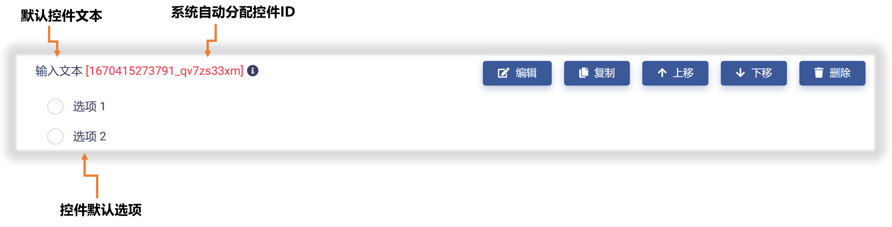

# 单选按钮控件 (RadioButton)

单选按钮控件是指从一组选项当中，选出一个作为正确（或较适合）的选项。在多种用户界面场景，经常使用这种控件形式。单选按钮控件具有下列属性：

* ID：控件的唯一标识，由开发者赋予，代表控件在数据节点树中的键值 (支持数值、英文字符，和中文)。

* 控件文本：与控件一起显示的标题性文字。

* 提示工具：当用户悬停在控件上时，显示的提示性文本。

* 选项文字：选项显示文字。

* 选项取值：由开发者赋予，在数据节点树中标识该选项的键值 (支持数值、英文字符，和中文)。

* 默认选项：设置选项为默认选中。

* 必填：强制用户输入。

* 内容重用：反复多次使用单选按钮控件时保留上一次填写内容，以节省输入时间。

## 添加

在视图页面草稿中，点击工作区顶部`选择控件`按钮，在下拉菜单中选中`单选`，即可完成单选按钮控件添加，如下图所示：

新添加的单选按钮控件使用系统默认设置，如下图所示，开发者可以对其进一步修改和定制。

## 编辑

点击控件右侧`编辑`按钮，即可打开`控件设置`对话框，对单选按钮控件的属性进行编辑与设置，如下图所示：

首先，可以对"控件ID"和"控件文本"进行编辑，如下图示例：

然后，可以对单选按钮控件的选项数目进行设置，根据实际需要增加或减少选项，如下图示例：

进而，可以对选项文字和对应的键值进行设置，如下图示例：

如果需要对选项次序进行调整，可以使用选项右侧的`操作`栏的上/下箭头按钮来完成，如下图所示：

完成所有设置后，点击`保存并关闭`按钮，即保存设置并返回视图页面，可以查看控件的编辑与设置结果，如下图示例：

## 预览测试

滑动工作区右上角`预览`滑块，进入视图页面"预览模式"，可以对单选按钮控件的操作和数据反馈正确性进行测试，在下图示例中，数据节点树 JSON 文件中的控件属性和选项键值都正确响应了对单选按钮控件的操作。

