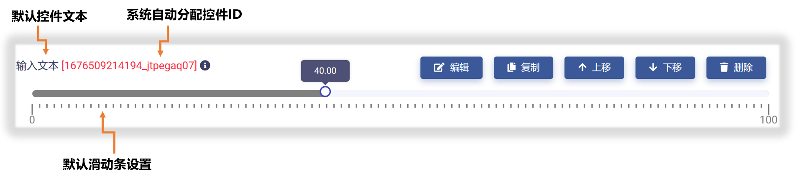
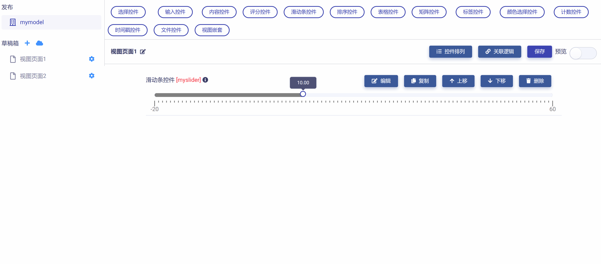

# 滑动条控件 (Slider)

滑动条控件允许用户通过拖动鼠标从预定范围中选择数值，由控制柄沿其长度的位置确定，与拖动控制柄的距离成比例。默认行为是滑动条从左向右增加数值，包含下列属性：

* ID：控件的唯一标识，由开发者赋予，代表控件在数据节点树中的键值 (支持数值、英文字符，和中文)。

* 控件文本：与控件一起显示的标题性文字。

* 提示工具：当用户悬停在控件上时，显示的提示性文本。

* 默认值：滑动条默认位置值。

* 最小值：滑动条最左侧位置对应值。

* 最大值：滑动条最右侧位置对应值。

* 必填：强制用户输入。

## 添加

在视图页面草稿中，点击工作区顶部`滑动条控件`按钮，即可完成滑动条控件的添加，如下图所示：

新添加的滑动条控件使用系统默认设置，如下图所示，开发者可以对其进一步修改和定制。

## 编辑

点击控件右侧`编辑`按钮，即可打开`控件设置`对话框，对滑动条控件的属性进行编辑与设置，如下图所示：

首先，可以对"控件ID"和"控件文本"进行编辑，如下图示例：

然后，可以对滑动条控件的默认值、最小值和最大值进行设置，如下图示例：

完成所有设置后，点击`保存并关闭`按钮，即保存设置并返回视图页面，可以查看控件的编辑与设置结果，如下图示例：

## 预览测试

滑动工作区右上角`预览`滑块，进入视图页面"预览模式"，可以对滑动条控件的操作和数据反馈正确性进行测试，在下图示例中，数据节点树 JSON 文件中的控件属性值正确响应了对滑动条控件的操作。

