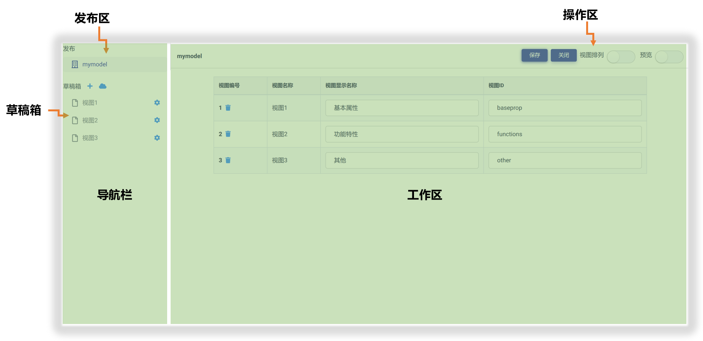

# 模型视图管理器简介

模型视图管理器 (Model View Studio) 是用来创建、编辑、管理、发布 Matrix 模型视图的工作平台。

在 Matrix.OS 上单击任一模型视图，即可打开模型视图管理器。如下图所示：

管理器基本布局如下图所示：

其中：

* **发布区**：视图页面发布版本管理
* **草稿箱**：视图页面草稿管理
* **工作区**：视图页面设计成果展示、控件拖放与组装、页面测试等
* **操作区**：常用操作与功能按钮

简单交互示例如下图：

