# 表格控件 (Tables)

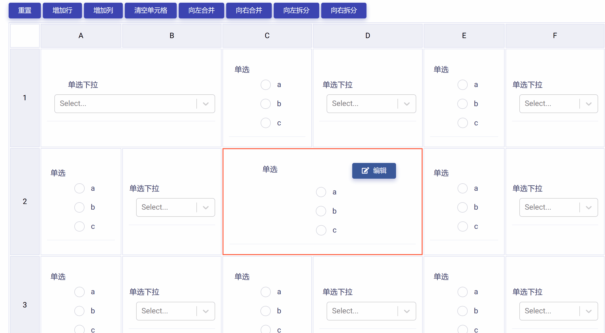

表格控件由不同行与列交叉形成的单元格动态组合而成，具有表格外观和功能。表格控件支持对单元格的各种组合排列与操作，每一单元格又可以嵌套其他类型控件，供开发者灵活调用以满足实际应用需要。表格控件包含下列属性和功能模块：

* ID：控件的唯一标识，由开发者赋予，代表控件在数据节点树中的键值 (支持数值、英文字符，和中文)。

* 控件文本：与控件一起显示的标题性文字。

* 提示工具：当用户悬停在控件上时，显示的提示性文本。

* 单元格控件模板库：可用于嵌套在表格单元格内的控件模板集合，由开发者自行创建和定制。

* 单元格编辑工具：用于表格和单元格编辑和操作。

* 必填：强制用户输入。

## 添加表格控件

在视图页面草稿中，点击工作区顶部`表格控件`按钮，即可完成表格控件的添加，如下图所示：

新添加的表格控件使用系统默认设置，如下图所示，开发者可以对其进一步修改和定制。

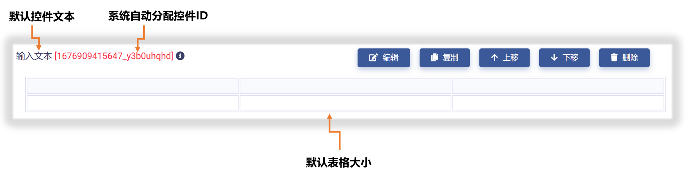

## 设置表格基本属性

点击控件右侧`编辑`按钮，即可打开`控件设置`对话框，对表格控件的基本属性进行设置，如下图所示：

首先，可以对"控件ID"和"控件文本"进行编辑，如下图示例：

## 创建单元格控件模板库

开发者可以创建单元格控件模板库，用于在不同的单元格中使用。点击`控件类型`下拉式菜单，选择要添加的控件模板类型，然后，在右侧输入框中输入控件模板名称，点击`添加控件`按钮，即可创建一个控件模板草稿。如下图所示：

然后，点击右侧`编辑`按钮，即可打开`控件设置`对话框，对控件模板草稿进行编辑，如下图所示：

控件编辑的方法已经在前面教程中详细介绍了，在此不再赘述。完成编辑后，点击`保存并关闭`按钮，即保存模板并返回。

此时点击`保存控件`按钮，即可将控件模板添加到下方列表中，如下图所示：

如果对控件草稿不满意，可点击`清除控件`按钮清空当前控件模板草稿，返回创建开始状态，如下图所示：

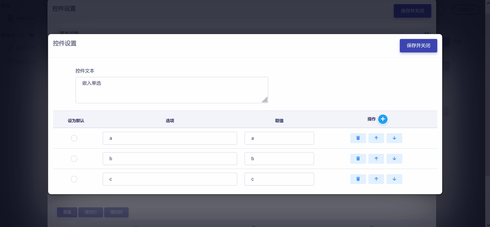

重复上述过程，则可以在列表中添加多个控件模板，如下图所示：

点击列表中任一控件模板，即可重新对该控件模板进行编辑，如下图所示：

点击控件上的"X"，可以从列表中移除该控件模板，如下图所示：

## 使用控件模板

### 应用到单元格

将控件模板拖放至表格中的目标单元格，即可将该控件模板应用到单元格，如下图所示：

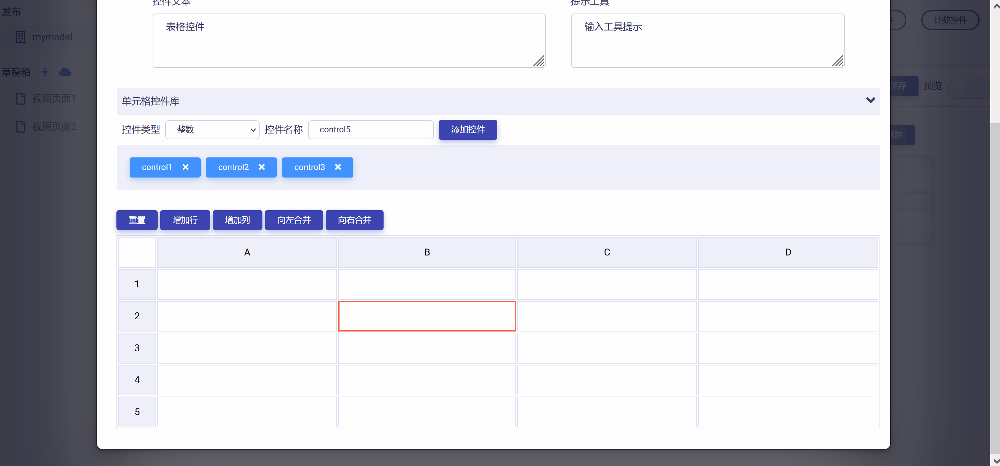

点击单元格中的`编辑`按钮，打开控件设置对话框，即可对单元格中的控件进行编辑，如下图所示：

选中单元格，点击表格上方`清空单元格`按钮，即可移除该单元格内控件，如下图所示：

### 应用到行

将控件模板拖放至表格中的目标行，即可将该控件模板批量应用到整行单元格，如下图所示：

单击选中目标行，点击表格上方`清空行`按钮，即可一次性移除该行所有单元格内的控件，如下图所示：

### 应用到列

将控件模板拖放至表格中的目标列，即可将该控件模板批量应用到整列单元格，如下图所示：

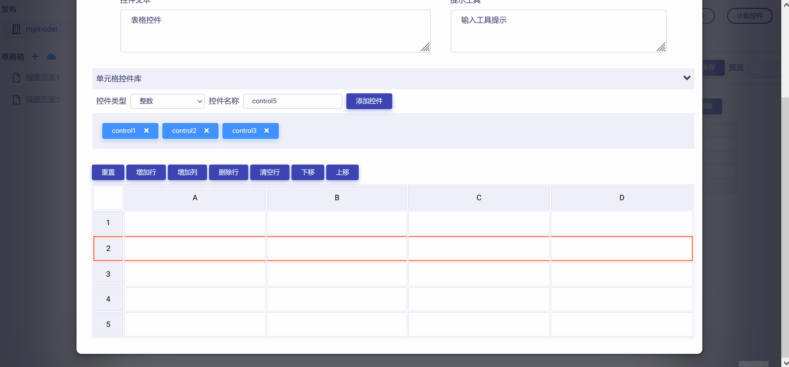

单击选中目标列，点击表格上方`清空列`按钮，即可一次性移除该列所有单元格内的控件，如下图所示：

### 应用到表格

将控件模板拖放至表格上，即可将该控件模板批量应用到表格全部单元格，如下图所示：

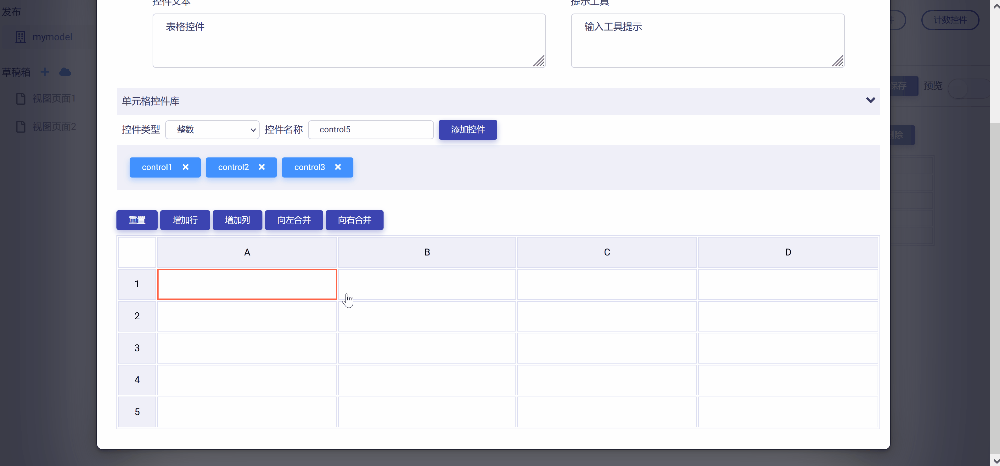

单击选中整个表格，点击`清空表格`按钮，即可一次性移除表格中所有单元格内的控件，如下图所示：

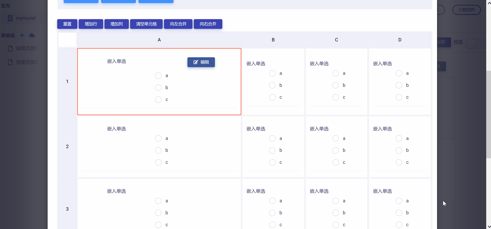

## 操作表格与单元格

### 增加行与列

点击`增加行`或`增加列`按钮，可在当前表格中增加整行或整列单元格，如下图所示：

### 删除行与列

单击选中表格中的行或列，点击`删除行`或`删除列`按钮，即可删除整行或整列单元格，如下图所示：

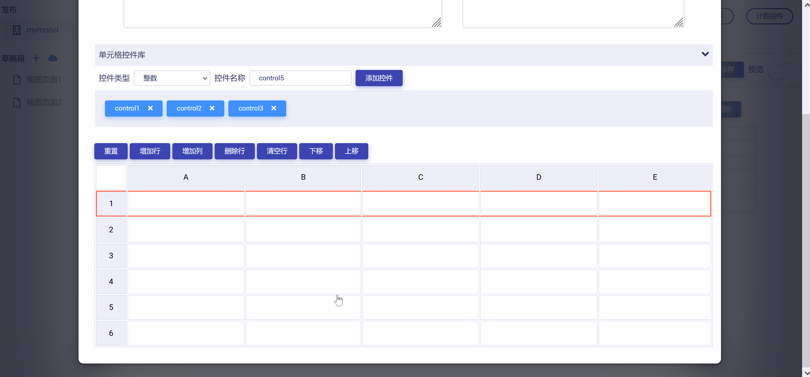

### 移动行

单击选中表格中某一行，点击`上移`或`下移`按钮，即可整行移动单元格，如下图所示：

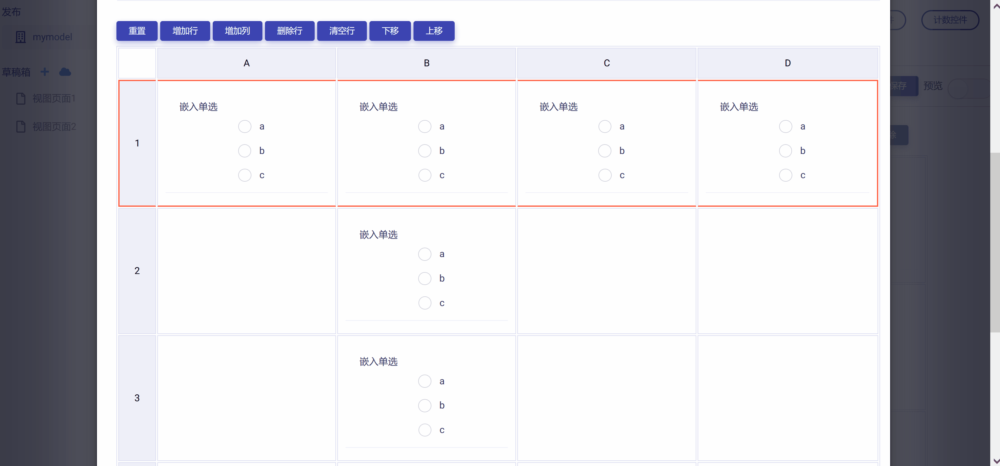

### 移动列

单击选中表格中某一列，点击`左移`或`右移`按钮，即可整列移动单元格，如下图所示：

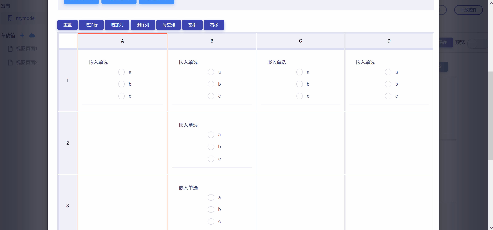

### 合并单元格

单击选中单元格，点击`向左合并`或`向右合并`按钮，即可与左侧或右侧单元格进行合并，如下图所示：

### 拆分单元格

单击选中单元格，点击`向左拆分`或`向右拆分`按钮，即可将单元格拆分为两个单元格，并将原单元格控件移动至拆分后的左侧或右侧单元格内，如下图所示：

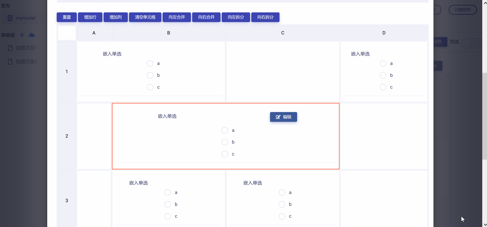

### 重置表格

点击表格上方`重置`按钮，即可将表格重置为默认格式并清空全部单元格中的控件，如下图所示：

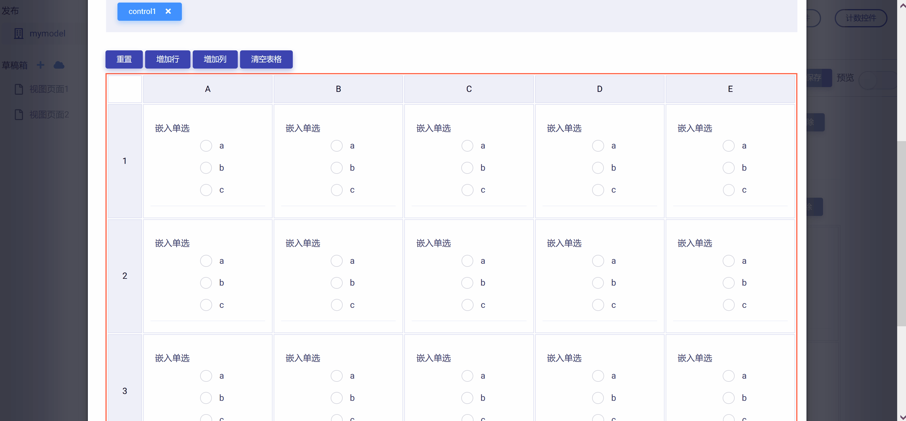

## 预览测试

完成所有表格设置后，点击`保存并关闭`按钮，即保存并返回视图页面，可以查看表格控件的编辑与设置结果，如下图所示：

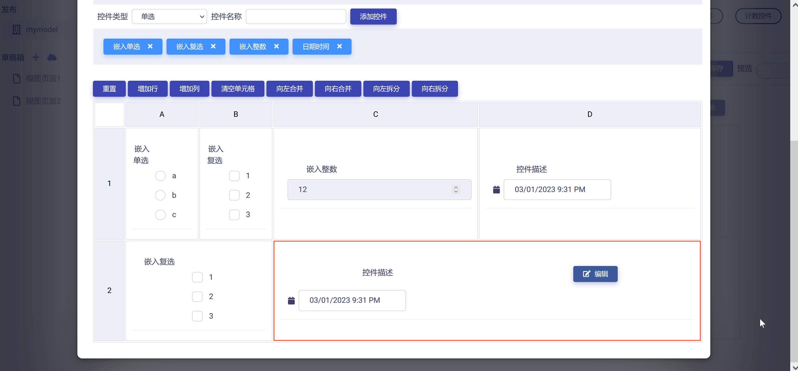

滑动工作区右上角`预览`滑块，进入视图页面"预览模式"，可以对表格控件的操作和数据反馈正确性进行测试，如下图所示：

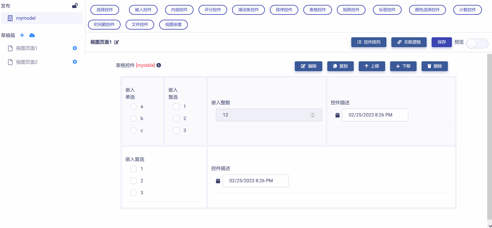

需要注意的是：在表格控件对应的数据节点树JSON文件中，每个单元格所对应的数据块是通过单元格ID进行索引的，即由行号（1,2,3,...）和列号（A,B,C,D,...）组合而成的ID（例如：1A, 2B, 3C等等）。下图展示了一个简单的例子：

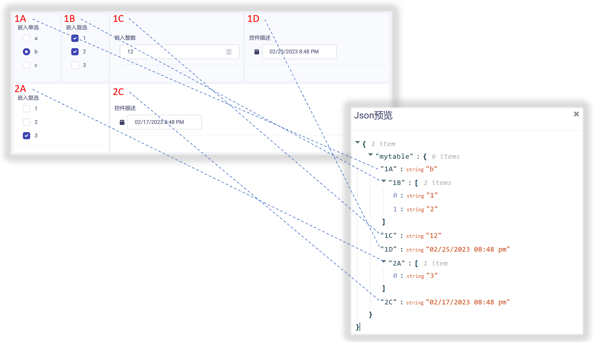