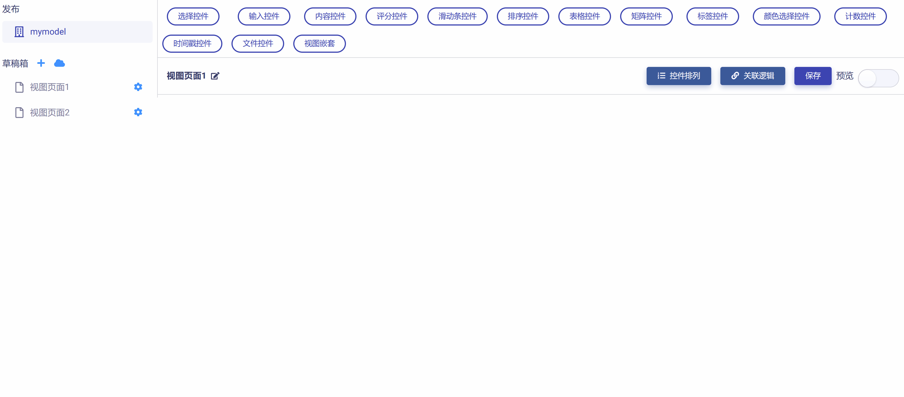
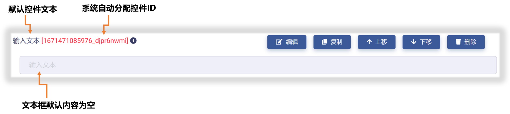
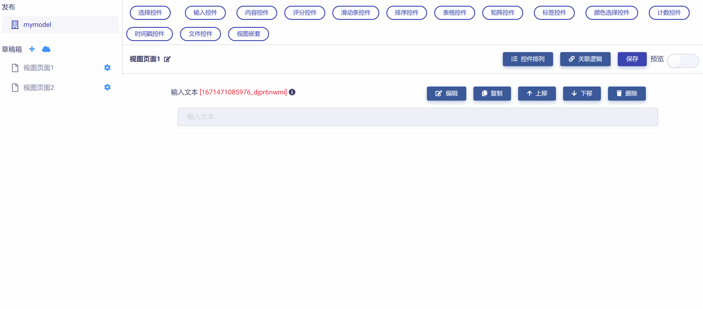
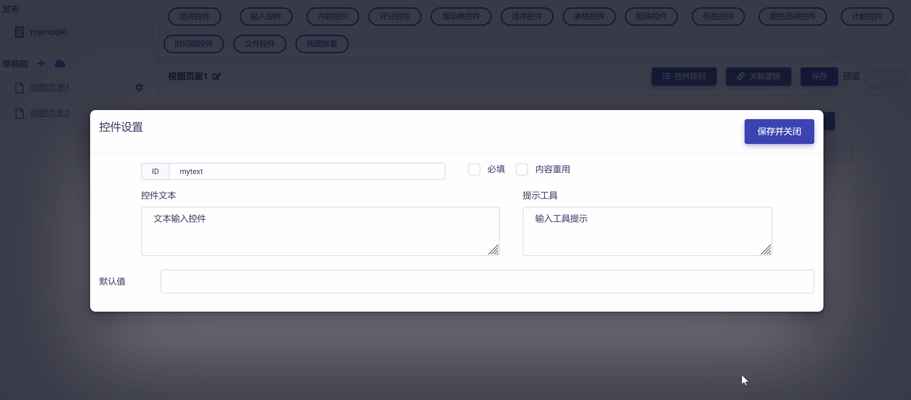
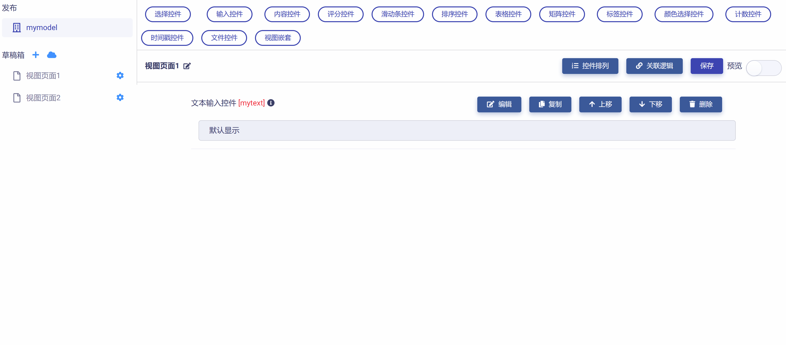

# 文本输入控件 (TextBox)

文本输入控件是一个简单的文本框，它可以接受任意输入并具有下列属性：

* ID：控件的唯一标识，由开发者赋予，代表控件在数据节点树中的键值 (支持数值、英文字符，和中文)。

* 控件文本：与控件一起显示的标题性文字。

* 提示工具：当用户悬停在控件上时，显示的提示性文本。

* 默认值：文本输入框的缺省内容。

* 必填：强制用户输入。

* 内容重用：反复使用文本框时保留上一次填写内容。

## 添加文本输入控件

在视图页面草稿中，点击工作区顶部  按钮，在下拉菜单中选中`文本`，即可完成文本输入控件添加，如下图所示：

新添加的文本输入控件使用系统默认设置，如下图所示，开发者可以对其进一步修改和定制。

## 编辑文本输入控件

点击控件右侧  按钮，即可打开`控件设置`对话框，对文本输入控件的属性进行编辑与设置，如下图所示：

首先，可以对 "控件ID" 和 "控件文本" 进行编辑，如下图示例：

然后，可以对文本输入控件的默认内容进行设置，如下图示例：

完成所有设置后，点击  按钮，即保存设置并返回视图页面，可以查看控件的编辑与设置结果，如下图示例：

## 预览测试

滑动工作区右上角  滑块，进入视图页面 "预览模式"，可以对文本输入控件的操作和数据反馈正确性进行测试，在下图示例中，数据节点树 JSON 文件中的控件属性值正确响应了对文本输入控件的操作。

