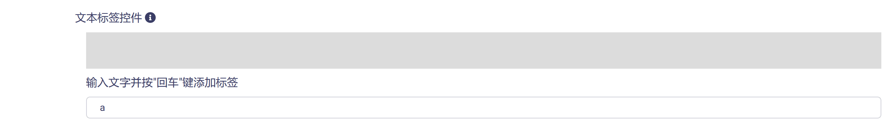
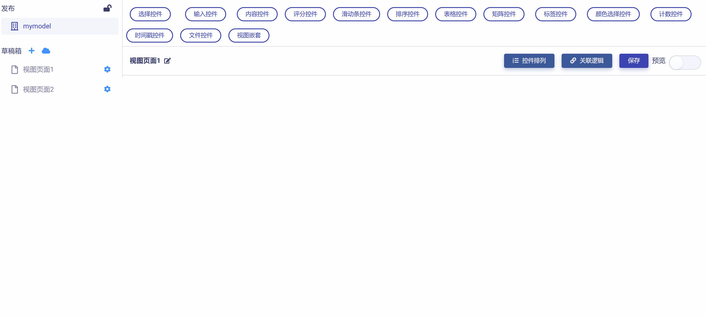
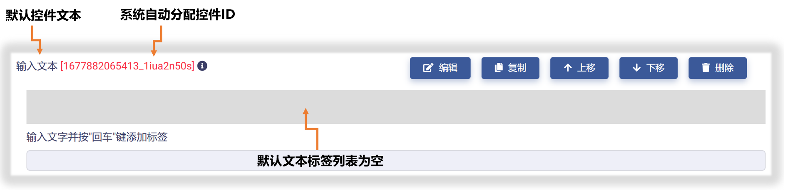
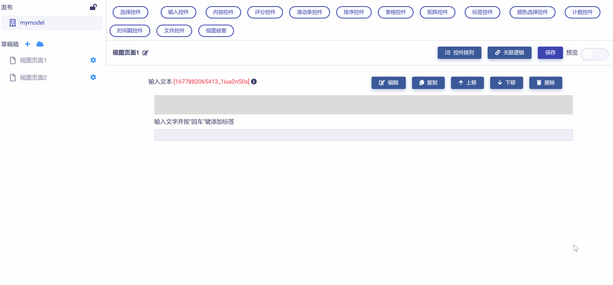
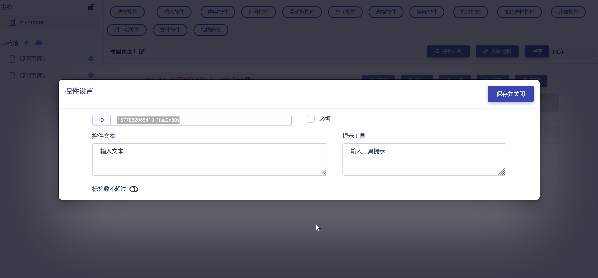
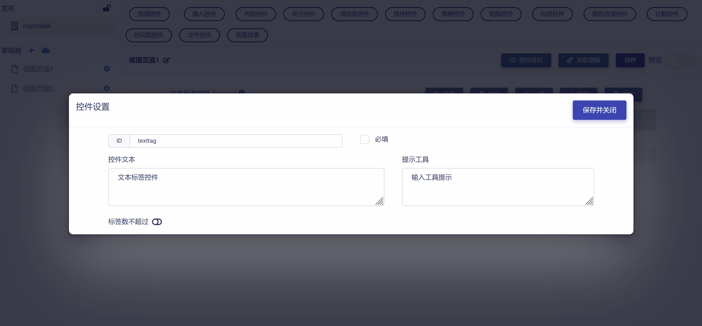
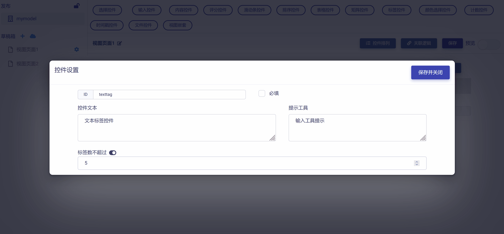
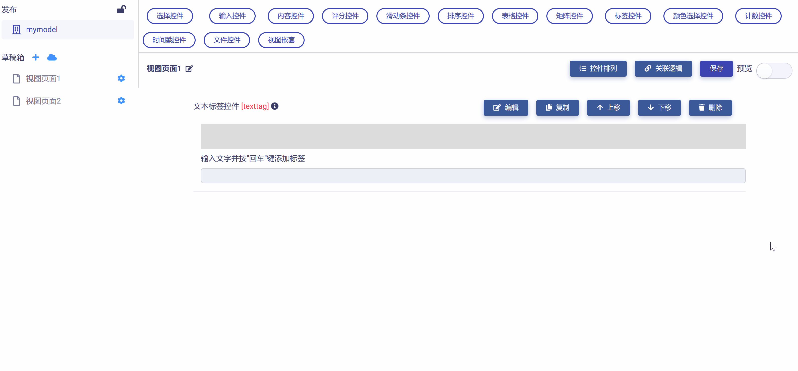

# 文本标签控件 (Text Tags)

文本标签控件让用户在文本输入框中键入文字，回车后变为文字标签，起到标识与分类作用，包含下列属性：

* ID：控件的唯一标识，由开发者赋予，代表控件在数据节点树中的键值 (支持数值、英文字符，和中文)。

* 控件文本：与控件一起显示的标题性文字。

* 提示工具：当用户悬停在控件上时，显示的提示性文本。

* 标签数目限制：用来限定用户允许输入的标签个数。

* 必填：强制用户输入。

## 添加文本标签控件

在视图页面草稿中，点击工作区顶部  按钮，在下拉菜单中选中`文本标签`，即可完成文本标签控件的添加，如下图所示：

新添加的文本标签控件使用系统默认设置，如下图所示，开发者可以对其进一步修改和定制。

## 编辑文本标签控件

点击控件右侧  按钮，即可打开`控件设置`对话框，对文本标签控件的属性进行编辑与设置，如下图所示：

首先，可以对 "控件ID" 和 "控件文本" 进行编辑，如下图所示：

进而，可以对允许用户输入的 "文本标签数目" 进行限制，如下图所示：

完成所有设置后，点击  按钮，即保存设置并返回视图页面，可以查看控件的编辑与设置结果，如下图所示：

## 预览测试

滑动工作区右上角  滑块，进入视图页面 "预览模式"，可以对文本标签控件的操作和数据反馈正确性进行测试，在下图示例中，数据节点树 JSON 文件中的控件属性值正确响应了对文本标签控件的操作。

