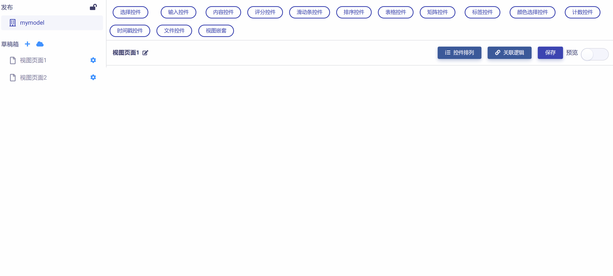
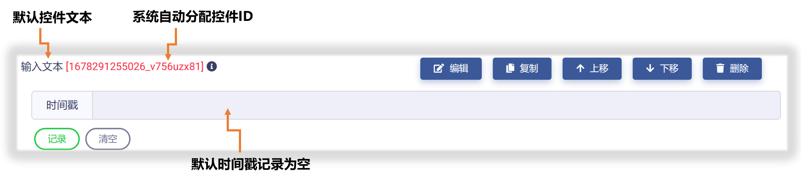
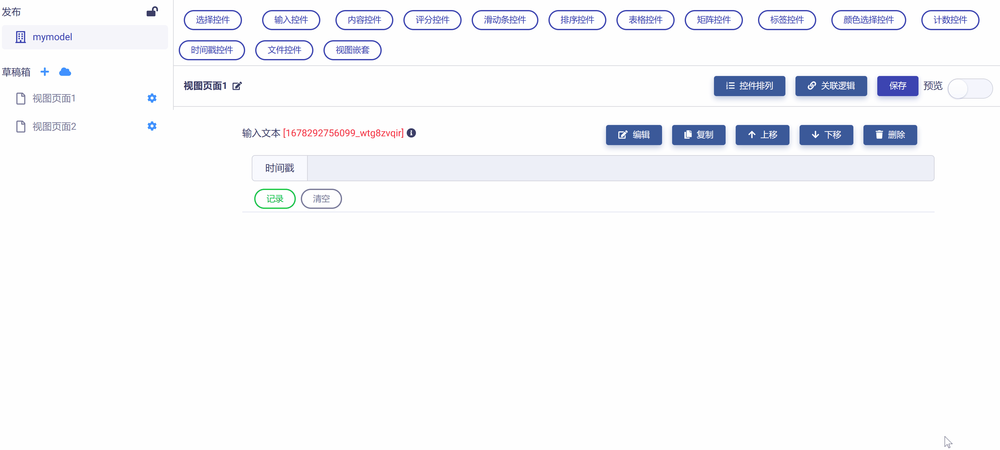

# 时间戳控件 (Timestamp)

时间戳控件让用户通过简单的时间按钮精确记录或更新事件的发生时间，可应用于多种场景，具有下列属性：

* ID：控件的唯一标识，由开发者赋予，代表控件在数据节点树中的键值 (支持数值、英文字符，和中文)。

* 控件文本：与控件一起显示的标题性文字。

* 提示工具：当用户悬停在控件上时，显示的提示性文本。

* 必填：强制用户输入。

## 添加时间戳控件

在视图页面草稿中，点击工作区顶部  按钮，即可完成时间戳控件的添加，如下图所示：

新添加的时间戳控件使用系统默认设置，如下图所示，开发者可以对其进一步修改和定制。

## 编辑时间戳控件

点击控件右侧  按钮，即可对时间戳控件的 "控件ID" 和 "控件文本" 进行编辑，完成后点击  按钮，即保存设置并返回视图页面，如下图所示：

## 预览测试

滑动工作区右上角  滑块，进入视图页面 "预览模式"，可以对时间戳控件进行测试和效果预览，查看数据节点树 JSON 文件校验数据正确性，如下图所示：

