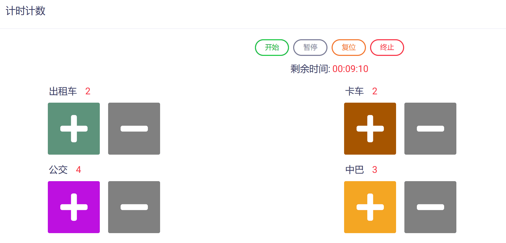
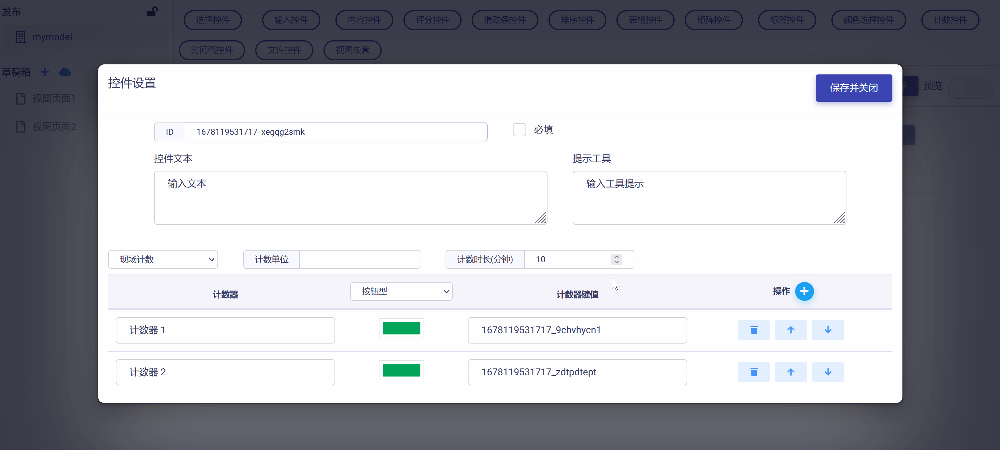
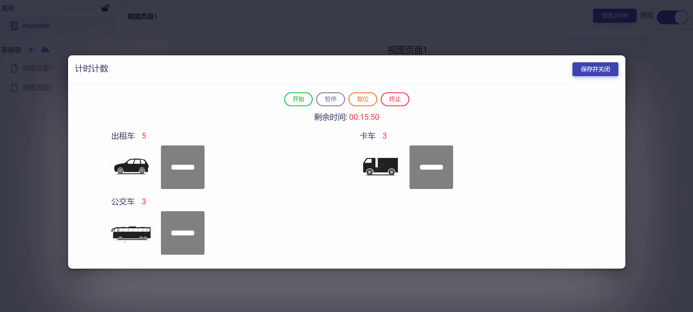

# 计时计数控件 (Timing Counter)

计时计数控件可以满足用户在多场景下对多个对象或事件（如：人数、车辆数、设施数等等）的发生时间节点和频次进行记录的需求，可以方便地部署于移动端和各种云端装备中，完成各种数据采集任务。计时计数控件具有下列属性：

* ID：控件的唯一标识，由开发者赋予，代表控件在数据节点树中的键值 (支持数值、英文字符，和中文)。

* 控件文本：与控件一起显示的标题性文字。

* 提示工具：当用户悬停在控件上时，显示的提示性文本。

* 任务方式：支持“现场计数”和“内业处理”两种不同方式。

* 计数单位：计数采用的计量单位（如：人、位、个、辆等等）。

* 计数时长：计数任务持续的时间长度（单位：分钟）。

* 计数器名称：由开发者自行定义的计数对象名称。

* 计数器显示类型：可以设置为“按钮型”与“图片型”两种类型。

* 计数器键值：代表计数器在数据节点树中的键值 (支持数值和英文字符)。

* 必填：强制用户输入。

## 添加计时计数控件

在视图页面草稿中，点击工作区顶部`计数控件`按钮，在下拉菜单中选中`计时计数`，即可完成计时计数控件添加，如下图所示：

新添加的计时计数控件使用系统默认设置，如下图所示，开发者可以对其进一步修改和定制。

查看默认计数器设置，可以点击`开始计数`按钮，打开计时计数页面，如下图所示：

计数器页面上包含以下功能按钮：

* `开始`键：启动计时计数任务。

* `暂停`键：暂停当前计时计数任务。

* `复位`键：重置当前计时计数任务，返回初始状态。

* `终止`键：终止计时计数任务。

## 编辑计时计数控件

点击控件右侧`编辑`按钮，即可打开`控件设置`对话框，对计时计数控件的属性进行编辑与设置，如下图所示：

首先，可以对"控件ID"和"控件文本"进行编辑，如下图所示：

下一步需要设置计数任务方式，可以点击下拉式菜单选择`现场计数`或是`内业处理`，然后设置`计数单位`和`计数时长`，如下图所示：

**注意：现场计数一般是指数据采集人员携带移动设备（手机或平板电脑等）到现场实时采集数据，内业处理则是后期处理已拍摄的现场视频来提取数据。二者的不同在于计数开始时间的校正与同步，以及计数速度的调节（比如：现场计数是不能加速计数的）。**

下一步根据实际任务需求明确计数对象，进而对计数器数目进行设置，增加或减少，如下图所示：

然后，可以对每个计数器的名称和对应键值进行设置，如下图所示：

下一步，需要设置计数器的显示类型，以方便用户区分不同计数对象。点击下拉式菜单选择按钮型或图片型，如下图所示：

**如果设置计数器显示为按钮型**，则需要对按钮的颜色进行设置来代表不同计数对象，如下图所示：

**如果设置计数器显示为图片型**，则需要对图片进行设置来代表不同计数对象，如下图所示：

如果需要对计数器次序进行调整，可以使用右侧的`操作`栏的上/下箭头按钮来完成，如下图所示：

完成所有设置后，点击`保存并关闭`按钮，即保存设置并返回视图页面，点击`开始计数`按钮，可以查看控件的编辑与设置效果，如下图示例：

## 预览测试

滑动工作区右上角`预览`滑块，进入视图页面"预览模式"，点击`开始计数`按钮，打开计数器页面，可以对计时计数控件的操作和数据反馈正确性进行测试，如下图所示：

点击`开始`按钮，启动计数任务，可以发现操作按钮下方出现倒计时信息，显示当前计数任务的剩余时间。

点击不同计数器按钮（图片），则会累加相应计数对象的频次并记录时间戳信息，累计计数结果则会更新显示于每个计数器名称的右方。

如果出现误操作导致计数错误累加，可以点击计数器按钮右侧的`-`按钮移除错误计数操作记录。

如下图示例：

点击`暂停`按钮，则可以暂停计数任务，已经收集的数据不会受到影响，再次点击`开始`按钮，则会继续计数任务，如下图所示：

点击`终止`按钮，则会结束计数任务，如下图所示：

任务终止后，点击`查看结果`按钮，可以打开JSON格式的计数数据文件，查看每个计数器的源数据以及每一计数事件的时间戳，如下图所示：

如点击`复位`按钮，则重置计数器，清空计数结果，返回初始状态，如下图所示：

点击计数器页面右上角的`保存并关闭`按钮，则保存计数结果，关闭计数器页面并返回视图页面。点击`预览JSON`按钮，打开数据节点树文件，可以看到计数结果完整地保存于计时计数控件所代表的节点内，如下图所示：

